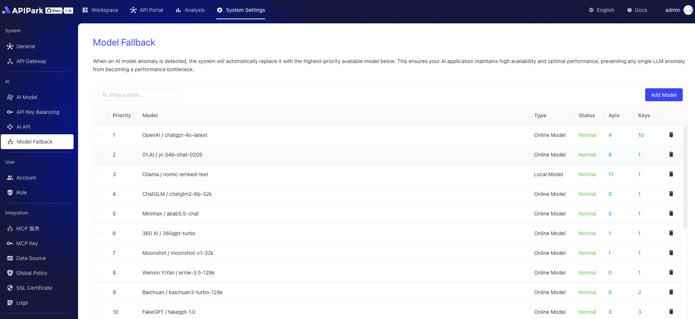

# AI 模型灾备

AI 模型模型灾备是一种智能调度机制，旨在确保 AI 服务的高可用性和稳定性。当主要的 AI 供应商服务出现故障时，负载均衡能够自动将请求切换到备用的 AI 供应商上。通过这种方式，它能够有效避免因供应商问题导致的服务中断，保障 AI 应用的连续运行，提升用户体验。

模型灾备还支持对供应商进行优先级排序，确保在异常情况下，能够按照预设的优先级顺序进行切换，进一步优化资源利用和响应速度。

  