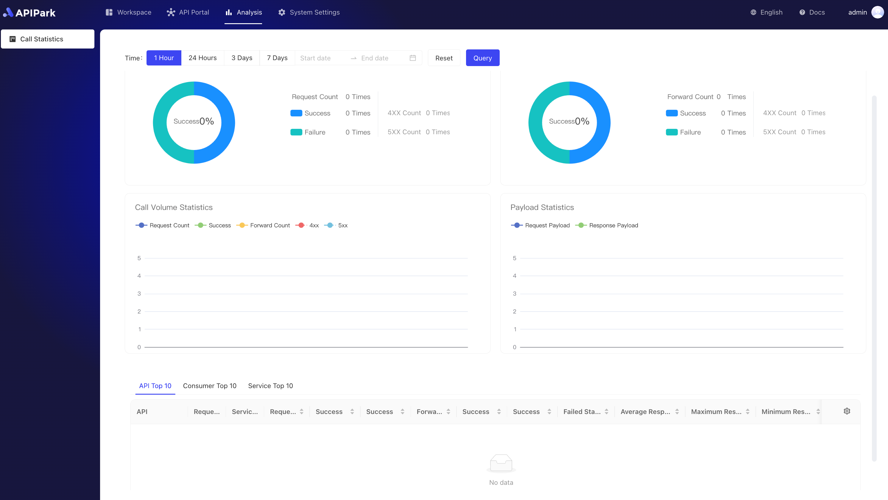

# API 调用分析报告

APIPark 通过对历史调用数据的分析， 展示 API 长期的调用趋势和性能变化，帮助企业维持 API 的稳定。

> 💡 APIPark 的 API 调用分析报告依赖于 InfluxDB 数据库。如果你使用 APIPark 官方提供的脚本部署，默认会安装 InfluxDB，了解更多：[🔗 部署 APIPark](deploy.md)。 💡 你也可以部署外部的 InfluxDB 数据库，然后在 APIPark 的系统设置中填写 InfluxDB 的数据源信息，了解更多：[🔗 设置数据源](system_setting/data_source.md)。

