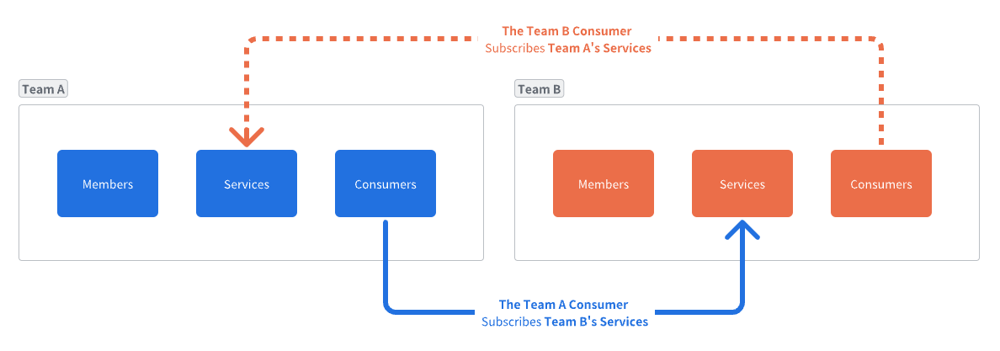
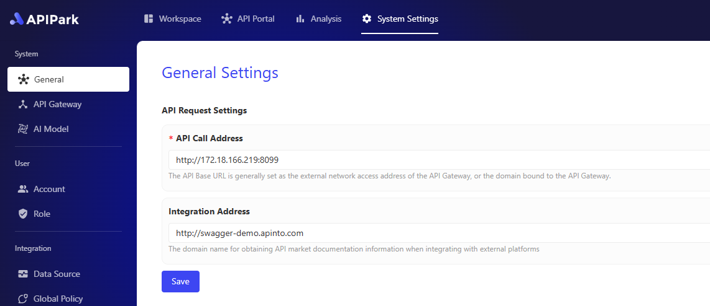

# API 开发者门户

👀 随着企业内部的 API 数量爆发式增长，企业的 IT 管理团队需要一个统一的平台展示内部可复用的 API，让内部开发人员能够基于现成的 API 快速开发新的产品，同时避免因内部 API 随意调用导致的管理成本和数据泄露问题。

✨ APIPark 的 **开发者门户** 用于统一展示团队内公开的 API 服务，让开发者能够方便地浏览和查找适合自己需求的 API，减少寻找和选择 API 的时间。同时，开发者在使用 API 服务前需要先订阅服务，并等待管理员审核通过后才能正式调用API，避免违规调用 API 导致的数据泄露等安全问题。

APIPark 会自动生成 API 的调用统计，展示 API 长期的调用趋势和性能变化，帮助企业维护 API 的稳定性。

## 创建消费者

订阅 API 服务之前，你需要先创建一个**消费者（Consumer）**，消费者是 **订阅服务** 和 **调用API** 的实体，消费者通过订阅服务来获得调用服务内API的权限，确保数据安全和访问权限合规。

如果需要创建消费者，请查看 [🔗 创建消费者](consumers.md)

## 订阅 API 服务

进入 **API 门户** 模块，你可以看到所有已经公开的 API 服务。点击需要订阅的服务，进入服务详细介绍页面，然后点击 **订阅** 按钮，在弹窗中选择订阅该服务的 **消费者**。

> 💡 如果你订阅的服务开启了 **人工审核**，那你订阅服务时可能需要输入订阅服务的用途，便于服务的管理员审核。并且你需要等服务的管理员对你的订阅申请审核通过之后，才能调用服务的API，否则 APIPark 会拒绝你的 API 请求并提示缺少 API 的访问权限。
> 
> 💡 如果你订阅的服务是无需审核的，那你订阅之后就可以通过消费者的身份认证来调用该服务的 API。
> 
> [🔗 了解更多：审核消费者](services/review_consumers.md)

## 调用 API

如果需要调用服务的 API，请查看 [🔗 调用 API](call_api.md)

# API 服务集成

**APIPark** 支持**将** **API** **服务无缝集成到各种** **AI** **Agent 平台中**。一键复制分享 API 服务的对外可读取文档详细信息的 URL，开发者则可轻松地将这些 API 服务导入到他们选择的 **AI Agent** 平台，无需复杂配置或手动输入。

这种集成方式不仅提高了工作效率，还确保了 API 服务的准确性和一致性；同时 **AI** **Agent** 平台还可以充分利用 **APIPark** 提供的丰富 API 资源，扩展功能和服务范围。

## 获取集成地址或文件

进入 **API市场** 模块，选中某个API服务并进入服务详情页，然后选择 **集成Tab**。

在该子页面即可一键点击【复制URL】按钮获取到集成地址，如果需要集成的Agent平台不支持读取URL集成，那么可以点击【下载 Json 文件】，可下载当前API服务的Json文件，该文件格式为Openapi 3.0 标准格式。

  

## 配置集成地址域名

系统会默认使用当前APIPark的域名为集成地址域名，但是为了适用企业的网络安全策略，我们可以单独为集成地址配置单独的访问域名。

进入 **系统设置** 模块，选择左侧的 **常规** 菜单，然后设置 **集成地址。**

在集成地址的输入框内输入域名即可。

  