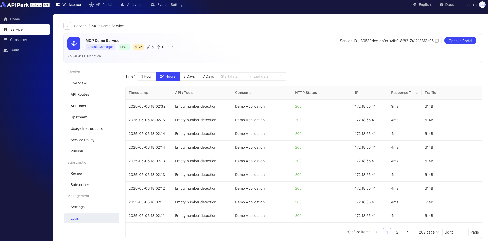

# 服务调用日志
在**服务管理-日志**模块中，用户可以实时查询和查看服务内的**API**或**MCP**的历史请求日志。该功能提供以下特性：

1. 请求与响应详情：
* 支持查看完整的请求参数和返回参数，清晰展示每次调用的输入与输出内容。
* 参数以结构化格式呈现，便于快速理解和分析。

2. 流式传输数据处理：
* 对于流式传输的数据，日志会自动整理为易于阅读的格式，优化查看体验，确保数据连续性和可读性。

3. 实时查询与历史追溯：
* 提供实时日志查询功能，方便用户监控当前服务调用状态。
* 支持按时间范围过滤历史日志，快速定位特定调用记录。

该功能旨在为开发者和服务管理者提供高效、便捷的日志管理工具，助力服务调用分析与优化。

## 功能展示
1. 按时间查询服务日志列表，可展示消费者、调用状态码、调用IP、响应时间、传输数据大小等基本信息

  

2. 获取调用日志详情，包括请求体信息、响应体信息等。

  

3. 对于流式传输（即AI大模型调用），日志会自动整理为易于阅读的格式，优化查看体验，确保数据连续性和可读性。

  

