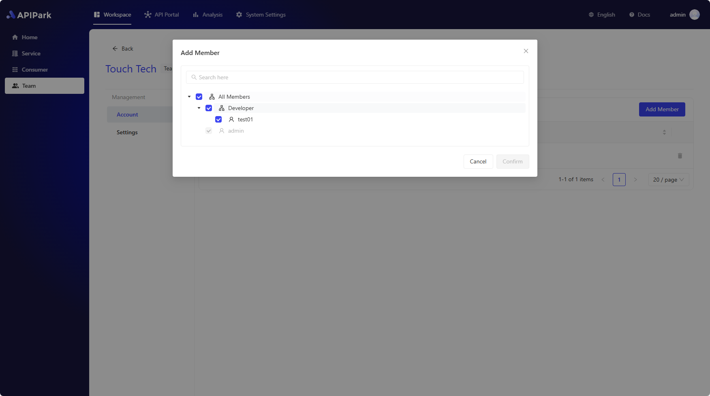

# 团队

你可以在 APIPark 里创建多个团队，团队类似于租户的概念，每个团队拥有各自的成员、服务、消费者。你可以通过团队功能来管理复杂的组织结构。

## 创建团队
进入 **工作空间** 模块，在侧边栏中选择 **团队**，然后 **创建团队**，填写：

- **团队名称**
- **团队 ID**：团队的唯一标识，一旦保存无法修改。
- **团队管理员**：团队管理员拥有团队内的最高权限，能够在团队内管理成员、添加服务和消费者等。
- **描述**

## 为团队添加成员
在团队详情页面，在侧边栏中选择 **成员**，然后点击 **添加成员**，在弹窗中选择需要加入团队的成员。

> 💡 添加团队成员时，只能从 APIPark 的账号列表中选择成员，如果你还没有为成员创建 APIPark 账号，请查看 [🔗 管理 APIPark 账号](system_setting/account.md)

## 创建 AI 服务
APIPark 的 AI Service (AI Gateway) 提供了对多个 AI 模型的统一接入管理，帮助开发者快速集成和调用各种 AI 模型。APIPark 通过统一的 API 格式来简化调用过程，减少切换模型的复杂性，并且支持将 Prompt 封装成标准 REST API，以便于 API 的复用和共享。APIPark 支持 API 全生命周期的管理，包括从设计、发布到调用和下线的全过程，同时还提供订阅审批机制，有助于提高数据安全性。

如果需要在团队内创建 AI 服务，请查看 [🔗 创建 AI 服务](services/ai_services.md)

## 创建 REST 服务
APIPark 内置了强大的云原生 API 网关，拥有比 Nginx 更高的性能，并且支持集群部署，能够支持大规模的流量。

通过 APIPark 将 REST API 在团队内共享，并管理API的调用关系，能够避免因混乱的API调用导致的管理成本和数据泄露问题。

如果需要在团队内创建 REST 服务，请查看 [🔗 创建 REST 服务](services/rest_services.md)

## 创建消费者
在 APIPark 中，**消费者（Consumer）** 是 **订阅服务** 和 **调用API** 的实体，消费者通过订阅服务来获得调用服务内API的权限，确保数据安全和访问权限合规。

消费者支持多种鉴权方式，包括API Key、Basic、JWT、以及AK/SK等方式，满足不同应用场景的安全需求。

如果需要在团队内创建消费者，请查看 [🔗 创建消费者](consumers.md)