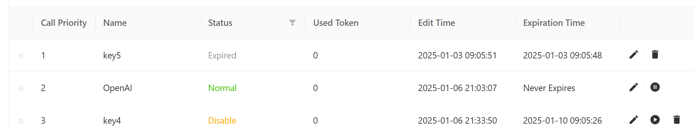

# APIKEY Resource Pool

The APIKEY resource pool is a feature that centrally manages and allocates APIKEYs, providing strong support for the stable operation of AI services. In the resource pool, users can view and manage APIKEYs from various vendors, including their status (such as normal, exceeded, expired, etc.) and calling priority. Through drag-and-drop operations, users can easily adjust the priority order of APIKEYs to meet different business needs. When an APIKEY encounters issues like exceeded usage or expiration, the system automatically activates other APIKEYs based on priority to ensure the continuous availability of AI services.

Of course, you can also use the AI APIKEY resource pool to uniformly reallocate AI calling resources.

  

## Default APIKEY

The APIKEY configured in the settings pop-up for AI vendors is the default APIKEY. This APIKEY cannot be deleted, ensuring that there is at least one APIKEY for the current vendor.

  

## Adding More APIKEYs

In the APIKEY resource pool page, you can add APIKEYs for the corresponding vendor. Clicking the add button will pop up the following configuration window.

- Name: The name of the KEY. The system will automatically provide a default name like key+number, which can be modified.
- API Key: The actual APIKEY parameter configuration. Note that not only the API Key can be entered here, but also API URL and other configurations.
- Expiration Time: The default is never expire, but you can choose a specific expiration time. After the expiration time, the APIKEY can no longer be used.

  

## Disabling/Enabling APIKEYs

You can disable or enable APIKEYs in the APIKEY resource pool.

- Expired APIKEYs do not have enable or disable buttons; they can only be deleted.
- If an APIKEY is disabled, it cannot be called, and the system automatically calls the next APIKEY.
- If an APIKEY encounters a quota issue, it can be re-enabled to return to normal status. Once enabled, the APIKEY can be normally used in the next AI service call.

  

## Adjusting Priority

You can adjust the priority by dragging the button in front of each APIKEY row. The APIKEY with a higher priority will be used first.

  
