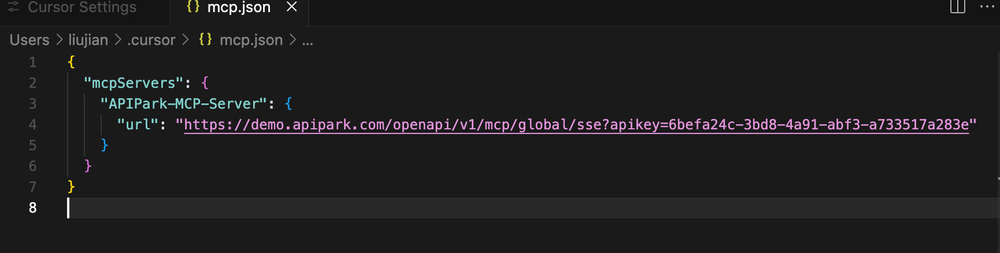

# Integrating MCP (Model Context Protocol)

In late 2024, Anthropic introduced the Model Context Protocol (MCP). As an emerging open protocol, MCP establishes a bidirectional communication channel between LLMs and external applications, akin to an AI “USB-C” connection, facilitating the discovery, understanding, and secure invocation of various external tools or APIs by models. This means:
- Developers no longer need to write complex custom interfaces to connect to each external service.
- Users can experience AI seamlessly harnessing numerous third-party applications, whether for handling daily office tasks, analyzing data, or executing marketing automation. AI is advancing from “intelligent conversations” to “efficient actions.”

  
(Image source: [What is Model Context Protocol (MCP)? How it simplifies AI integrations compared to APIs | AI Agents](https://norahsakal.com/blog/mcp-vs-api-model-context-protocol-explained/))

APIPark provides system-level MCP services and service-level MCP services, supporting tools like AI Agent, MCP Host, MCP Client, and seamless invocation on platforms such as Claude, Cursor, Cline, and Dify. MCP (Model Context Protocol) is a standardized protocol aimed at achieving efficient communication and data exchange between AI models, services, and clients.

Through APIPark's MCP Server, any client supporting the MCP protocol can quickly integrate into its ecosystem, achieving interoperability, scalability, and simplified workflows. This allows developers and enterprises to leverage APIPark's robust infrastructure to build, manage, and deploy AI-driven solutions with minimal integration costs.

System-Level MCP Service

The system-level MCP (multi-cloud platform) interface provides a unified, standardized access mechanism for accessing all publicly available services on the platform. This capability is designed to simplify service integration, achieving seamless interaction across diverse services, and is particularly suitable for building multimodal intelligent agents and automated workflows.

  

System-Level MCP offers the following Tools:
- service_list: This tool is used to retrieve a list of registered services in APIPark. Each service includes its unique identifier (service ID), name, description, and a list of included APIs and other key information. It supports fuzzy search by keywords to quickly narrow down the search range. After obtaining the ID of a specific service, the openapi_document tool can be used to get the OpenAPI documentation of the service for subsequent API interface calls.
- openapi_document: This tool is used to obtain the OpenAPI interface documentation of a specified service. The returned content supports both OpenAPI v2 and v3 specification formats. By entering the service ID, you can view all API definitions, parameter structures, request methods, and other detailed information of the service to prepare for constructing requests.
- invoke_api: This tool is used to directly call the specified API interface. Before calling, it is necessary to construct the necessary request parameters based on the OpenAPI documentation of the interface, such as request path, method, query parameters, request headers, request body, etc. Authentication information like the Authorization field in the request header does not need to be provided during the call.

Using the scenario of obtaining the current day's weather information as an example, the AI Agent call flow is as follows:
  

## Service-Level MCP Service

Service-level MCP (Model Context Protocol) provides an efficient, standardized method for seamless integration of services with AI Agents and other MCP protocol-supporting tools in APIPark. Below are the main features:
- One-Click MCP Access
Enables rapid conversion of HTTP or AI APIs into MCP services with simple configurations, without complex development, significantly lowering the integration threshold.
- Service Plaza MCP Tag Display
Services that have activated MCP will display an exclusive MCP tag in the service plaza, allowing users to quickly identify services that support the MCP protocol.
- MCP Access Information on Service Details Page
On the service details page, users can view complete MCP access information. By copying the relevant configuration, integration into AI Agents or other MCP-supporting tools becomes easy, enabling rapid deployment and application.

Through these features, service-level MCP aids developers and companies in efficiently building and managing AI-driven service ecosystems, enhancing system interoperability and scalability.

### Enabling MCP for New Services

On the service list page, enable MCP when creating services, as shown below:

  

### Enabling MCP for Existing Services

Enable MCP in the service settings interface, as shown below:

  

### API Portal MCP Service Display

Upon service release, the API portal will allow viewing of the service's MCP information, including an MCP configuration preview for AI Client access.

  

# Fast Access to MCP Server

MCP Config can be obtained from the above tutorial's system-level MCP or service-level MCP overview pages. A known MCP Config configuration is shown below (for demonstration purposes only):

```
{
  "mcpServers": {
    "APIPark-MCP-Server": {
      "url": "https://demo.apipark.com/openapi/v1/mcp/global/sse?apikey=6befa24c-3bd8-4a91-abf3-a733517a283e"
    }
  }
}
```

## Cursor Connection to MCP Server 
### Mac Environment

1. Open Cursor -> Preferences -> Cursor Setting

  

2. Click MCP -> Add new global MCP server

  

3. Paste the example configuration above and save it.

  

4. Once saved successfully, return to the previous screen to see the newly added MCP Server.

  

## Trae Connection to MCP Server
Trae requires the use of Cline for integration. Hence, Cline must be installed on Trae first before connecting.

1. Open Trae's plugin marketplace and install Cline.

  

2. In the left navigation bar, select Cline, and click MCP Servers -> Remote Server. Copy the MCP Server information into it, as shown below:

  

3. After completion, click Add Server. Upon successful addition, it will redirect to the Installed page, as shown

  