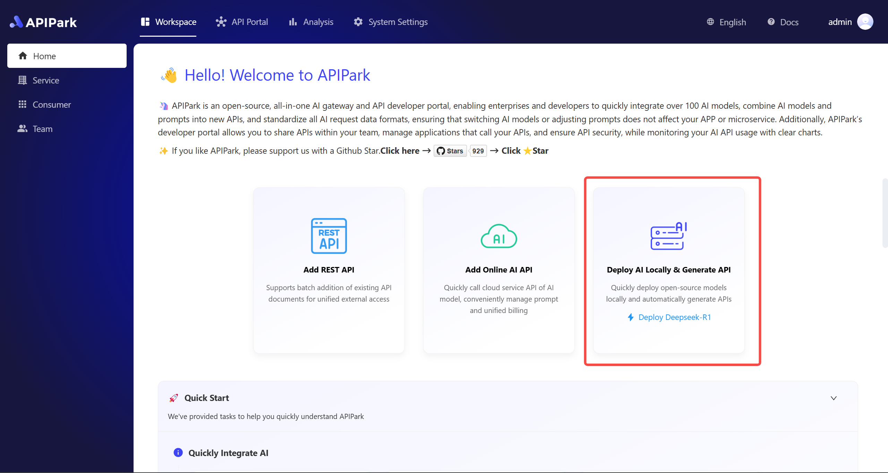

# One-click LLM Deployment

APIPark One-click deployment LLM capability enables users to deploy mainstream open-source large language models (such as DeepSeek, LLaMA, ChatGLM, QWen, etc.) through a visual interface with one click, automatically completing model optimization, service deployment, and gateway configuration initialization. Developers do not need to focus on the underlying architecture; they can deploy open-source models locally within minutes and transform them into API interfaces that comply with the openai request and response format. It can be integrated into existing business systems, significantly reducing the threshold for AI application implementation and helping enterprises quickly build intelligent service capabilities.

## 1. Deploy Open-Source LLM
- Click the "Deploy AI Locally & Generate API" card on the homepage

  

Note: If you click "Deploy Deepseek-R1" directly, the model will be deployed directly without further steps.

- Enter the required vendor name, select the corresponding model, and click confirm to initiate deployment.

  

- The deployment process will go through three stages: "Download model files", "Deploy model", and "Initialize configuration". Users can view the deployment process log at any time.

  

- After successful deployment, a service with the model name will be added to the service list, and you can enter the service to call the local model.

  

## 2. Call Open-Source LLM
- In the consumer list, find the subscriber consumer of the service. Generally, it defaults to "Demo Application". Go to the consumer details and get its API Key. Copy this API Key for use when calling the interface.

  

- Enter the newly deployed open-source AI service and check for any errors in its detailed configuration. After confirming that there are no errors, you need to click the [New Publishment] button in the publishing menu. Publish the current configuration to the gateway before it can be called.

  

- After publishing, find the service in the API portal menu, and you can call the corresponding interface. When calling this interface, use the API Key mentioned above for authorization verification.

  
