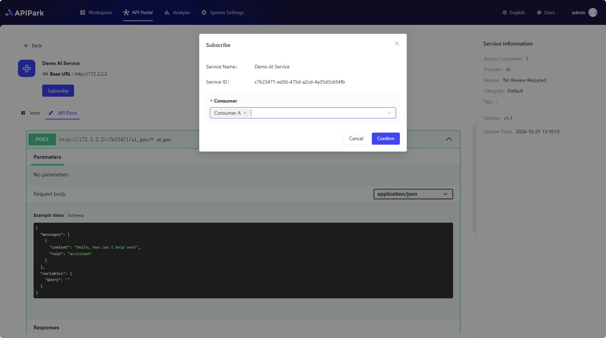
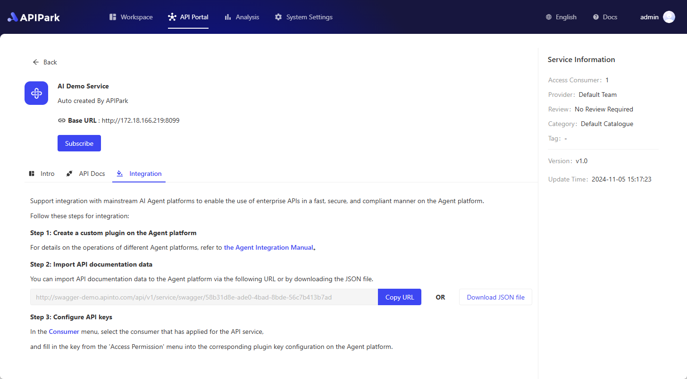

# API Developer Portal

👀 With the explosive growth of APIs within enterprises, IT management teams need a unified platform to display reusable internal APIs, allowing internal developers to quickly develop new products based on existing APIs. This also helps to avoid management costs and data leakage issues caused by arbitrary internal API usage.

✨ APIPark's **Developer Portal** is designed to showcase publicly available API services within a team, enabling developers to easily browse and find APIs that meet their needs, thus reducing the time spent searching and selecting APIs. Before using any API service, developers must subscribe to the service and wait for admin approval before they can officially call the API. This prevents unauthorized API calls and potential data breaches.

APIPark automatically generates API usage statistics, displaying long-term call trends and performance changes to help companies maintain API stability.

## Create a Consumer

Before subscribing to API services, you need to create a **Consumer**. A consumer is the entity that **subscribes to services** and **calls APIs**. Consumers obtain the right to call APIs within a service by subscribing to it, ensuring data safety and compliance with access permissions.

For creating a consumer, please refer to [🔗 Create a Consumer](consumers.md)

## Subscribe to API Services

In the **API Portal** module, you can see all publicly available API services. Click on the service you want to subscribe to, go to the detailed service introduction page, then click the **Subscribe** button, and select the **Consumer** for this subscription in the popup.

> 💡 If the service you are subscribing to requires **manual review**, you may need to enter the purpose of your subscription to assist the service admin in the review process. You will need to wait for the subscription to be approved by the admin before you can call the service's API. Otherwise, APIPark will deny your API request and prompt a lack of API access rights.
> 
> 💡 If the service you are subscribing to does not require a review, you can call the service's API with consumer authentication immediately after subscribing.
> 
> [🔗 Learn More: Review Consumers](services/review_consumers.md)

## Call API

For calling the service's API, please refer to [🔗 Call API](call_api.md)

# **API** **Service Integration**

APIPark supports seamless integration of API services into various AI Agent platforms. Developers can easily import these API services into their chosen AI Agent platform by simply copying and sharing the URL of the external API documentation, with no complex configuration or manual input required.

This integration method not only improves work efficiency but also ensures the accuracy and consistency of the API services. Additionally, AI Agent platforms can fully leverage the rich API resources provided by APIPark to expand functionality and service coverage.

## **Obtain Integration URL or File**

Go to the **API Marketplace** module, select a specific API service, and enter the service details page. Then, choose the **Integration** tab. On this subpage, you can click the **Copy URL** button to obtain the integration URL. If the Agent platform you want to integrate with does not support URL-based integration, you can click **Download** **JSON** **File** to download the current API service’s JSON file, which is formatted in OpenAPI 3.0 standard.

  

## **Configure Integration Address Domain**

The system will by default use the current APIPark domain as the integration address domain. However, to comply with the company’s network security policies, you can configure a separate access domain for the integration address. Go to the **System Settings** module, select the **General** menu on the left, and then configure the **Integration Address**. Enter the domain name in the input field for the integration address.

  