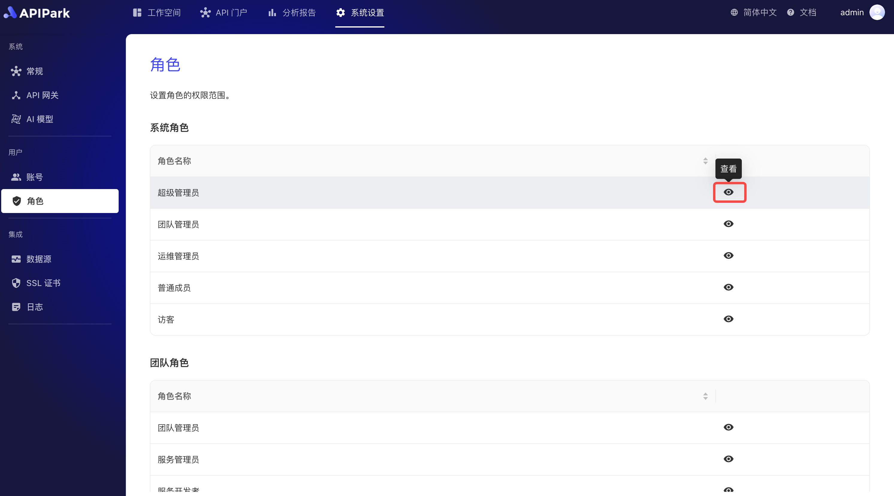
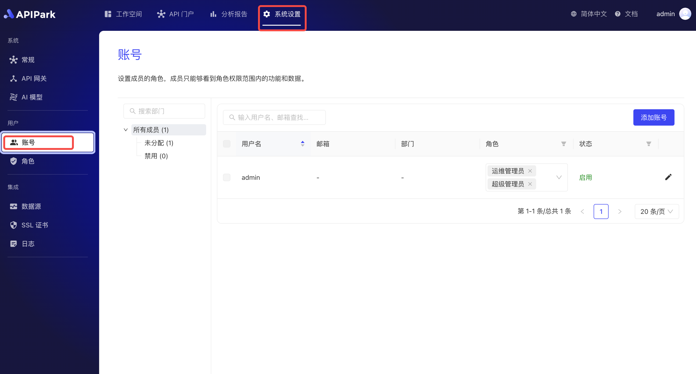

# User Roles

The user role module of APIPark is used for managing the permissions of different roles within the system, ensuring users have appropriate access and operational rights within their scope of duties. This module categorizes roles into **System Roles** and **Team Roles**, which are applicable for platform-level and team-level permissions control respectively.

- **System Roles**: Includes roles like Super Administrator, Team Administrator, and Regular Member, primarily used for system-default general roles.
- **Team Roles**: Such as Team Administrator, Service Developer, Application Administrator, etc., used for flexible permissions allocation within team members.

Every role can have detailed permissions set, including **Organization Management** (View and management of members, teams, roles), **System Settings** (access permissions for modules like service catalogs, clusters, SSL certificates, data sources, log configurations, AI providers, etc.). Through this module, system administrators can finely control the access rights of various users, enhancing system security and management efficiency.

## Overview of Role Permissions
### System Level Permissions

<table>
  <tr>
    <th></th>
    <th></th>
    <th></th>
    <th>Super Administrator (Unmodifiable)</th>
    <th>Team Administrator</th>
    <th>Operations Administrator</th>
    <th>[Default] Regular Member</th>
  </tr>
  <tr>
    <th rowspan="6">Organization</th>
    <td rowspan="2">Members</td>
    <td>View</td>
    <td>✔</td>
    <td></td>
    <td></td>
    <td></td>
  </tr>
  <tr>
    <td>Manage</td>
    <td>✔</td>
    <td></td>
    <td></td>
    <td></td>
  </tr>
  <tr>
    <td rowspan="2">Teams</td>
    <td>View</td>
    <td>✔</td>
    <td>✔</td>
    <td></td>
    <td></td>
  </tr>
  <tr>
    <td>Manage</td>
    <td>✔</td>
    <td>✔</td>
    <td></td>
    <td></td>
  </tr>
  <tr>
    <td rowspan="2">Roles</td>
    <td>View System Roles</td>
    <td>✔</td>
    <td></td>
    <td></td>
    <td></td>
  </tr>
  <tr>
    <td>View Team Roles</td>
    <td>✔</td>
    <td>✔</td>
    <td></td>
    <td></td>
  </tr>
  <tr>
    <th rowspan="2">API Portal</th>
    <td rowspan="2">Service Categories</td>
    <td>View</td>
    <td>✔</td>
    <td></td>
    <td>✔</td>
    <td></td>
  </tr>
  <tr>
    <td>Manage</td>
    <td>✔</td>
    <td>✔</td>
    <td></td>
    <td></td>
  </tr>
  <tr>
    <th rowspan="8">Operations</th>
    <td rowspan="2">Clusters</td>
    <td>View</td>
    <td>✔</td>
    <td></td>
    <td>✔</td>
    <td></td>
  </tr>
  <tr>
    <td>Manage</td>
    <td>✔</td>
    <td></td>
    <td>✔</td>
    <td></td>
  </tr>
  <tr>
    <td rowspan="2">SSL Certificates</td>
    <td>View</td>
    <td>✔</td>
    <td></td>
    <td>✔</td>
    <td></td>
  </tr>
  <tr>
    <td>Manage</td>
    <td>✔</td>
    <td></td>
    <td>✔</td>
    <td></td>
  </tr>
  <tr>
    <td rowspan="2">Logs</td>
    <td>View</td>
    <td>✔</td>
    <td></td>
    <td>✔</td>
    <td></td>
  </tr>
  <tr>
    <td>Manage</td>
    <td>✔</td>
    <td></td>
    <td>✔</td>
    <td></td>
  </tr>
  <tr>
    <td rowspan="2">OpenAPI</td>
    <td>View</td>
    <td>✔</td>
    <td></td>
    <td>✔</td>
    <td></td>
  </tr>
  <tr>
    <td>Manage</td>
    <td>✔</td>
    <td></td>
    <td>✔</td>
    <td></td>
  </tr>
  <tr>
    <td rowspan="2">Dashboard</td>
    <td>Running View</td>
    <td>View</td>
    <td>✔</td>
    <td></td>
    <td>✔</td>
    <td></td>
  </tr>
  <tr>
    <td>System Topology</td>
    <td>View</td>
    <td>✔</td>
    <td></td>
    <td>✔</td>
    <td></td>
  </tr>
  <tr>
    <th rowspan="4">Workspace</th>
    <td>Apps</td>
    <td>View All Apps (if unchecked, view only those joined)</td>
    <td>✔</td>
    <td>✔</td>
    <td>✔</td>
    <td></td>
  </tr>
  <tr>
    <td>Services</td>
    <td>View All Services (if unchecked, view only those joined)</td>
    <td>✔</td>
    <td>✔</td>
    <td>✔</td>
    <td></td>
  </tr>
  <tr>
    <td>Teams</td>
    <td>View All Teams (if unchecked, view only those joined)</td>
    <td>✔</td>
    <td>✔</td>
    <td>✔</td>
    <td></td>
  </tr>
  <tr>
    <td>API Portal</td>
    <td>View</td>
    <td>✔</td>
    <td>✔</td>
    <td>✔</td>
    <td>✔</td>
  </tr>
</table>

### Team Level Permissions

<table>
  <tr>
    <th></th>
    <th></th>
    <th></th>
    <th>Team Administrator</th>
    <th>Service Administrator</th>
    <th>Service Developer</th>
    <th>Application Administrator</th>
    <th>[Default] Application Developer</th>
  </tr>
  <tr>
    <th rowspan="10">Services</th>
    <td rowspan="2">API</td>
    <td>View</td>
    <td>✔</td>
    <td>✔</td>
    <td>✔</td>
    <td></td>
    <td></td>
  </tr>
  <tr>
    <td>Manage</td>
    <td>✔</td>
    <td>✔</td>
    <td>✔</td>
    <td></td>
    <td></td>
  </tr>
  <tr>
    <td rowspan="2">Upstream</td>
    <td>View</td>
    <td>✔</td>
    <td>✔</td>
    <td>✔</td>
    <td></td>
    <td></td>
  </tr>
  <tr>
    <td>Manage</td>
    <td>✔</td>
    <td>✔</td>
    <td>✔</td>
    <td></td>
    <td></td>
  </tr>
  <tr>
    <td rowspan="2">Publication</td>
    <td>View</td>
    <td>✔</td>
    <td>✔</td>
    <td>✔</td>
    <td></td>
    <td></td>
  </tr>
  <tr>
    <td>Manage</td>
    <td>✔</td>
    <td>✔</td>
    <td>✔</td>
    <td></td>
    <td></td>
  </tr>
  <tr>
    <td rowspan="2">Subscriber Management (including subscriber approval and list)</td>
    <td>View</td>
    <td>✔</td>
    <td>✔</td>
    <td></td>
    <td></td>
    <td></td>
  </tr>
  <tr>
    <td>Manage</td>
    <td>✔</td>
    <td>✔</td>
    <td></td>
    <td></td>
    <td></td>
  </tr>
  <tr>
    <td>Service Management</td>
    <td>Manage (Add, Modify, Delete Service)</td>
    <td>✔</td>
    <td>✔</td>
    <td></td>
    <td></td>
    <td></td>
  </tr>
  <tr></tr>
  <tr>
    <th rowspan="6">Applications</th>
    <td rowspan="2">Subscribed Services</td>
    <td>View</td>
    <td>✔</td>
    <td></td>
    <td></td>
    <td>✔</td>
    <td>✔</td>
  </tr>
  <tr>
    <td>Manage</td>
    <td>✔</td>
    <td></td>
    <td></td>
    <td>✔</td>
    <td>✔</td>
  </tr>
  <tr>
    <td rowspan="2">Access Authorization</td>
    <td>View</td>
    <td>✔</td>
    <td></td>
    <td></td>
    <td>✔</td>
    <td>✔</td>
  </tr>
  <tr>
    <td>Manage</td>
    <td>✔</td>
    <td></td>
    <td></td>
    <td>✔</td>
    <td></td>
  </tr>
  <tr>
    <td rowspan="2">Application Management</td>
    <td>Manage (Add, Modify, Delete Application)</td>
    <td>✔</td>
    <td></td>
    <td></td>
    <td>✔</td>
    <td></td>
  </tr>
  <tr></tr>
  <tr>
    <th rowspan="4">Team</th>
    <td rowspan="2">Members</td>
    <td>View</td>
    <td>✔</td>
    <td>✔</td>
    <td>✔</td>
    <td>✔</td>
    <td>✔</td>
  </tr>
  <tr>
    <td>Manage</td>
    <td>✔</td>
    <td></td>
    <td></td>
    <td></td>
    <td></td>
    <td></td>
  </tr>
  <tr>
    <td rowspan="2">Team Management</td>
    <td>View</td>
    <td>✔</td>
    <td></td>
    <td></td>
    <td></td>
    <td></td>
  </tr>
  <tr>
    <td>Manage (Modify, Delete Team)</td>
    <td>✔</td>
    <td></td>
    <td></td>
    <td></td>
  </tr>
</table>

## Viewing Role Permissions

1. Click `System Settings` -> `Roles` to access the system roles list.

 

2. Click the `View` button at the end to enter the role permissions details page.

  

  

## Assigning System Roles
1. Click `System Settings` -> `Accounts` to access the accounts list page.

  

2. Select the needed system role from the role dropdown menu.

  

## Assigning Team Roles
1. Click `Workspace` -> `Teams` to access the team list page.

  

2. Select the team you want to assign roles for, enter the team page, and click `Accounts`.

  

3. Choose the team role you wish to allocate from the role dropdown menu.

  