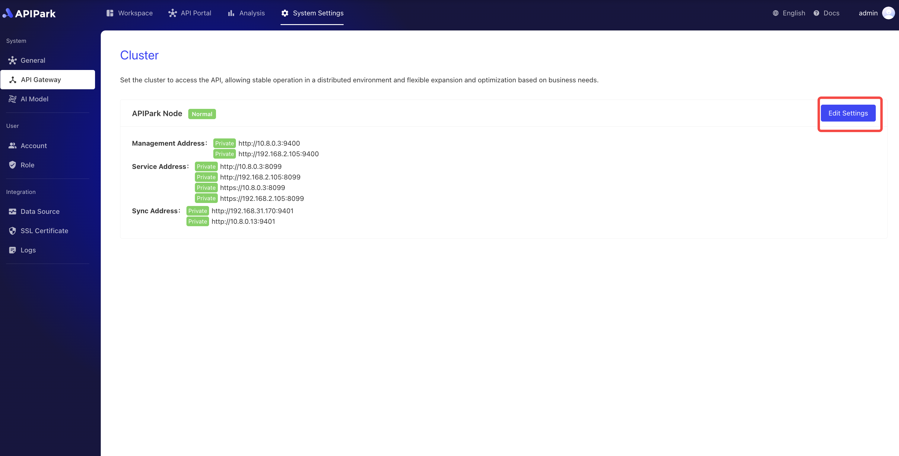
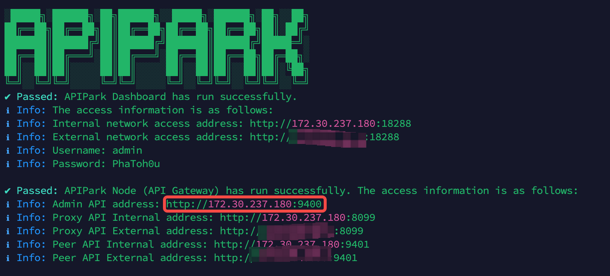
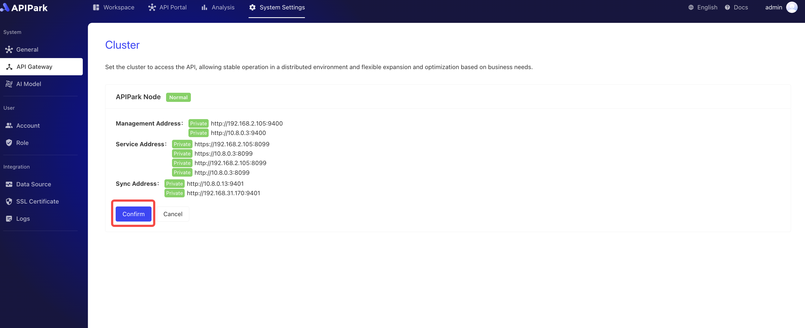

# API Gateway Cluster

**API Gateway Cluster** is a core component of **APIPark**. It undertakes several important tasks, such as API traffic management, security control, and traffic optimization. For **APIPark**, the API Gateway Cluster provides critical support, making API invocation and management more secure, reliable, and efficient.

The role of the API Gateway Cluster in **APIPark** is reflected in the following aspects:

* **Enhancing API Security and Control**: With the gateway cluster's authentication and security policies, APIs in the developer portal can be opened to consumers in a more secure and compliant manner, reducing security risks and making service access safer.

* **Providing Stable High-Performance Support**: The load balancing and auto-scaling capabilities of the gateway cluster help the developer portal handle high concurrent traffic, ensuring the response speed of API calls and optimizing consumer experience.

* **Simplifying Call Restrictions and Permission Management**: The gateway cluster sets rate limits and traffic control according to consumer subscription content. This allows the developer portal to flexibly define different levels of access permissions, making API usage more efficient and preventing abuse.

* **Real-Time Call Monitoring and Analysis**: Utilizing the monitoring and logging functionalities of the gateway cluster, the developer portal can provide consumers with detailed call statistics and usage analysis, aiding in the optimization of API call strategies.

* **Enhancing Integration Convenience**: Through the smart routing and data transformation capabilities of the gateway cluster, the API interfaces in the developer portal can automatically adapt to the varying system needs of consumers, improving integration efficiency and reducing the connection complexity for developers.

The API Gateway Cluster is the backbone of **APIPark**, ensuring secure, stable, and efficient API calls. It not only provides comprehensive security control and performance optimization for API call processes but also, through monitoring and management functionalities, allows the developer portal to better serve consumers, providing solid technical assurance for the sustainable development of the API ecosystem.

## Configuring the Gateway Cluster

:::tip
Before configuring, ensure that the **APIPark** gateway node has been deployed. If not, please refer to the tutorial [Deploy APIPark Gateway Node](../deploy.md)
:::
1. Click on `System Configuration` -> `API Gateway`, then click on `Modify Settings`.

  

2. Enter the cluster node Admin address in the pop-up box.
:::tip
If you deployed the APIPark gateway node using the one-click deployment script, the node’s Admin communication address will be displayed upon completion.

  
:::

3. Once filled in, click `Next`.

  

4. After passing the test, click to confirm.

  