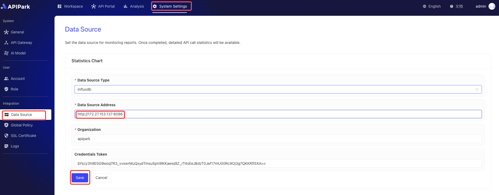

# Data Source

APIPark stores API call statistics in an external database to facilitate the generation of various analytical reports.

## Set Data Source for Analysis Charts

Go to the **System Settings** module, click **Data Source** in the sidebar, and modify the analysis chart settings on the data source list page.

> 💡 APIPark's API call analysis reports rely on the InfluxDB database. If you deploy using the script provided by APIPark, 
>
> 
>
> InfluxDB will be installed by default. Learn more: [🔗 Deploy APIPark](deploy.md).

