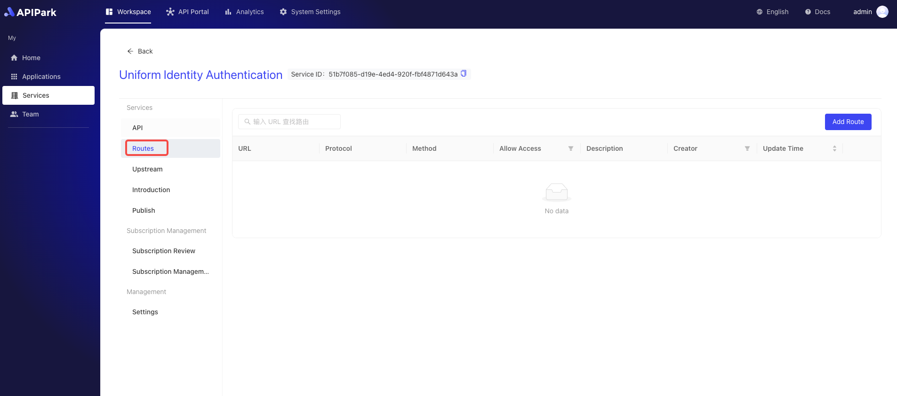
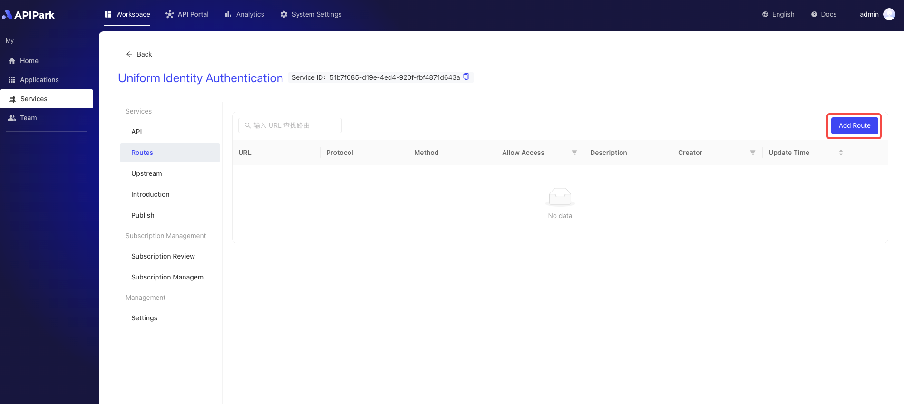
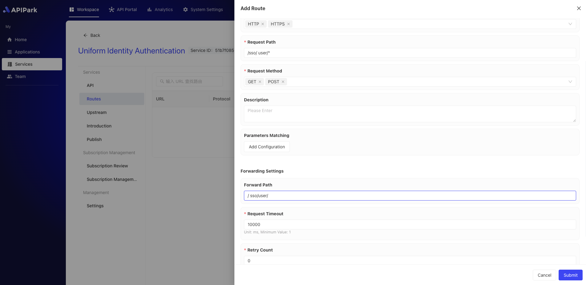

# Adding Routes

Routing refers to the process where the API Gateway forwards client requests to the appropriate backend services based on specific paths or conditions. The API Gateway is an intermediary layer located between the client and the server, used to manage, monitor, and route client API requests. Its routing capability is one of the core functionalities of the API Gateway.

In an API Gateway, **routing** typically relies on conditions such as URL paths, HTTP methods (like GET, POST), request headers, query parameters, and more. When the API Gateway receives a client request, it determines which backend service to forward the request to, based on pre-configured routing rules.

## Demonstration

### Adding a Route

1. Select the service you need to configure and enter its details page.

  

2. Click on "Route".

  

3. Click on "Add Route".

  

4. Fill in the basic information for the route.

  

**Field Descriptions**

| Field Name              | Field Description                                               |
| :---------------------- | :-------------------------------------------------------------- |
| Intercept this request  | Whether to intercept the requests of this interface            |
| Request Method          | Supports common HTTP request methods like GET, POST, PUT, DELETE, and allows multiple selections |
| Request Path            | URI of the API, applied to the relative path in the request URL, supports Restful parameters and prefix matching |
| Advanced Matching       | Supports routing matches through request headers, parameters, and Cookies; allows multiple entries |
| Forward Upstream Path   | The relative path to be forwarded upstream                      |
| Request Timeout         | Defines the timeout for the gateway to forward requests and receive responses from upstream |
| Retry Count             | When forwarding requests to upstream fails, the gateway will automatically retry, with a maximum retry count |
| Forward Upstream Headers| Allows creating, editing, and deleting parameters for forward upstream headers, primarily used for authentication between gateway and upstream |

Once completed, click the "Submit" button.
