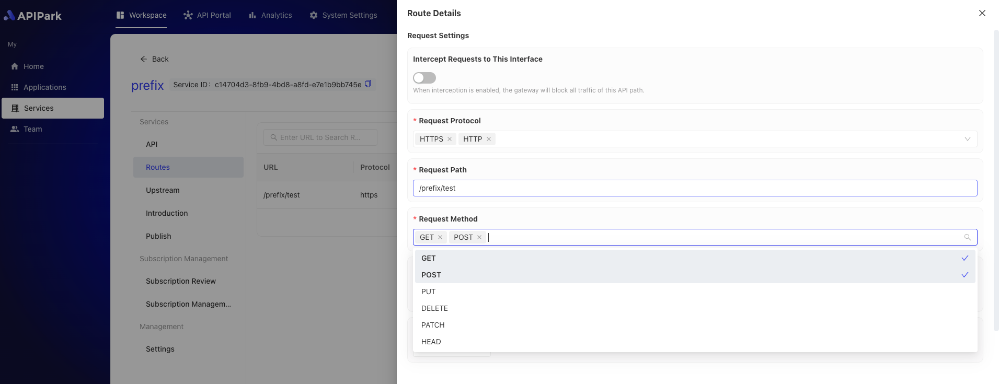
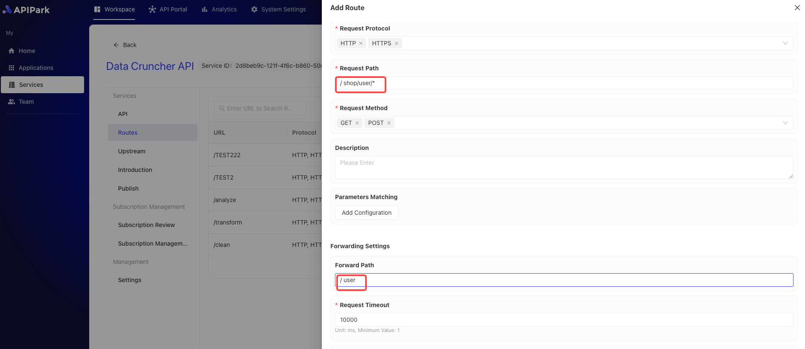
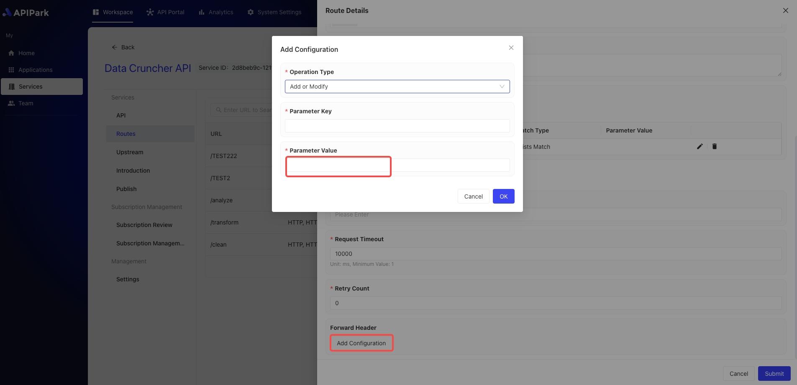

# Add Routing

Routing refers to the process where an API gateway forwards client requests to appropriate backend services based on a specific path or conditions. The API gateway is an intermediary layer positioned between the client and server, responsible for managing, monitoring, and routing client API requests. Routing is one of the core functions of the API gateway.

In an API gateway, **routing** is often based on several conditions such as URL path, HTTP method (e.g., GET, POST), request headers, query parameters, etc. When the API gateway receives a client request, it determines which backend service to forward the request to based on pre-configured routing rules.

## Routing Matching Rules

APIPark's routing can be configured with multiple criteria, including request protocol, method, path, headers, and query parameters.

Matching priority is: Request Protocol > Request Method > Request Path > Request Header > Query Parameters

**Request Protocol, Request Method** can be multi-selected during configuration, as shown below:

  

### Request Path Matching Rules

| Matching Type | Rule | Description                                                  |
| ------------- | ---- | ------------------------------------------------------------ |
| Exact Match   | str  | The value exists and is exactly equal to str                 |
| Prefix Match  | str* | The value exists and str is a prefix of the value. In this mode, the gateway appends the path following **str** to the forwarding path. |

#### Exact Match Example

* Request Path: /shop/user/info
* Forward Path: /user/info

  

The request path then appears as follows:

```
POST /shop/user/info
```

The path to the upstream service requested by the gateway is:

````
POST /user/info
````

If the request path is not `/shop/user/info`, this route cannot be matched.

#### Prefix Match Example

* Request Path: /shop/user/*
* Forward Path: /user/

  

The relationship between the requested path and the actual path forwarded to the upstream service is as follows:

```shell
POST /shop/user/info    ->   POST /user/info
POST /shop/user/phone   ->   POST /user/phone
POST /shop/user/order   ->   POST /user/order
```

### Request Header, Query Parameter Value Matching Rules

| Matching Type              | Rule   | Description                                               |
| -------------------------- | ------ | --------------------------------------------------------- |
| Exact Match                | str    | The value exists and is exactly equal to str              |
| Prefix Match               | str*   | The value exists and str is a prefix of the value         |
| Suffix Match               | *str   | The value exists and str is a suffix of the value         |
| Substring Match            | *str*  | The value exists and str is a substring of the value      |
| Not Equal Match            | !=str  | The value exists and does not equal str                   |
| Empty Value Match          | $      | The key must exist with an empty value, mainly for headers and query parameters |
| Existence Match            | **     | The key must exist and not be empty, mainly for headers and query parameters |
| Non-existence Match        | !      | The key must not exist, mainly for headers and query parameters |
| Case-sensitive Regex Match | ~=str  | The value matches the regex                               |
| Case-insensitive Regex Match | ~*=str | The value matches the regex                               |
| Wildcard Match             | *      | Always matches successfully                               |

  

## Operational Demonstration

### Add Routing

1. Select the service you want to configure and enter the service details page.

  

2. Click "Routing"


3. Click "Add Routing"


4. Fill in the basic routing information


**Field Description**

| Field Name         | Field Description                                             |
| ------------------ | ------------------------------------------------------------- |
| Intercept the Request | Whether to intercept the request for this interface         |
| Request Method     | Supports common HTTP methods like GET, POST, PUT, DELETE, etc., and allows multiple selections |
| Request Path       | URI of the API used for the relative path in the request URL, supports Restful parameters and prefix matching |
| Advanced Matching  | Supports routing matches via request headers, parameters, or Cookies, allowing multiple entries |
| Forwarding Upstream Path | Relative path forwarded to the upstream                     |
| Request Timeout    | Defines the timeout for the gateway forwarding requests to upstream |
| Retry Count        | When a request forwarded to upstream fails, the gateway will automatically retry; the maximum number of attempts is defined |
| Forwarding Upstream Headers | Allows creation, editing, and deletion of headers in the forwarded request, mainly used for authentication between the gateway and upstream |

After completing the fields, click the "Submit" button.


This guide covers all the steps to configure routing in an application, including selecting routing options, adding routes, choosing request methods, configuring API basic information, and finally submitting the configuration.