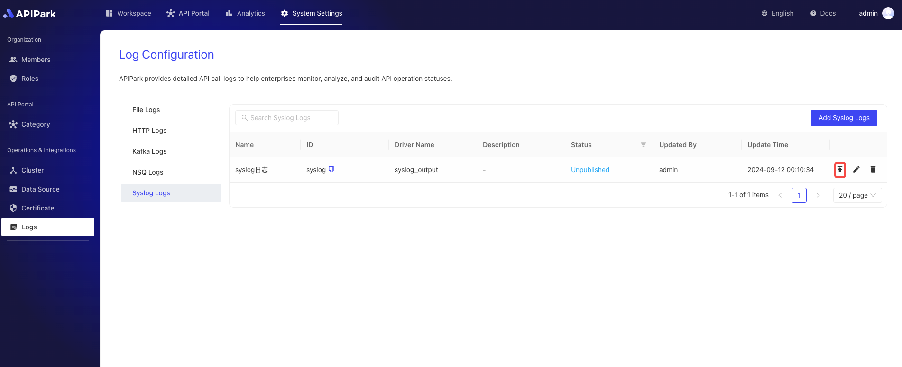

# Log Configuration

In APIPark, the log configuration feature allows users to output log data from the system's operational processes to various target storage and processing systems. Logs are a means to expose the internal state of a system, and good logging can help developers quickly locate issues and find appropriate ways to resolve them. By configuring log output, centralized management and analysis of logs can be achieved, thereby enhancing system maintainability and efficiency in troubleshooting.

## **Supported Log Output Targets**

**File:**

* Logs can be configured to be output to local or remote file systems, facilitating subsequent viewing and backup.
* This method is suitable for scenarios requiring simple storage and viewing of logs, as it is easy to implement and manage.

**HTTP Server:**

* Logs can be sent to a specified HTTP server via the HTTP protocol for real-time reception and processing.
* This method is suitable for scenarios requiring real-time monitoring and processing of logs, such as transmitting logs to log analysis services through an HTTP interface.

**Syslog Server:**

* Logs can be sent to a Syslog server for centralized log management and analysis using the Syslog protocol.
* This method is suitable for enterprise-grade systems, especially in Linux/Unix environments, and can integrate with existing log management infrastructure.

**Kafka:**

* Logs can be sent to a Kafka message queue for high-throughput log collection and stream processing.
* This method is suitable for large-scale distributed systems that require real-time analysis and processing of logs.

**NSQD:**

* Logs can be sent to NSQD (a distributed real-time messaging platform) for high-performance log transmission and processing.
* This method is suitable for scenarios requiring low-latency, high-availability log processing, particularly in microservices architecture.

## **Advantages**

**Flexibility:**

* Supports various log output targets, allowing users to choose the most appropriate log storage and processing method based on specific needs.

**Centralized Management:**

* By outputting logs to centrally managed systems, log data can be uniformly managed and analyzed, enhancing operational efficiency.

**Real-Time Monitoring:**

* Supports real-time log output to systems like HTTP servers and Kafka, enabling real-time monitoring and rapid response to system issues.

**Scalability:**

* Supports distributed log processing systems (such as Kafka and NSQD), capable of handling large-scale log data and meeting high concurrency and high throughput needs.

**Ease of Integration:**

* Supports standardized log protocols (such as Syslog and HTTP), enabling seamless integration with existing log management and analysis tools.  
