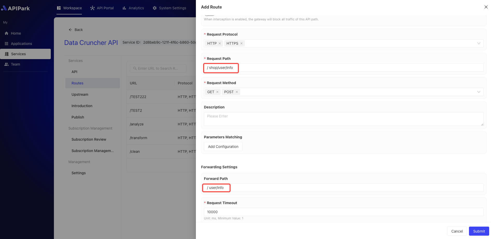
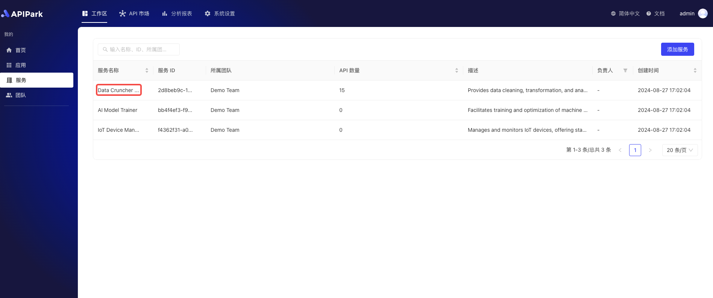
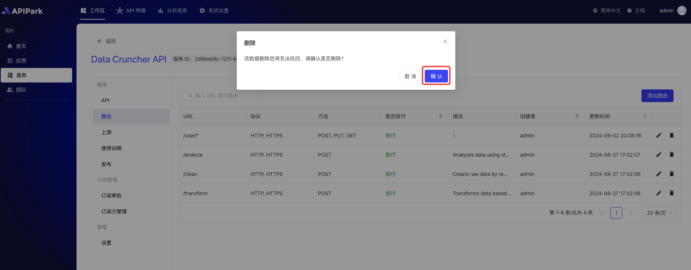

# Routing

Routing refers to the process by which an API gateway forwards a client request to the corresponding backend service based on a specific path or conditions from the request. An API gateway is an intermediary layer situated between the client and server, responsible for managing, monitoring, and routing client API requests. Its routing functionality is one of the core features of an API gateway.

In an API gateway, **routing** is typically based on various conditions such as URL path, HTTP method (e.g., GET, POST), request headers, and query parameters. When the API gateway receives a client request, it decides which backend service to forward the request to based on pre-configured routing rules.

## Routing Matching Rules

APIPark's routing can be configured with multiple criteria, including request protocol, request method, request path, request headers, and query parameters.

The matching priority is: Request Protocol > Request Method > Request Path > Request Header > Query Parameter

**Request Protocol, Request Method** can be multi-selected during configuration, as shown below:

  

### Request Path Matching Rules

| Match Type     | Rule | Description                                                  |
| -------------- | ---- | ------------------------------------------------------------ |
| Exact Match    | str  | The value exists and is completely equal to str              |
| Prefix Match   | str* | The value exists and str is the prefix of the value; in this mode, the gateway appends the path after **str** to the forwarding path. |

#### Exact Match Example

* Request Path: /shop/user/info
* Forwarding Path: /user/info

  

In this case, the request path is as follows:

```
POST /shop/user/info
```

The gateway will request the upstream service with the following path:

````
POST /user/info
````

If the request path is not `/shop/user/info`, the route cannot be matched.

#### Prefix Match Example

* Request Path: /shop/user/*
* Forwarding Path: /user/

  

In this case, the relationship between the requested path and the actual path forwarded to the upstream service is as follows:

```shell
POST /shop/user/info    ->   POST /user/info
POST /shop/user/phone   ->   POST /user/phone
POST /shop/user/order   ->   POST /user/order
```

### Request Header, Query Parameter Value Matching Rules

| Match Type                  | Rule   | Description                                                  |
| --------------------------- | ------ | ------------------------------------------------------------ |
| Exact Match                 | str    | The value exists and is completely equal to str              |
| Prefix Match                | str*   | The value exists and str is the prefix                       |
| Suffix Match                | *str   | The value exists and str is the suffix                       |
| Substring Match             | *str*  | The value exists and str is a substring                      |
| Not Equal Match             | !=str  | The value exists and differs from str                        |
| Empty Value Match           | $      | The key must exist and the value must be empty, often used for headers or query parameters |
| Existence Match             | **     | The key must exist and not be empty, often used for headers or query parameters |
| Non-existence Match         | !      | The key must not exist, often used for headers or query parameters |
| Case-sensitive Regex Match  | ~=str  | The value matches the regular expression                      |
| Case-insensitive Regex Match| ~*=str | The value matches the regular expression                      |
| Any Match                   | *      | Always matches successfully                                  |

  


## Operations Demonstration

### Adding a Route

1. Select the service to configure and enter the service details page.

  

2. Click "Route"


3. Click "Add Route"


4. Fill in the basic route information


**Field Descriptions**

| Field Name         | Description                                                 |
| :----------------- | :----------------------------------------------------------- |
| Intercept Request  | Whether to intercept the request for this interface          |
| Request Method     | Supports common HTTP request methods like GET, POST, PUT, DELETE, etc., and allows multiple selections |
| Request Path       | The API's URI used for the relative path in the request URL, supports Restful parameters and path prefix matching |
| Advanced Matching  | Supports routing matches via request headers, parameters, and cookies, allowing multiple entries |
| Forwarding Path    | The relative path for forwarding upstream                    |
| Request Timeout    | Defines the timeout duration for forwarding requests to upstream until response |
| Retry Count        | Triggers automatic retry for forwarding requests upon failure, not exceeding the maximum retry count |
| Upstream Header    | Allows creation, editing, and deletion of request headers for upstream forwarding, mainly for authentication between the gateway and upstream |

After filling, click the "Submit" button.


This guide covers all steps in configuring routing in the application, including selecting routing options, adding routes, choosing request methods, configuring API basic information, and ultimately submitting the configuration.

### Editing a Route

1. Click the `Edit` button next to the route to be edited.

  

2. Fill in the route information.

  

After completion, click submit.

### Deleting a Route

1. Click the `Delete` button next to the route to be deleted.

  

2. Click confirm in the pop-up box.

  
