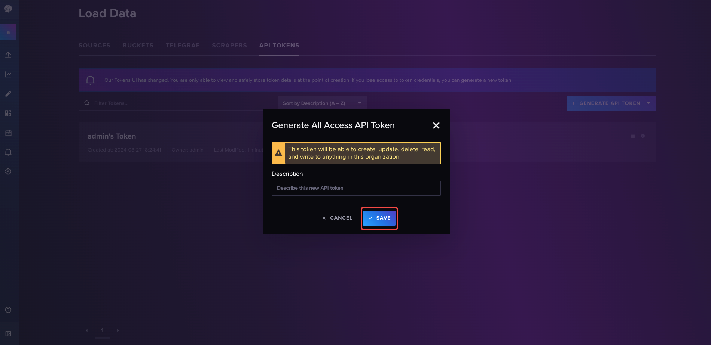

# Deploy APIPark
## Hardware Requirements

:::tip
Recommended configuration:

- **CPU**: 8 cores
- **Memory**: 16GB
- **Disk Storage**: 200GB
- **Operating System**: Linux / Mac
- **System Architecture**: AMD64 / ARM64
:::

:::note
Minimum configuration:

- **CPU**: 2 cores
- **Memory**: 4GB
- **Disk Storage**: 200GB
- **Operating System**: Linux / Mac
- **System Architecture**: AMD64 / ARM64
:::

## Program Dependencies

`APIPark` depends on `MYSQL, Redis, InfluxDB` databases. The required versions of the databases are as follows:

<table><thead><tr><th width="184">Name</th><th>Version Requirement</th></tr></thead><tbody><tr><td>MYSQL</td><td>>=5.7.x</td></tr><tr><td>Redis</td><td>>=6.2.x</td></tr><tr><td>InfluxDB</td><td>>=2.6</td></tr></tbody></table>

## Deployment Method

### Using Script Deployment

:::note
Supported Systems:

* CentOS 7.9 (7.x as representative)
* CentOS 8.5 (8.x as representative)
* Ubuntu 20.04
* Ubuntu 22.04
* Debian 12.4
* Alibaba Cloud Linux 3.2104
* Alibaba Cloud Linux 2.1903

The installation has been tested only on the above systems. If you need one-click deployment for other systems, you can submit an [Issue](https://github.com/APIParkLab/APIPark/issues) to us.
:::

Enter the one-click deployment command:

```
curl -sSO https://download.apipark.com/install/quick-start.sh; bash quick-start.sh
```

Follow the prompts to deploy. After the deployment is complete, deployment information will be displayed.

## Configure InfluxDB

### Initialize InfluxDB

:::tip

The one-click deployment script automatically installs the InfluxDB database. After deployment is complete, the access address for InfluxDB will be displayed, as shown below:


:::

1. Open the InfluxDB address in a browser.


2. Fill in the initialization information, including username, password, organization name, and bucket name.
   :::warning
   The `Organization Name` should be `apipark`, and the `Bucket Name` should be `apinto`.
   :::
   

### Create API Tokens

:::tip

InfluxDB's API Tokens are tokens used for authentication and authorization, allowing users and applications to securely access InfluxDB's data and functionalities. Their main purposes are as follows:

1. **Access Control**: API Tokens can be used to control who can access the data in the InfluxDB database. Each token can be associated with different permission levels to restrict access to specific databases, organizations, or resources.
2. **Read/Write Permissions**: API Tokens can differentiate between read and write permissions. You can create read-only tokens, write-only tokens, or tokens with both read and write permissions to control the operational capabilities of different users or applications.
3. **Secure Communication**: API Tokens can work with HTTPS to ensure that communication with InfluxDB is encrypted and secure, preventing unauthorized access and data leakage.
4. **Multi-user Management**: In multi-user or multi-tenant environments, API Tokens allow for the generation of different tokens for each user or application with varying permissions as needed.
5. **Audit and Tracking**: Through API Tokens, you can track which users or applications accessed which data and at what time, facilitating logging and security auditing.

:::

1. After entering the InfluxDB browser page, select `API Tokens`.


2. Generate an `All Access API Token`.


3. After entering a description, click `SAVE`.



4. Copy the generated `API Token`. It will be needed later when [configuring the APIPark data source](system_setting/data_source.md). 

