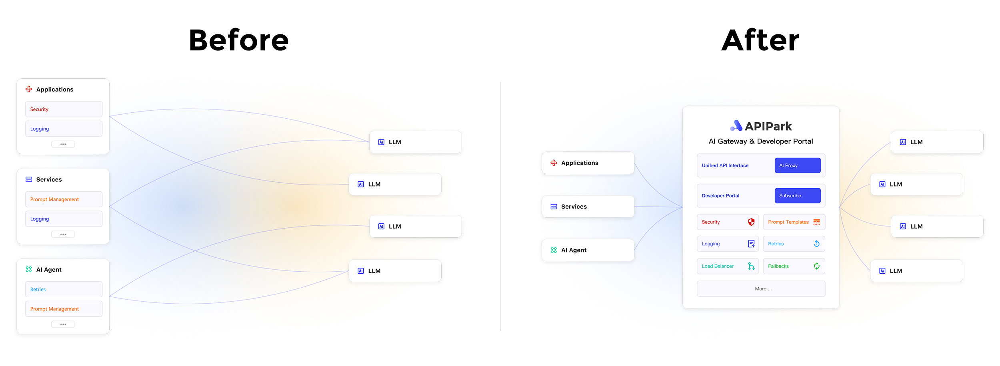
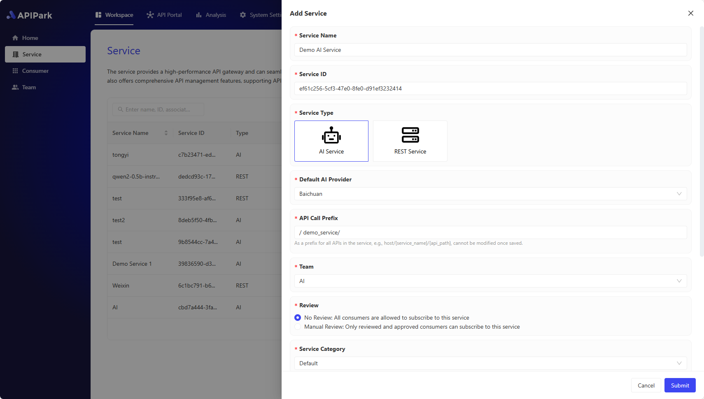
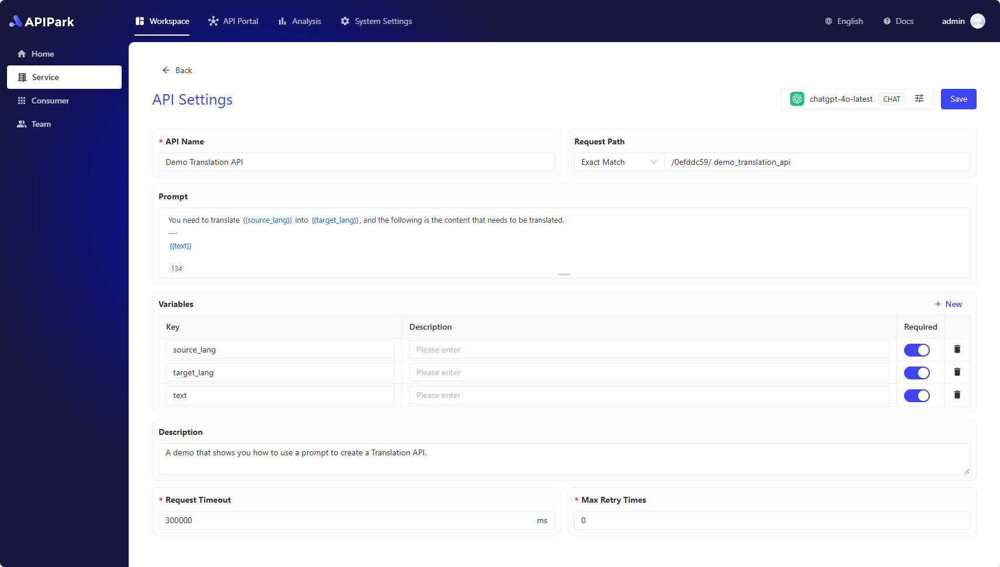

# AI Services (AI Gateway)

👀 With the rapid development of AI, the API design and calling methods of different AI providers (including open source and self-hosted models) are inconsistent, making the way developers and businesses use and manage AI services very complex.

✨ APIPark's AI Service (AI Gateway) provides unified access management to multiple AI models, helping developers quickly integrate and call various AI models. APIPark simplifies the calling process through a unified API format, reducing the complexity of switching models, and supports encapsulating Prompts into standard REST APIs to facilitate API reuse and sharing. APIPark supports full lifecycle management of APIs, including the entire process from design, release, to invocation and offline, and also provides a subscription approval mechanism to help improve data security.

📍 There are the following steps to use APIPark AI Services:

1. Set up AI model provider
2. Create and publish AI service
3. [Optional] Create consumers and subscribe to the service
4. [Optional] Call API

# Setting AI Model Provider

Before creating AI services, you need to configure AI model providers. APIPark supports over 100 AI models, including OpenAI, Anthropic, AWS Bedrock, Google Gemini, and others. Once you configure the provider, you can choose different models to create AI services and manage the authorization information and cost statistics of all AI services uniformly in APIPark.

Go to the **System Settings** module, select **AI Model Management** in the sidebar to see all AI providers supported by APIPark.

To integrate OpenAI, for example, click the settings button, and in the pop-up window:

- Select the **Default AI Model**: The system will automatically set the default AI model when creating an API within the AI service, reducing the number of user operations.
- Fill in the **Provider Configuration**: Each provider has different configuration information. The system will automatically generate the required configuration information based on your selected provider. Configuration information is typically available in the provider's Open API management console, where you can find a quick link to the provider's website in the bottom left corner of the pop-up window.

> 💡 If APIPark does not support the AI provider you are using, feel free to [🔗 submit an issue to us](https://github.com/APIParkLab/APIPark/issues/new)

# Creating and Publishing AI Service

## 1. Create AI Service

Enter the **Workspace** module, select **Service** on the sidebar, then **Create Service**, and fill in:

- **Service Name**
- **Service ID**: A unique identifier for the service, which cannot be changed once saved.
- **Service Type**, choose **AI Service**:
  - **AI Service**: AI gateway that converts different AI models and Prompts to a unified REST API through APIPark.
  - **REST Service**: Traditional API gateway that can access microservices or HTTP REST APIs.
- **Default AI Provider**: Choose which AI provider the APIs in the service will default to using.
- **API Request Prefix**: Set a unified request prefix for all APIs in the service, which cannot be changed once saved.
- **Team**: If you have joined multiple teams, you need to set which team is responsible for managing this service.
- **Subscription Review**:
  - **No Review Required**: All consumers can subscribe and call the service.
  - **Manual Review**: Only consumers who have been reviewed and approved can call the service.
- **Service Category**: Choose the category in which the service will be published on the API portal.

## 2. Create API

After creating a service, APIPark will automatically create a default **Unified API** within the service, which you can directly use to call AI services.

If you need to combine Prompt keywords and AI models into a custom AI API, click **Create API** on the API page and fill in:

- **API Name**
- **API Request Path**
- **Prompt Keyword**: Define what actions the AI needs to perform. For example, you can use keywords to make the AI serve as a translation API or a data analysis API.
- **Variables**: If you want to concatenate the request content of the API in the keyword, you can use the variable function. Variables can be defined in the keyword using `{{param}}`, and they act as request parameters for the API.
- **API Description**
- **Timeout**: API requests generally have a timeout limit to prevent a large number of timed-out requests from affecting APIPark's performance.
- **Max Retry Count**: When an API request times out or the AI model returns an error, APIPark will automatically retry the request. If the maximum retry count is exceeded, APIPark will return an error message to the caller.

Once you've created an API, APIPark automatically generates API documentation, which you can view by selecting **API Documentation** on the sidebar.

## 3. Publish Service

✨ If there are changes in the **API, API Documentation, Usage Introduction, Upstream**, you need to publish a new version for the new configuration to take effect.

Select **Publish** in the sidebar, then click **New Version** and fill in:

- **Version Number**
- **Version Description**

Click **Confirm** to complete the publication.

> 💡 If this is the first time the service is published, it will appear on the **API Portal** and can be subscribed to by **consumers**.
> 💡 If the service has **manual review** enabled, **consumers** who have subscribed to the service need to wait for the **service manager** to approve the review before they can call the API.

# [Optional] Create Consumers and Subscribe to the Service

APIPark provides the **API Portal** feature, allowing users to publish services to the API portal, where they can be viewed, subscribed to, and called by other users.

To ensure safe and standardized use of APIs and reduce API management costs, users need to first create **consumers**. Subscriptions to services are made through consumers, and service calls are made using the consumer's **authorization certificate**.

[🔗 Learn more: Consumers](../consumers.md)

# [Optional] Call API

[🔗 Learn more: Call API](../call_api.md)