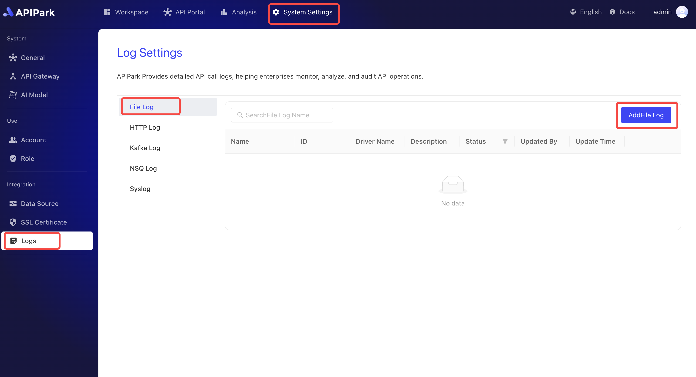

# File Logs

Collect log information from the request gateway and output it to a file for developers to review.

## Features

File Logs: Output request information to log files with the following features:

* Customize the directory and file name for storage
* Split log files periodically to prevent a single file from becoming too large and difficult to review
* Regularly delete expired files to reduce hard disk space usage

## Operation Demo

### Create a New File Log Configuration

1. Click `System Settings` -> `Logs` -> `File Logs`, then click `Add File Log`.
  

2. Fill in the file log configuration

  

**Configuration Explanation**:

| Field Name   | Description                                                   |
| ------------ | ------------------------------------------------------------- |
| File Name    | The name of the stored file; the actual stored name will have the `.log` suffix added, i.e., `{File Name}.log` |
| Storage Directory | The directory where the file is stored, supporting both relative and absolute paths |
| Log Rotation Period | Create a new log file at a certain interval; old log files will be renamed, options: hourly, daily |
| Expiration Time | File retention time in days; files exceeding this time will be deleted regularly |
| Output Format | The format of the output log content; supports single-line and JSON format outputs |
| Formatting Configuration | Template for output format; tutorial available [here](https://help.apinto.com/docs/formatter) |

**File Lifecycle Demo**


**Formatting Configuration Example**

```json
{
   "fields": [
      "$time_iso8601",
      "$request_id",
      "@request",
      "@proxy",
      "@response",
      "@status_code",
      "@time"
   ],
   "request": [
      "$request_method",
      "$scheme",
      "$request_uri",
      "$host",
      "$header",
      "$remote_addr"
   ],
   "proxy": [
      "$proxy_method",
      "$proxy_scheme",
      "$proxy_uri",
      "$proxy_host",
      "$proxy_header",
      "$proxy_addr"
   ],
   "response": [
      "$response_headers"
   ],
   "status_code": [
      "$status",
      "$proxy_status"
   ],
   "time": [
      "$request_time",
      "$response_time"
   ]
}
```

After completing the fields, click `Submit`.

### Launch

1. Click the `Launch` button next to the configuration you wish to release.

  
