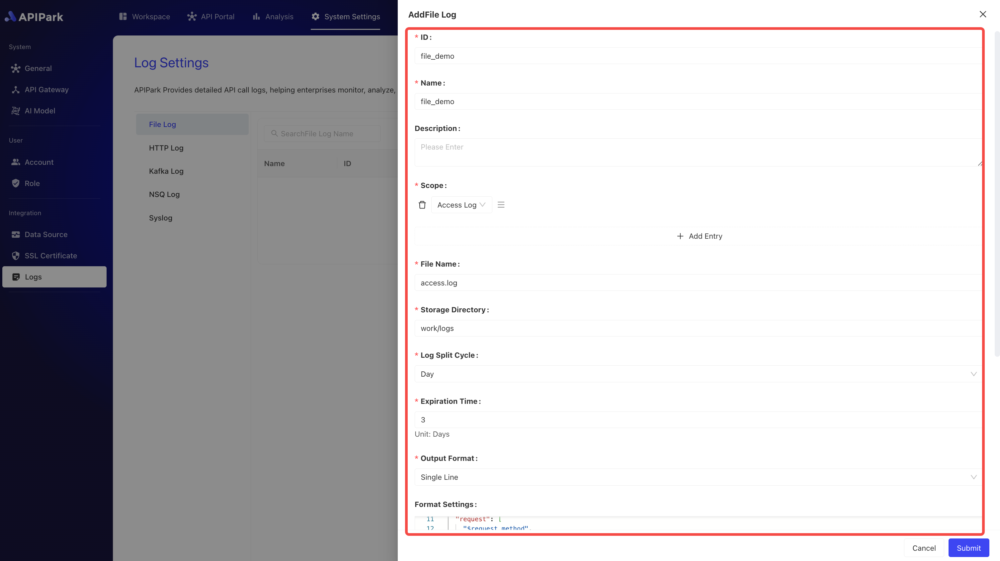
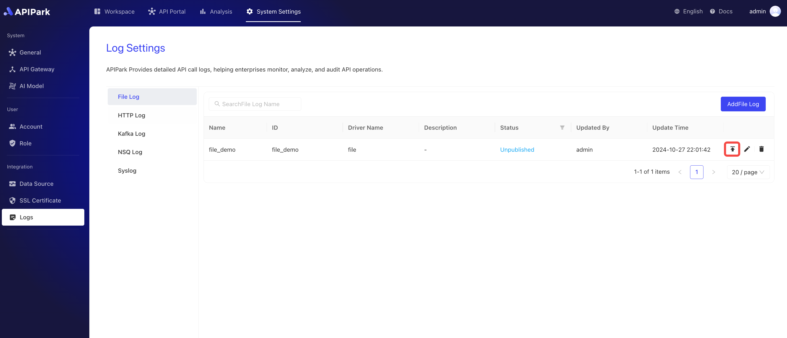

# File Logging

Collect log information from the request gateway and output it to a file for developers to query.

## Features

File Logging: Outputs request information to a log file with the following features:

* Customize the storage directory and file name
* Split log files periodically to avoid a single file becoming too large and difficult to view
* Delete expired files regularly to reduce hard disk space usage

## Operation Demonstration

### Create a New File Log Configuration

1. Click `System Settings` -> `Logs` -> `File Log`, then click `Add File Log`.
  


2. Fill in the file log configuration.

  


**Configuration Description**:

| Field Name      | Description                                                                 |
| --------------- | --------------------------------------------------------------------------- |
| File Name       | The name of the file to be stored; the actual stored name will have a `.log` suffix, i.e., \{File Name\}.log |
| Storage Directory | The directory where the file is stored, supports both relative and absolute paths |
| Log Splitting Period | Creates a new log file periodically, and renames old log files; options: Hourly, Daily |
| Expiration Time | File retention time in days; files exceeding this time will be regularly deleted |
| Output Format   | The format of the log content, supports single line or JSON formatted output |
| Formatting Configuration | Template for output format. For tutorial [click here](https://help.apinto.com/docs/formatter) to jump |

**File Lifecycle Demonstration**


**Formatting Configuration Example**

```json
{
   "fields": [
      "$time_iso8601",
      "$request_id",
      "@request",
      "@proxy",
      "@response",
      "@status_code",
      "@time"
   ],
   "request": [
      "$request_method",
      "$scheme",
      "$request_uri",
      "$host",
      "$header",
      "$remote_addr"
   ],
   "proxy": [
      "$proxy_method",
      "$proxy_scheme",
      "$proxy_uri",
      "$proxy_host",
      "$proxy_header",
      "$proxy_addr"
   ],
   "response": [
      "$response_headers"
   ],
   "status_code": [
      "$status",
      "$proxy_status"
   ],
   "time": [
      "$request_time",
      "$response_time"
   ]
}
```

After completing the configuration, click `Submit`.

### Launch

1. Click the `Launch` button next to the configuration you wish to launch.

  