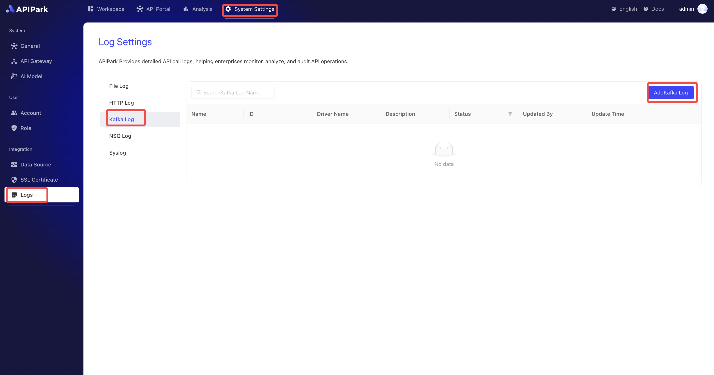

# Kafka Logs

Collect log information from the request gateway and output it to `Kafka`, facilitating user operations such as log analysis.

## Features

Able to output log content generated during program operation to a specified Kafka cluster queue.

## Operation Demonstration

### Create Kafka Log Configuration

1. Click `Operations & Integration` -> `Kafka Logs`, then click `Add Kafka Log`.

  

2. Fill in the Kafka log configuration and click save after completing it.

  

**Configuration Description**:

<table><thead><tr><th width="208">Field Name</th><th>Description</th></tr></thead><tbody><tr><td>Version</td><td>Kafka version</td></tr><tr><td>Server Address</td><td>Kafka server address, multiple addresses separated by commas</td></tr><tr><td>Topic</td><td>Kafka service Topic information</td></tr><tr><td>Partition Type</td><td>Partition selection method, defaults to hash; if partition_key is empty when hash is selected, random selection is used</td></tr><tr><td>Partition</td><td>When Partition Type is manual, specify the partition number here</td></tr><tr><td>Partition Key</td><td>When Partition Type is hash, specify the hash value here</td></tr><tr><td>Request Timeout</td><td>Timeout, in seconds</td></tr><tr><td>Output Format</td><td>Output log content format, supporting single-line and Json formats</td></tr><tr><td>Formatting Configuration</td><td>Output format template, configuration tutorial <a href="https://help.apinto.com/docs/formatter">click here</a> to jump</td></tr></tbody></table>

**Example Formatting Configuration**

```json
{
   "fields": [
      "$time_iso8601",
      "$request_id",
      "@request",
      "@proxy",
      "@response",
      "@status_code",
      "@time"
   ],
   "request": [
      "$request_method",
      "$scheme",
      "$request_uri",
      "$host",
      "$header",
      "$remote_addr"
   ],
   "proxy": [
      "$proxy_method",
      "$proxy_scheme",
      "$proxy_uri",
      "$proxy_host",
      "$proxy_header",
      "$proxy_addr"
   ],
   "response": [
      "$response_headers"
   ],
   "status_code": [
      "$status",
      "$proxy_status"
   ],
   "time": [
      "$request_time",
      "$response_time"
   ]
}
```

### Go Live

1. Click the `Go Live` button next to the configuration to be deployed.

  