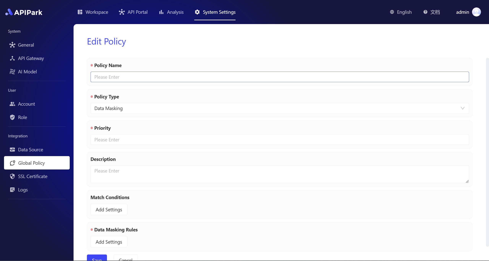
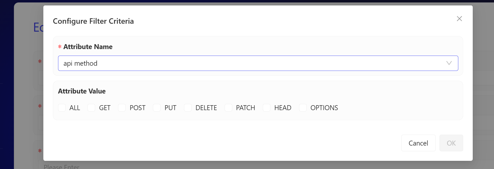
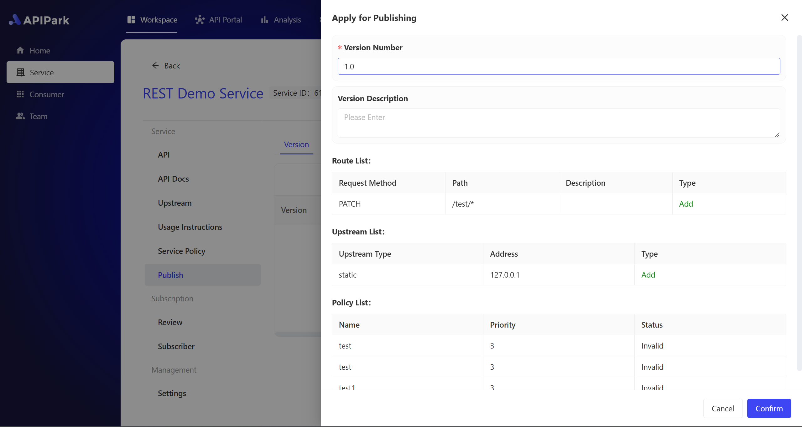

---

sidebar_position: 6

title: "API 服务集成"

---

# **Data Masking**

The **data masking** feature is a core component of APIPark's security capabilities. It automatically replaces or hides sensitive information in API responses, ensuring the protection of key business data, such as customer information, financial records, intellectual property, and employee details, during transmission.

This feature helps businesses comply with data protection regulations like **GDPR** or **HIPAA**, while enhancing the trustworthiness of their data management practices. APIPark's data masking strategy creates a secure, compliant, and efficient API ecosystem.

The strategy includes two levels: **Global Strategy** and **Service-Level Strategy.**

## 1. **Global Masking Strategy**

Go to the **System Settings** module, select **Global Strategy** from the sidebar, and then choose **Data Masking**.

  

### 1.1 **Add Strategy**

Click the **Add Strategy** button in the top right corner of the list to enter the strategy addition page.

  

**Configuration Instructions：**

**Strategy Name:** The name of the strategy, a required field, used to briefly describe what the strategy is.

**Strategy Type:** Currently, only **Data Masking** can be selected. More strategy types will be added in the future.

**Priority:** Used to determine the execution priority between multiple strategies. The smaller the number, the higher the priority. Only positive integers are allowed, with a minimum value of 1.

**Description:** A detailed introduction to the current strategy, such as the background and goals for creating it.

**Matching Conditions:** APIs that match the current rule can be selected across multiple dimensions. Multiple matching conditions are supported. This is optional; if left blank, it will match all APIs by default.

**Data Masking Rules:** Specifies the parameter values and the masking methods that need to be applied. A required field, supports adding multiple masking rules.

### 1.2 **Add Matching Conditions**

- In the global masking strategy, when adding matching conditions, the following attributes and attribute values are available.

| Attribute Name      | Optional Attribute Values                                    |
| :------------------ | :----------------------------------------------------------- |
| AAPI Request Method | ALL/GET/POST/PUT/DELETE/PATCH/HEADER/OPTIONS                 |
| API Path            | Specify the API path to match using regular expressions.     |
| IP                  | Enter an IP address or CIDR range, separated by line breaks. |
| Consumer            | Select from the consumer list, supporting multiple selections. |

- When adding multiple matching conditions, the final matched APIs will be the union of all the matching conditions.

  

### 1.3 **Add Masking Rules**

When adding masking rules, it requires two steps. The first step is to specify which data needs to be masked, and the second step is to define how to mask this data. Therefore, you need to set both data matching rules and masking rules separately.

- The data matching rules support the following optional attributes and attribute values.

| **Matching Type**      | **Options**                                                  | **Remarks**                                                  |
| :--------------------- | :----------------------------------------------------------- | :----------------------------------------------------------- |
| **Data Format**        | Name, phone number, ID card number, bank card number, date, amount | The available options are pre-built data rules, and the system will automatically match all values. |
| **Keyword**            | Enter keywords for the key or value that needs to be masked  | Both key and value will be matched using fuzzy matching.     |
| **Regular Expression** | Enter a regular expression for the parameter name that needs to be masked | Both key and value will be matched using regular expressions. |
| **JsonPath**           | Enter a JsonPath expression                                  | Matches the key.                                             |

- The masking rules support the following options.

| **Masking Type**    | **Specific Configuration**                                   |
| :------------------ | :----------------------------------------------------------- |
| **Partial Display** | Choose from which position the data starts and how many characters to display. |
| **Partial Masking** | Choose from which position the data starts and how many characters to mask. |
| **Truncation**      | Choose from which position the data starts and how many characters to truncate. |
| **Replacement**     | Choose to replace with a random string or a specific string. |

  

### 1.4 **Publish Global Strategy**

After a strategy is successfully created, it needs to be published in order to take effect.

- For a global strategy, click the **Publish** button in the top right corner of the strategy list. A confirmation popup will appear, showing the changes in the current version. Click **Confirm** to successfully publish.
- There are three possible states for a strategy:
  - **Unpublished**: A newly created strategy will be shown as "Unpublished" until it is published.
  - **Published**: After the strategy is published, it will be shown as "Live."
  - **Pending Update**: If the strategy is edited after being published, causing changes to the configuration, the changes will not take effect immediately. A re-publish is required. The strategy will then be shown as "Pending Update."

  

## 2. **Service-Level Masking Strategy**

Go to the **Workspace** module, select **Services** from the sidebar, then choose **Service Strategy** from the submenu in the details of a specific service, and select **Data Masking**.

  

### 2.1 **Add Strategy**

Click the **Add Strategy** button in the top right corner of the list to enter the strategy creation page.

- **Strategy Name**: A required field used to briefly describe what the strategy is.
- **Strategy Type**: Currently, only **Data Masking** can be selected. More strategy types will be added in the future.
- **Priority**: Used to determine the execution priority between multiple strategies. The smaller the number, the higher the priority. Only positive integers are allowed, with a minimum value of 1.
- **Description**: A detailed introduction to the current strategy, such as the background and goals for creating it.
- **Matching Conditions**: APIs that match the current rule can be selected across multiple dimensions. Multiple matching conditions are supported. This is optional; if left blank, it will match all APIs by default.
- **Data Masking Rules**: Specifies the parameter values and masking methods that need to be applied. This is a required field, and multiple masking rules can be added.

### 2.2 **Add Matching Conditions**

- In the service-level masking strategy, the following optional attributes and attribute values are available when adding matching conditions.
- Note that, compared to the global masking strategy, the service-level masking strategy includes an option to provide an API list.

Here is the information organized into a table:

| **Attribute Name**         | **Optional Attribute Values**                                |
| :------------------------- | :----------------------------------------------------------- |
| **API** **Request Method** | ALL/GET/POST/PUT/DELETE/PATCH/HEADER/OPTIONS                 |
| **API** **Path**           | Specify the API path to match using regular expressions      |
| **IP**                     | Enter IP addresses or CIDR ranges, separated by line breaks  |
| **Consumer**               | Select from the consumer list of the **current service**, supporting multiple selections |
| **API**                    | Select from the API list of the **current service**, supporting multiple selections |

- When adding multiple matching conditions, the final matched APIs will be the union of all the matching conditions.

### 2.3 **Add Masking Rules**

When adding masking rules, two steps are required. The first step is to specify which data needs to be masked, and the second step is to define how to mask this data. Therefore, both data matching rules and masking rules need to be set separately.

- The data matching rules support the following optional attributes and attribute values.

This translation is accurate, clear, and grammatically correct.

| **Matching Type**      | **Options**                                                  | **Remarks**                                                  |
| :--------------------- | :----------------------------------------------------------- | :----------------------------------------------------------- |
| **Data Format**        | Name, phone number, ID card number, bank card number, date, amount | The available options are pre-built data rules, and the system will automatically match all values. |
| **Keyword**            | Enter keywords for the key or value that needs to be masked  | Both key and value will be matched using fuzzy matching.     |
| **Regular Expression** | Enter a regular expression for the parameter name that needs to be masked | Both key and value will be matched using regular expressions. |
| **JsonPath**           | Enter a JsonPath expression                                  | Matches the key.                                             |

- The masking rules support the following options.

| **Masking Type**    | **Specific Configuration**                                   |
| :------------------ | :----------------------------------------------------------- |
| **Partial Display** | Choose from which position the data starts and how many characters to display. |
| **Partial Masking** | Choose from which position the data starts and how many characters to mask. |
| **Truncation**      | Choose from which position the data starts and how many characters to truncate. |
| **Replacement**     | Choose to replace with a random string or a specific string. |

  

### 2.4 **Publish Service-Level Strategy**

After a strategy is successfully created, it needs to be published to take effect.

- For a service-level strategy, in the service details, go to the **Publish** menu in the secondary menu. Click the **Publish** button in the top right corner of the publish list. A confirmation popup will appear, showing the changes in the current version. Click **Confirm** to successfully publish the strategy.

  

There are three states for a strategy:

- **Unpublished**: A newly created strategy will be shown as "Unpublished" until it is published.
- **Published**: After the strategy is published, it will be shown as "Live."
- **Pending Update**: After the strategy is published, if it is edited and the configuration changes, the changes will not take effect immediately. A re-publish is required. In this case, the strategy will be shown as "Pending Update."

  

## 3. **Strategy Priority**

When multiple strategies apply to the same object, execution priority comes into play. The main logic is as follows:

- Service-level strategies take precedence over global strategies.
- Within the same level of strategies, the smaller the priority number, the higher the priority.
- When multiple strategies apply to the same object, only the highest priority strategy will be executed.

## 4. **Processing Logs**

Strategy processing logs allow you to view how the current strategy processes the target object. For example, the processing log of a data masking strategy shows a comparison of the original and masked parameter values for API input or output.

- In the strategy list, each published strategy has an operation button on the right side of the sidebar to view the processing logs. Clicking this button will open a processing log popup.
- In the processing log popup, you can search for strategy log entries by key fields. It also supports filtering log entries by time range.