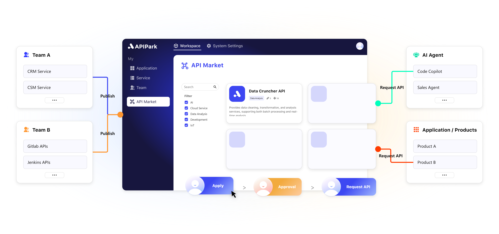
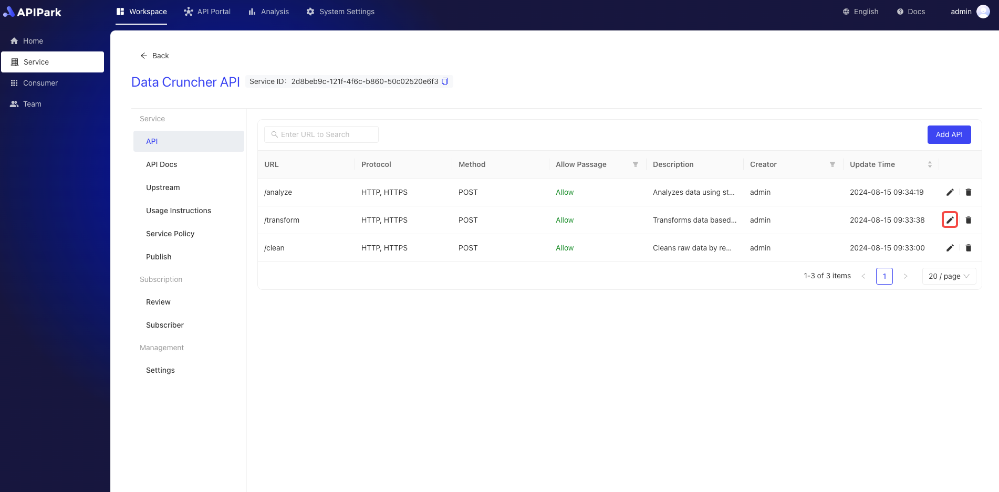

# Overview

## APIPark



**🦄APIPark is an open-source, all-in-one AI gateway and API developer portal designed to help developers and businesses easily manage, integrate, and deploy AI services. Based on the Apache 2.0 protocol, APIPark is open-source and can be used for commercial purposes for free!**

✨With APIPark, you can achieve the following:

1. Quickly integrate over 100 AI models; we support all major AI companies!
2. Combine AI models and prompts into APIs, such as creating a sentiment analysis API, translation API, or data analysis API with OpenAI GPT4o and some custom prompts.
3. Standardize the request data format for all AI APIs, so switching AI models or modifying prompts won't affect your app or microservices, simplifying AI usage and maintenance.
4. Share APIs within your team through the APIPark developer portal.
5. Manage applications and API keys to ensure the security and stability of your APIs.
6. Monitor your AI API usage with clear charts.
7. Quickly output API request logs to third-party log platforms.

\
\


✨APIPark is also a powerful cloud-native API gateway:

1. It offers higher performance than Nginx and supports cluster deployment to handle large-scale traffic.
2. Share and manage REST APIs within your team to avoid management costs and data leakage issues due to chaotic API calls.

\


## 💌 Why did we create APIPark?

Before creating APIPark, we spent seven years developing an API development and automated testing platform, Eolink, with over 1 million developer users. We have over 500 corporate clients and received multi-million yuan investment from Sequoia Capital.

With the development of AI and Agents, we found many enterprises wanted to integrate AI into internal systems and third-party APIs to enable AI Agents to perform more complex tasks, not just act as Q\&A bots. Thus, we created APIPark, your one-stop AI gateway and API developer portal, to accelerate your AI API development and quickly build your products or AI Agents!

\


## ✨ Quick Start

APIPark aims to solve the following problems:

* Seamlessly integrate various large AI models and package these AI capabilities into APIs for easy calling, simplifying the threshold for using AI models.
* Manage complex AI & API call relationships.
* Manage API creation, monitoring, and security.
* Fault detection and troubleshooting: simplify system issue identification and resolution.
* Quantify data asset value: enhance data asset visibility and valuation.

\


😍 Deploying APIPark is straightforward; you can set up your AI gateway and API developer portal within 5 minutes with just one command line.

```
curl -sSO https://download.apipark.com/install/quick-start.sh; bash quick-start.sh
```

\


## 🔥 Features

| Quickly Integrate 100+ AI Models                                          | Call All AI Using a Unified API Format                                   |
| ------------------------------------------------------------------------- | ------------------------------------------------------------------------ |
|         |       |
| One-Click Prompt to REST API Conversion                                   | Quickly Share APIs Within Teams                                          |
|    |  |
| Performance Rivaling Nginx                                                | Complete API Design, Release, Call, Decommissioning in One Place         |
|  |        |
| Approve API Call Requests from Tenants                                    | Multi-Tenant Management                                                  |
|        |      |
| Detailed Logging of All API Calls                                         | Powerful Data Analysis                                                   |
|            |             |

\


## 🚀 Use Cases

### Simplify AI Integration Cost

* Connect to over 100 major models from mainstream AI vendors with a unified API call, without extra adaptation work.
* Create new AI APIs by combining AI models and prompts, simplifying AI API development.
* Quickly share AI APIs within the team.

### Improve Operational Efficiency

* Rapidly build an internal API developer portal.
* Efficiently manage and call APIs.
* Reduce complex inter-system call relationships.

### Ensure Compliance and Security

* Strong service governance and compliance management features.
* Granular management of application call permissions.
* Ensure the security and compliance of API calls, reducing enterprise risk.

### Simplify System Troubleshooting

* Quickly detect and resolve issues using monitoring and fault diagnosis tools.
* Reduce downtime and improve system stability.

### Multi-Tenant Management and Flexible Subscription

* Supports multi-tenant management, catering to different business unit needs.
* Flexible subscription and approval processes simplify API usage and management.

### Enhance API Observability

* Real-time monitoring and tracking of API usage.
* Comprehensive understanding of data flow, enhancing data usage transparency.

\


## 🚩 Roadmap

We have exciting goals for APIPark: enabling everyone to quickly create their products and AI Agents with AI and APIs!

To achieve this, we plan to add new features to APIPark:

1. Integrate API markets like Postman, RapidAPI, APISpace, APILayer, etc. You can use APIs from various markets directly through APIPark and make them smarter with AI.
2. Integrate AI Agents like Langchain, AgentGPT, Auto-GPT, Dify, etc., allowing AI Agents to access your internal systems or third-party APIs via APIPark for more complex tasks.
3. Intelligent API Orchestration, offering a unified API entry through APIPark to automatically orchestrate multiple APIs based on your request content to meet your needs.

\


## 📕 Documentation

Visit [APIPark Documentation](https://docs.apipark.com/docs/install) for detailed installation guides, API references, and usage instructions.

\


## 🧾 License

APIPark uses the Apache 2.0 license. For more details, please check the LICENSE file.

\


## 💌 Contact Us

For enterprise-level features and professional technical support, please contact our pre-sales experts for personalized demonstrations, customized solutions, and quotes.

* Website: https://apipark.com
* Email: contact@apipark.com

\


🙏 Thank you to everyone who helped shape APIPark. We are excited to hear from the community! Let's make the world of APIs and AI stronger and more exciting together. 🎉
