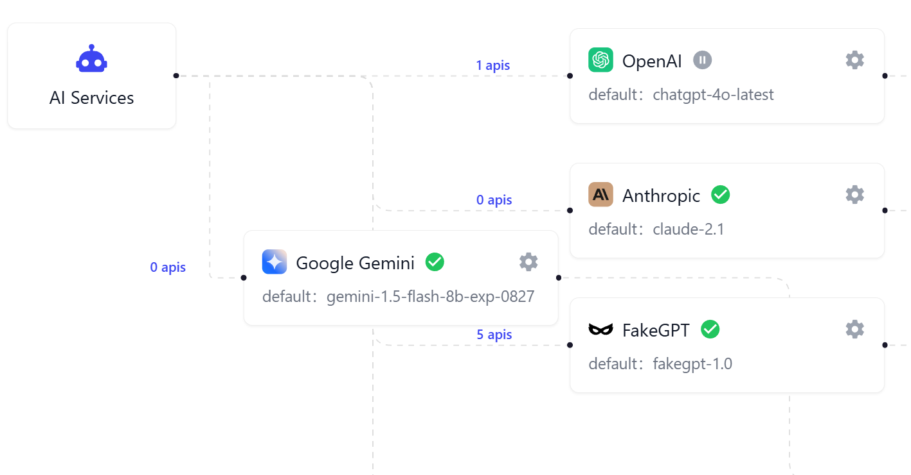

--- 
sidebar_position: 2
--- 

# AI Model Load Balancing

AI model load balancing is an intelligent scheduling mechanism designed to ensure the high availability and stability of AI services. When a primary AI provider service fails, the load balancing can automatically switch requests to a backup AI provider. This effectively avoids service interruptions caused by provider issues, ensuring continuous operation of AI applications and enhancing user experience.

Load balancing also supports prioritizing providers to ensure that in the event of an anomaly, switching can be done according to a preset priority sequence, further optimizing resource utilization and response speed.

## Introduction to Model Load Balancing Diagram

On the AI model page, under the configured tab, a load balancing diagram of all currently configured AI model providers will be displayed. You can view the status information of each provider and their corresponding API keys.

- **Provider Card**: The provider card displays the provider's availability status and the default selected model. Users can click the edit button in the upper right corner to make edits.

- **API Key Card**: Connected to the right of the provider card is the API key card for that provider. Each color block represents an API key on that provider, with green indicating a normal status and red indicating an abnormal (unavailable) status.

- **API Association Count**: The data on the connecting line between AI Services and provider cards represents how many APIs have called that provider's AI model. Clicking this data text opens a new page to view the specific AI API list.

- **API Key Count**: The data on the connecting line between the provider card and the API key card represents how many API keys exist for that provider. Clicking this data text opens a new page to view and manage the corresponding API key resource pool.

## Load Priority

There is a load priority field in the current provider configuration, which determines which provider's AI model is prioritized in case other providers fail. The lower the priority number, the higher the priority, meaning the default model of that provider is called first.

The system supports two methods for adjusting load priority:

- Directly drag the provider's card in the load balancing diagram to change the priority order.
- Adjust the load priority number in the corresponding provider configuration popup to the target rank number.

