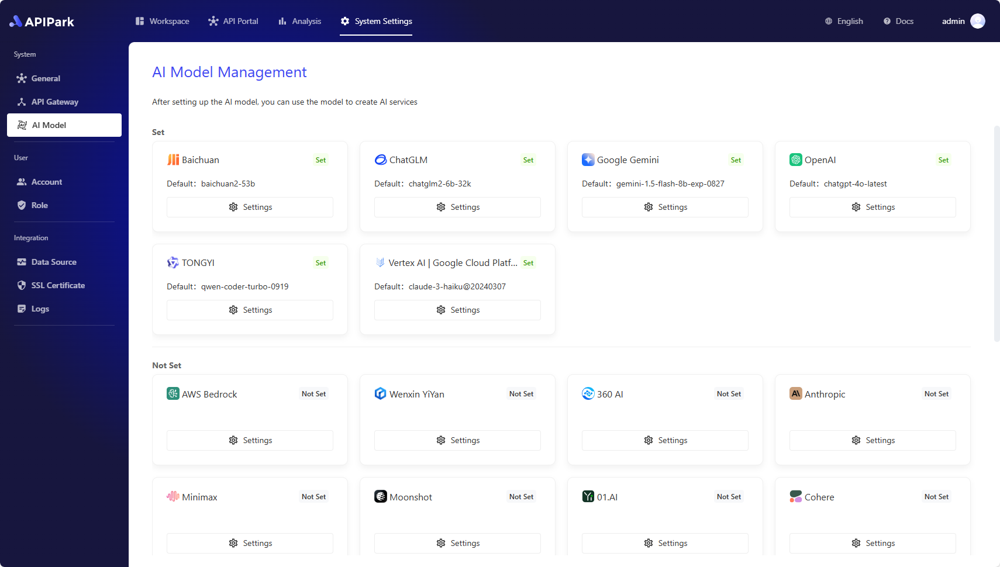

# Setting Up AI Models

Before starting to create AI services, you first need to configure your AI model provider. APIPark supports over 100 AI models, including OpenAI, Anthropic, AWS Bedrock, Google Gemini, and more. Once the provider is configured, you can select different models to create AI services and manage all authorization information and cost statistics for AI services within APIPark.

Navigate to the **System Settings** module, and select **AI Model Management** from the sidebar, where you can view all AI providers supported by APIPark.

Taking OpenAI as an example, click the settings button, and in the popup:

- Select the **Default AI Model**: The system will automatically set the default AI model when creating an API in AI services, reducing the number of actions required from the user.
- Fill in the **Provider Configuration**: Each provider has different configuration information. The system will automatically generate the required configuration information based on your selected provider. This information can generally be obtained from the Open API management backend of the provider, and you can find a quick link to the provider's website at the bottom left of the popup.

> 💡 If APIPark does not support the AI provider you are using, feel free to [🔗 Submit an Issue to Us](https://github.com/APIParkLab/APIPark/issues/new)

