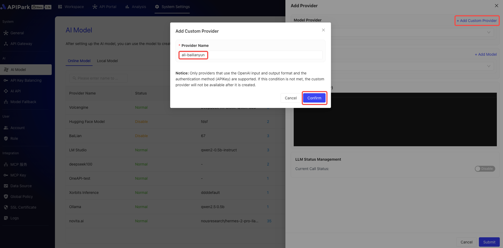
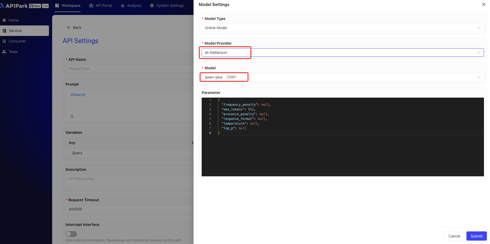

# Integrating LLM Providers

Before creating AI services, you first need to configure an AI model provider. APIPark supports over 100 AI models, including OpenAI, Anthropic, AWS Bedrock, Google Gemini, etc. After configuring the provider, you can choose different models to create AI services and manage all authorization information and cost statistics for AI services in APIPark.

Currently, APIPark is pre-integrated with six major service platforms:
- Volcengine (ByteDance Cloud Services)
- Alibaba Cloud (Alibaba Intelligent Computing Platform)
- Hugging Face (Open Source Model Community)
- Ollama (Local Large Model Framework)
- LM Studio (Desktop Model Tool)
- Xinference (Distributed Inference Platform)

## Adding a Built-in Provider

### Configuration Steps

1. Click on System Settings -> AI Models to enter the online model page, and click on Add New Provider.

  

2. Select the provider you need to configure, enter the provider's API Key information, enable LLM, and click save, like this:

  

After saving, you can [create and publish AI services](../services/ai_services.md).

## Adding a Custom Provider

APIPark not only has multiple built-in mainstream large language model (LLM) providers but also supports quickly adding third-party services that comply with the OpenAI interface standard as new LLM providers. Through a standardized configuration process, you can complete registration and integration within just 5 minutes, easily expanding model services suited to your business needs.

### Configuration Steps

1. Preparations.
Ensure your third-party LLM service is compatible with the OpenAI interface standard and obtain the API Key and endpoint address.
This example uses Alibaba Cloud's configuration for demonstration.

2. Add a Custom Provider
  

  

3. Add a Custom Model
When adding a custom model, the model name needs to be consistent with the provider's model name, as shown below:

  

  

4. Fill in the Basic Information about the Provider

Alibaba Cloud's `base_url` is `https://dashscope.aliyuncs.com/compatible-mode/v1`, and the API Key needs to be acquired individually.

  

After saving, you can create AI APIs in the AI service and bind their providers and models.

  

  

> 💡 If APIPark does not support the AI provider you use, feel free to [🔗 Submit an Issue to Us](https://github.com/APIParkLab/APIPark/issues/new)

