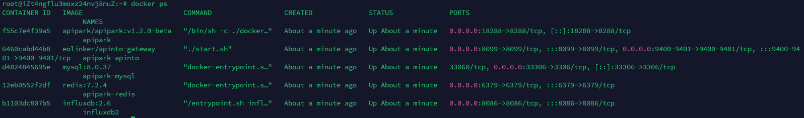
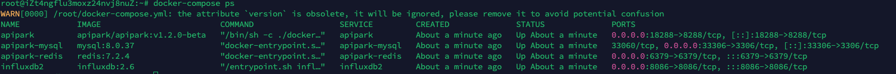

# Deploy APIPark
## Hardware Requirements

:::tip
Recommended configuration:

- **CPU**: 8 cores
- **Memory**: 16G
- **Disk Storage**: 200G
- **Operating System**: Linux / Mac
- **System Architecture**: AMD64 / ARM64
:::

:::note
Minimum configuration:

- **CPU**: 2 cores
- **Memory**: 4G
- **Disk Storage**: 200G
- **Operating System**: Linux / Mac
- **System Architecture**: AMD64 / ARM64
:::

## Software Dependencies

`APIPark` depends on `MYSQL, Redis, InfluxDB` databases. Below are the required versions for these databases:

<table><thead><tr><th width="184">Name</th><th>Version Requirement</th></tr></thead><tbody><tr><td>MYSQL</td><td>>=5.7.x</td></tr><tr><td>Redis</td><td>>=6.2.x</td></tr><tr><td>InfluxDB</td><td>>=2.6</td></tr></tbody></table>

## Deployment Methods

### Deploy with Script

:::note
List of supported systems:

* CentOS 7.9 (representative of 7.x)
* CentOS 8.5 (representative of 8.x)
* Ubuntu 20.04
* Ubuntu 22.04
* Debian 12.4
* Alibaba Cloud Linux 3.2104
* Alibaba Cloud Linux 2.1903

Currently, only the above deployments have been tested. If you need a one-click deployment for other systems, you can submit an [Issue](https://github.com/APIParkLab/APIPark/issues) to us.
:::

Enter the one-click deployment command:

```
curl -sSO https://download.apipark.com/install/quick-start.sh; bash quick-start.sh
```

Follow the prompts to complete the deployment. Deployment information will be displayed upon completion.

### Deploy with Docker-Compose

:::note

To install APIPark using this method, you need to install [Docker](https://www.docker.com/) and [Docker Compose](https://docs.docker.com/compose/).

After deployment, APIPark requires binding an API Gateway node to be usable. For detailed tutorials, please refer to [Configure API Gateway](./system_setting/api_gateway_cluster.md).

:::

#### Deploy APIPark + API Gateway

1. Edit `config.yml`

```
vi config.yml
```

2. Modify the file configuration

```
version: 2
#certificate: # Root directory for certificates
#  dir: /etc/apinto/cert
client:
  advertise_urls: # Open API broadcast addresses
    - http://{IP}:9400
  listen_urls: # Open API listening addresses
    - http://0.0.0.0:9400
  #certificate:  # Certificate configuration, allowing self-signed certificates using IP
  #  - cert: server.pem
  #    key: server.key
gateway:
  advertise_urls: # Forwarding service broadcast addresses
    - http://{IP}:8099
    - https://{IP}:8099
  listen_urls: # Forwarding service listening addresses
    - https://0.0.0.0:8099
    - http://0.0.0.0:8099
peer: # Cluster node communication configuration information
  listen_urls: # Node listening addresses
    - http://0.0.0.0:9401
  advertise_urls: # Node communication broadcast addresses
    - http://{IP}:9401
  #certificate:  # Certificate configuration, allowing self-signed certificates using IP
  #  - cert: server.pem
  #    key: server.key
```

In the above configuration, `{IP}` is a variable that should be replaced with the **host machine IP** of the container. If the host machine IP is `172.18.65.22`, the configuration should be as follows:

```
version: 2
#certificate: # Root directory for certificates
#  dir: /etc/apinto/cert
client:
  advertise_urls: # Open API broadcast addresses
    - http://172.18.65.22:9400
  listen_urls: # Open API listening addresses
    - http://0.0.0.0:9400
  #certificate:  # Certificate configuration, allowing self-signed certificates using IP
  #  - cert: server.pem
  #    key: server.key
gateway:
  advertise_urls: # Forwarding service broadcast addresses
    - http://172.18.65.22:8099
    - https://172.18.65.22:8099
  listen_urls: # Forwarding service listening addresses
    - https://0.0.0.0:8099
    - http://0.0.0.0:8099
peer: # Cluster node communication configuration information
  listen_urls: # Node listening addresses
    - http://0.0.0.0:9401
  advertise_urls: # Node communication broadcast addresses
    - http://172.18.65.22:9401
  #certificate:  # Certificate configuration, allowing self-signed certificates using IP
  #  - cert: server.pem
  #    key: server.key
```

**Configuration Explanation**

| Field Name                | Description                                                  |
| :------------------------ | :----------------------------------------------------------- |
| version                   | Configuration version number, default is 2                   |
| client                    | OpenAPI configuration information                            |
| client -> listen_urls     | OpenAPI listening addresses, format: `{protocol}://{IP}:{port}` |
| client -> advertise_urls  | OpenAPI broadcast addresses, displayed in cluster node list in console, format: `{protocol}://{IP/domain}:{port}` |
| client -> certificate     | OpenAPI certificate information list                         |
| gateway                   | Forwarding agent core program configuration information      |
| gateway -> listen_urls    | Forwarding agent core program listening addresses, format: `{protocol}://{IP}:{port}` |
| gateway -> advertise_urls | Forwarding agent core program broadcast addresses, displayed in cluster node list in console, format: `{protocol}://{IP/domain}:{port}` |
| peer                      | Raft node configuration information for Raft cluster node configuration synchronization, joining or leaving cluster operations communication |
| peer -> listen_urls       | Raft node listening addresses, format: `{protocol}://{IP}:{port}` |
| peer -> advertise_urls    | Raft node broadcast addresses, format: `{protocol}://{IP/domain}:{port}` |
| peer -> certificate       | Raft node certificate information list                       |

3. Edit `docker-compose.yml` file

```bash
vi docker-compose.yml
```

4. Modify the file configuration

```
version: '3'
services:
  apipark-mysql:
    image: mysql:8.0.37
    privileged: true
    restart: always
    container_name: apipark-mysql
    hostname: apipark-mysql
    command:
      - "--character-set-server=utf8mb4"
      - "--collation-server=utf8mb4_unicode_ci"
    ports:
      - "33306:3306"
    environment:
      - MYSQL_ROOT_PASSWORD={MYSQL_PWD}
      - MYSQL_DATABASE=apipark
    volumes:
      - /var/lib/apipark/mysql:/var/lib/mysql
    networks:
      - apipark
  apipark:
    image: apipark/apipark:v1.7.3-beta
    container_name: apipark
    privileged: true
    restart: always
    networks:
      - apipark
    ports:
      - "18288:8288"
    depends_on:
      - apipark-mysql
    environment:
      - MYSQL_USER_NAME=root
      - MYSQL_PWD={MYSQL_PWD}
      - MYSQL_IP=apipark-mysql
      - MYSQL_PORT=3306                 # MySQL port
      - MYSQL_DB="apipark"
      - ERROR_DIR=work/logs  # Log directory
      - ERROR_FILE_NAME=error.log          # Error log file name
      - ERROR_LOG_LEVEL=info               # Error log level, options: panic, fatal, error, warning, info, debug, trace. Default is info if not set or invalid
      - ERROR_EXPIRE=7d                    # Error log expiration time, default unit is days, d|days, h|hours. Default is 7d if not valid
      - ERROR_PERIOD=day                  # Error log rotation period, only supports day, hour
      - REDIS_ADDR=apipark-redis:6379           # Redis cluster address, multiple addresses separated by commas
      - REDIS_PWD={REDIS_PWD}                         # Redis password
      - ADMIN_PASSWORD={ADMIN_PASSWORD}
      - Init=true
      - InfluxdbToken={INFLUXDB_TOKEN}
  apipark-influxdb:
    image: influxdb:2.6
    privileged: true
    restart: always
    container_name: apipark-influxdb
    hostname: apipark-influxdb
    ports:
      - "8086:8086"
    volumes:
      - /var/lib/apipark/influxdb2:/var/lib/influxdb2
    environment:
      - DOCKER_INFLUXDB_INIT_USERNAME=admin
      - DOCKER_INFLUXDB_INIT_PASSWORD=Key123qaz
      - DOCKER_INFLUXDB_INIT_ORG=apipark
      - DOCKER_INFLUXDB_INIT_BUCKET=apinto
      - DOCKER_INFLUXDB_INIT_ADMIN_TOKEN={INFLUXDB_TOKEN}
      - DOCKER_INFLUXDB_INIT_MODE=setup
    networks:
      - apipark
  apipark-redis:
    container_name: apipark-redis
    image: redis:7.2.4
    hostname: apipark-redis
    privileged: true
    restart: always
    ports:
      - 6379:6379
    command:
      - bash
      - -c
      - "redis-server --protected-mode yes --logfile redis.log --appendonly no --port 6379 --requirepass {REDIS_PWD}"
    networks:
      - apipark
  apipark-loki:
    container_name: apipark-loki
    image:  grafana/loki:3.2.1
    hostname: apipark-loki
    privileged: true
    user: root
    restart: always
    ports:
      - 3100:3100
    entrypoint:
      - sh
      - -euc
      - |
        mkdir -p /mnt/config
        cat <<EOF > /mnt/config/loki-config.yaml
        ---
        auth_enabled: false

        server:
          http_listen_port: 3100
          grpc_listen_port: 9096

        common:
          instance_addr: 127.0.0.1
          path_prefix: /tmp/loki
          storage:
            filesystem:
              chunks_directory: /tmp/loki/chunks
              rules_directory: /tmp/loki/rules
          replication_factor: 1
          ring:
            kvstore:
              store: inmemory

        query_range:
          results_cache:
            cache:
              embedded_cache:
                enabled: true
                max_size_mb: 100

        schema_config:
          configs:
            - from: 2020-10-24
              store: tsdb
              object_store: filesystem
              schema: v13
              index:
                prefix: index_
                period: 24h
        limits_config:
          max_query_length: 90d # set max query length to 90 days
        ruler:
          alertmanager_url: http://localhost:9093

        # By default, Loki will send anonymous, but uniquely-identifiable usage and configuration
        # analytics to Grafana Labs. These statistics are sent to https://stats.grafana.org/
        #
        # Statistics help us better understand how Loki is used, and they show us performance
        # levels for most users. This helps us prioritize features and documentation.
        # For more information on what's sent, look at
        # https://github.com/grafana/loki/blob/main/pkg/analytics/stats.go
        # Refer to the buildReport method to see what goes into a report.
        #
        # If you would like to disable reporting, uncomment the following lines:
        #analytics:
        #  reporting_enabled: false
        table_manager:
          retention_period: 90d
        EOF
        /usr/bin/loki -config.file=/mnt/config/loki-config.yaml
    networks:
      - apipark
  apipark-grafana:
    container_name: apipark-grafana
    image:  grafana/grafana:11.3.2
    hostname: apipark-grafana
    privileged: true
    restart: always
    environment:
      - GF_PATHS_PROVISIONING=/etc/grafana/provisioning
      - GF_AUTH_ANONYMOUS_ENABLED=true
      - GF_AUTH_ANONYMOUS_ORG_ROLE=Admin
    depends_on:
      - apipark-loki
    entrypoint:
      - sh
      - -euc
      - |
        mkdir -p /etc/grafana/provisioning/datasources
        cat <<EOF > /etc/grafana/provisioning/datasources/ds.yaml
        apiVersion: 1
        datasources:
          - name: Loki
            type: loki
            access: proxy
            url: http://apipark-loki:3100
        EOF
        /run.sh
    ports:
      - "3000:3000"
    healthcheck:
      test: [ "CMD-SHELL", "wget --no-verbose --tries=1 --spider http://localhost:3000/api/health || exit 1" ]
      interval: 10s
      timeout: 5s
      retries: 5
    networks:
      - apipark
  apipark-nsq:
    container_name: apipark-nsq
    image: nsqio/nsq:v1.3.0
    hostname: apipark-nsq
    privileged: true
    restart: always
    command:
      - /nsqd
    ports:
      - 4150:4150
      - 4151:4151
    networks:
      - apipark
  apipark-apinto:
    image: eolinker/apinto-gateway
    container_name: apipark-apinto
    privileged: true
    restart: always
    ports:
      - "18099:8099"
      - "19400:9400"
      - "19401:9401"
    volumes:
      - /var/lib/apipark/apinto/data:/var/lib/apinto
      - /var/lib/apipark/apinto/log:/var/log/apinto
      - ${PWD}/config.yml:/etc/apinto/config.yml
    networks:
      - apipark
networks:
  apipark:
    driver: bridge
    ipam:
      driver: default
      config:
        - subnet: 172.100.0.0/24
```

In the above configuration, items enclosed in "{}" are variables. The related variable explanations are as follows:

- **MYSQL_PWD:** Initial password for the MySQL database root user.
- **REDIS_PWD:** Redis password.
- **ADMIN_PASSWORD:** Initial password for the APIPark Admin account.
- **INFLUXDB_TOKEN:** Initial token for InfluxDB.

An example of a configuration after replacement is as follows:

```
version: '3'
services:
  apipark-mysql:
    image: mysql:8.0.37
    privileged: true
    restart: always
    container_name: apipark-mysql
    hostname: apipark-mysql
    command:
      - "--character-set-server=utf8mb4"
      - "--collation-server=utf8mb4_unicode_ci"
    ports:
      - "33306:3306"
    environment:
      - MYSQL_ROOT_PASSWORD=123456
      - MYSQL_DATABASE=apipark
    volumes:
      - /var/lib/apipark/mysql:/var/lib/mysql
    networks:
      - apipark
  apipark:
    image: apipark/apipark:v1.7.3-beta
    container_name: apipark
    privileged: true
    restart: always
    networks:
      - apipark
    ports:
      - "18288:8288"
    depends_on:
      - apipark-mysql
    environment:
      - MYSQL_USER_NAME=root
      - MYSQL_PWD=123456
      - MYSQL_IP=apipark-mysql
      - MYSQL_PORT=3306                 # MySQL port
      - MYSQL_DB="apipark"
      - ERROR_DIR=work/logs  # Log directory
      - ERROR_FILE_NAME=error.log          # Error log file name
      - ERROR_LOG_LEVEL=info               # Error log level, options: panic, fatal, error, warning, info, debug, trace. Default is info if not set or invalid
      - ERROR_EXPIRE=7d                    # Error log expiration time, default unit is days, d|days, h|hours. Default is 7d if not valid
      - ERROR_PERIOD=day                  # Error log rotation period, only supports day, hour
      - REDIS_ADDR=apipark-redis:6379           # Redis cluster address, multiple addresses separated by commas
      - REDIS_PWD=123456                         # Redis password
      - ADMIN_PASSWORD=12345678
      - Init=true
      - InfluxdbToken=dQ9>fK6&gJ
  apipark-influxdb:
    image: influxdb:2.6
    privileged: true
    restart: always
    container_name: apipark-influxdb
    hostname: apipark-influxdb
    ports:
      - "8086:8086"
    volumes:
      - /var/lib/apipark/influxdb2:/var/lib/influxdb2
    environment:
      - DOCKER_INFLUXDB_INIT_USERNAME=admin
      - DOCKER_INFLUXDB_INIT_PASSWORD=Key123qaz
      - DOCKER_INFLUXDB_INIT_ORG=apipark
      - DOCKER_INFLUXDB_INIT_BUCKET=apinto
      - DOCKER_INFLUXDB_INIT_ADMIN_TOKEN=dQ9>fK6&gJ
      - DOCKER_INFLUXDB_INIT_MODE=setup
    networks:
      - apipark
  apipark-redis:
    container_name: apipark-redis
    image: redis:7.2.4
    hostname: apipark-redis
    privileged: true
    restart: always
    ports:
      - 6379:6379
    command:
      - bash
      - -c
      - "redis-server --protected-mode yes --logfile redis.log --appendonly no --port 6379 --requirepass 123456"
    networks:
      - apipark
  apipark-loki:
    container_name: apipark-loki
    image:  grafana/loki:3.2.1
    hostname: apipark-loki
    privileged: true
    user: root
    restart: always
    ports:
      - 3100:3100
    entrypoint:
      - sh
      - -euc
      - |
        mkdir -p /mnt/config
        cat <<EOF > /mnt/config/loki-config.yaml
        ---
        auth_enabled: false

        server:
          http_listen_port: 3100
          grpc_listen_port: 9096

        common:
          instance_addr: 127.0.0.1
          path_prefix: /tmp/loki
          storage:
            filesystem:
              chunks_directory: /tmp/loki/chunks
              rules_directory: /tmp/loki/rules
          replication_factor: 1
          ring:
            kvstore:
              store: inmemory

        query_range:
          results_cache:
            cache:
              embedded_cache:
                enabled: true
                max_size_mb: 100

        schema_config:
          configs:
            - from: 2020-10-24
              store: tsdb
              object_store: filesystem
              schema: v13
              index:
                prefix: index_
                period: 24h
        limits_config:
          max_query_length: 90d # set max query length to 90 days
        ruler:
          alertmanager_url: http://localhost:9093

        # By default, Loki will send anonymous, but uniquely-identifiable usage and configuration
        # analytics to Grafana Labs. These statistics are sent to https://stats.grafana.org/
        #
        # Statistics help us better understand how Loki is used, and they show us performance
        # levels for most users. This helps us prioritize features and documentation.
        # For more information on what's sent, look at
        # https://github.com/grafana/loki/blob/main/pkg/analytics/stats.go
        # Refer to the buildReport method to see what goes into a report.
        #
        # If you would like to disable reporting, uncomment the following lines:
        #analytics:
        #  reporting_enabled: false
        table_manager:
          retention_period: 90d
        EOF
        /usr/bin/loki -config.file=/mnt/config/loki-config.yaml
    networks:
      - apipark
  apipark-grafana:
    container_name: apipark-grafana
    image:  grafana/grafana:11.3.2
    hostname: apipark-grafana
    privileged: true
    restart: always
    environment:
      - GF_PATHS_PROVISIONING=/etc/grafana/provisioning
      - GF_AUTH_ANONYMOUS_ENABLED=true
      - GF_AUTH_ANONYMOUS_ORG_ROLE=Admin
    depends_on:
      - apipark-loki
    entrypoint:
      - sh
      - -euc
      - |
        mkdir -p /etc/grafana/provisioning/datasources
        cat <<EOF > /etc/grafana/provisioning/datasources/ds.yaml
        apiVersion: 1
        datasources:
          - name: Loki
            type: loki
            access: proxy
            url: http://apipark-loki:3100
        EOF
        /run.sh
    ports:
      - "3000:3000"
    healthcheck:
      test: [ "CMD-SHELL", "wget --no-verbose --tries=1 --spider http://localhost:3000/api/health || exit 1" ]
      interval: 10s
      timeout: 5s
      retries: 5
    networks:
      - apipark
  apipark-nsq:
    container_name: apipark-nsq
    image: nsqio/nsq:v1.3.0
    hostname: apipark-nsq
    privileged: true
    restart: always
    command:
      - /nsqd
    ports:
      - 4150:4150
      - 4151:4151
    networks:
      - apipark
  apipark-apinto:
    image: eolinker/apinto-gateway
    container_name: apipark-apinto
    privileged: true
    restart: always
    ports:
      - "18099:8099"
      - "19400:9400"
      - "19401:9401"
    volumes:
      - /var/lib/apipark/apinto/data:/var/lib/apinto
      - /var/lib/apipark/apinto/log:/var/log/apinto
      - ${PWD}/config.yml:/etc/apinto/config.yml
    networks:
      - apipark
networks:
  apipark:
    driver: bridge
    ipam:
      driver: default
      config:
        - subnet: 172.100.0.0/24
```

5. Start APIPark

```
docker-compose up -d
```

Once completed, the following image will appear:

  


  

#### Deploy APIPark Alone

1. Edit `docker-compose.yml` file

```bash
vi docker-compose.yml
```

2. Modify the file configuration

```
version: '3'
services:
  apipark-mysql:
    image: mysql:8.0.37
    privileged: true
    restart: always
    container_name: apipark-mysql
    hostname: apipark-mysql
    command:
      - "--character-set-server=utf8mb4"
      - "--collation-server=utf8mb4_unicode_ci"
    ports:
      - "33306:3306"
    environment:
      - MYSQL_ROOT_PASSWORD={MYSQL_PWD}
      - MYSQL_DATABASE=apipark
    volumes:
      - /var/lib/apipark/mysql:/var/lib/mysql
    networks:
      - apipark
  apipark:
    image: apipark/apipark:v1.7.3-beta
    container_name: apipark
    privileged: true
    restart: always
    networks:
      - apipark
    ports:
      - "18288:8288"
    depends_on:
      - apipark-mysql
    environment:
      - MYSQL_USER_NAME=root
      - MYSQL_PWD={MYSQL_PWD}
      - MYSQL_IP=apipark-mysql
      - MYSQL_PORT=3306                 # MySQL port
      - MYSQL_DB="apipark"
      - ERROR_DIR=work/logs  # Log directory
      - ERROR_FILE_NAME=error.log          # Error log file name
      - ERROR_LOG_LEVEL=info               # Error log level, options: panic, fatal, error, warning, info, debug, trace. Default is info if not set or invalid
      - ERROR_EXPIRE=7d                    # Error log expiration time, default unit is days, d|days, h|hours. Default is 7d if not valid
      - ERROR_PERIOD=day                  # Error log rotation period, only supports day, hour
      - REDIS_ADDR=apipark-redis:6379           # Redis cluster address, multiple addresses separated by commas
      - REDIS_PWD={REDIS_PWD}                         # Redis password
      - ADMIN_PASSWORD={ADMIN_PASSWORD}
      - Init=true
      - InfluxdbToken={INFLUXDB_TOKEN}
  apipark-influxdb:
    image: influxdb:2.6
    privileged: true
    restart: always
    container_name: apipark-influxdb
    hostname: apipark-influxdb
    ports:
      - "8086:8086"
    volumes:
      - /var/lib/apipark/influxdb2:/var/lib/influxdb2
    environment:
      - DOCKER_INFLUXDB_INIT_USERNAME=admin
      - DOCKER_INFLUXDB_INIT_PASSWORD=Key123qaz
      - DOCKER_INFLUXDB_INIT_ORG=apipark
      - DOCKER_INFLUXDB_INIT_BUCKET=apinto
      - DOCKER_INFLUXDB_INIT_ADMIN_TOKEN={INFLUXDB_TOKEN}
      - DOCKER_INFLUXDB_INIT_MODE=setup
    networks:
      - apipark
  apipark-redis:
    container_name: apipark-redis
    image: redis:7.2.4
    hostname: apipark-redis
    privileged: true
    restart: always
    ports:
      - 6379:6379
    command:
      - bash
      - -c
      - "redis-server --protected-mode yes --logfile redis.log --appendonly no --port 6379 --requirepass {REDIS_PWD}"
    networks:
      - apipark
  apipark-loki:
    container_name: apipark-loki
    image:  grafana/loki:3.2.1
    hostname: apipark-loki
    privileged: true
    user: root
    restart: always
    ports:
      - 3100:3100
    entrypoint:
      - sh
      - -euc
      - |
        mkdir -p /mnt/config
        cat <<EOF > /mnt/config/loki-config.yaml
        ---
        auth_enabled: false

        server:
          http_listen_port: 3100
          grpc_listen_port: 9096

        common:
          instance_addr: 127.0.0.1
          path_prefix: /tmp/loki
          storage:
            filesystem:
              chunks_directory: /tmp/loki/chunks
              rules_directory: /tmp/loki/rules
          replication_factor: 1
          ring:
            kvstore:
              store: inmemory

        query_range:
          results_cache:
            cache:
              embedded_cache:
                enabled: true
                max_size_mb: 100

        schema_config:
          configs:
            - from: 2020-10-24
              store: tsdb
              object_store: filesystem
              schema: v13
              index:
                prefix: index_
                period: 24h
        limits_config:
          max_query_length: 90d # set max query length to 90 days
        ruler:
          alertmanager_url: http://localhost:9093

        # By default, Loki will send anonymous, but uniquely-identifiable usage and configuration
        # analytics to Grafana Labs. These statistics are sent to https://stats.grafana.org/
        #
        # Statistics help us better understand how Loki is used, and they show us performance
        # levels for most users. This helps us prioritize features and documentation.
        # For more information on what's sent, look at
        # https://github.com/grafana/loki/blob/main/pkg/analytics/stats.go
        # Refer to the buildReport method to see what goes into a report.
        #
        # If you would like to disable reporting, uncomment the following lines:
        #analytics:
        #  reporting_enabled: false
        table_manager:
          retention_period: 90d
        EOF
        /usr/bin/loki -config.file=/mnt/config/loki-config.yaml
    networks:
      - apipark
  apipark-grafana:
    container_name: apipark-grafana
    image:  grafana/grafana:11.3.2
    hostname: apipark-grafana
    privileged: true
    restart: always
    environment:
      - GF_PATHS_PROVISIONING=/etc/grafana/provisioning
      - GF_AUTH_ANONYMOUS_ENABLED=true
      - GF_AUTH_ANONYMOUS_ORG_ROLE=Admin
    depends_on:
      - apipark-loki
    entrypoint:
      - sh
      - -euc
      - |
        mkdir -p /etc/grafana/provisioning/datasources
        cat <<EOF > /etc/grafana/provisioning/datasources/ds.yaml
        apiVersion: 1
        datasources:
          - name: Loki
            type: loki
            access: proxy
            url: http://apipark-loki:3100
        EOF
        /run.sh
    ports:
      - "3000:3000"
    healthcheck:
      test: [ "CMD-SHELL", "wget --no-verbose --tries=1 --spider http://localhost:3000/api/health || exit 1" ]
      interval: 10s
      timeout: 5s
      retries: 5
    networks:
      - apipark
  apipark-nsq:
    container_name: apipark-nsq
    image: nsqio/nsq:v1.3.0
    hostname: apipark-nsq
    privileged: true
    restart: always
    command:
      - /nsqd
    ports:
      - 4150:4150
      - 4151:4151
    networks:
      - apipark
networks:
  apipark:
    driver: bridge
    ipam:
      driver: default
      config:
        - subnet: 172.100.0.0/24
```

In the above configuration, items enclosed in "{}" are variables. The related variable explanations are as follows:

- **MYSQL_PWD:** Initial password for the MySQL database root user.
- **REDIS_PWD:** Redis password.
- **ADMIN_PASSWORD:** Initial password for the APIPark Admin account.
- **INFLUXDB_TOKEN:** Initial token for InfluxDB.

An example of a configuration after replacement is as follows:

```
version: '3'
services:
  apipark-mysql:
    image: mysql:8.0.37
    privileged: true
    restart: always
    container_name: apipark-mysql
    hostname: apipark-mysql
    command:
      - "--character-set-server=utf8mb4"
      - "--collation-server=utf8mb4_unicode_ci"
    ports:
      - "33306:3306"
    environment:
      - MYSQL_ROOT_PASSWORD=123456
      - MYSQL_DATABASE=apipark
    volumes:
      - /var/lib/apipark/mysql:/var/lib/mysql
    networks:
      - apipark
  apipark:
    image: apipark/apipark:v1.7.3-beta
    container_name: apipark
    privileged: true
    restart: always
    networks:
      - apipark
    ports:
      - "18288:8288"
    depends_on:
      - apipark-mysql
    environment:
      - MYSQL_USER_NAME=root
      - MYSQL_PWD=123456
      - MYSQL_IP=apipark-mysql
      - MYSQL_PORT=3306                 # MySQL port
      - MYSQL_DB="apipark"
      - ERROR_DIR=work/logs  # Log directory
      - ERROR_FILE_NAME=error.log          # Error log file name
      - ERROR_LOG_LEVEL=info               # Error log level, options: panic, fatal, error, warning, info, debug, trace. Default is info if not set or invalid
      - ERROR_EXPIRE=7d                    # Error log expiration time, default unit is days, d|days, h|hours. Default is 7d if not valid
      - ERROR_PERIOD=day                  # Error log rotation period, only supports day, hour
      - REDIS_ADDR=apipark-redis:6379           # Redis cluster address, multiple addresses separated by commas
      - REDIS_PWD=123456                         # Redis password
      - ADMIN_PASSWORD=12345678
      - Init=true
      - InfluxdbToken=dQ9>fK6&gJ
  apipark-influxdb:
    image: influxdb:2.6
    privileged: true
    restart: always
    container_name: apipark-influxdb
    hostname: apipark-influxdb
    ports:
      - "8086:8086"
    volumes:
      - /var/lib/apipark/influxdb2:/var/lib/influxdb2
    environment:
      - DOCKER_INFLUXDB_INIT_USERNAME=admin
      - DOCKER_INFLUXDB_INIT_PASSWORD=Key123qaz
      - DOCKER_INFLUXDB_INIT_ORG=apipark
      - DOCKER_INFLUXDB_INIT_BUCKET=apinto
      - DOCKER_INFLUXDB_INIT_ADMIN_TOKEN=dQ9>fK6&gJ
      - DOCKER_INFLUXDB_INIT_MODE=setup
    networks:
      - apipark
  apipark-redis:
    container_name: apipark-redis
    image: redis:7.2.4
    hostname: apipark-redis
    privileged: true
    restart: always
    ports:
      - 6379:6379
    command:
      - bash
      - -c
      - "redis-server --protected-mode yes --logfile redis.log --appendonly no --port 6379 --requirepass 123456"
    networks:
      - apipark
  apipark-loki:
    container_name: apipark-loki
    image:  grafana/loki:3.2.1
    hostname: apipark-loki
    privileged: true
    user: root
    restart: always
    ports:
      - 3100:3100
    entrypoint:
      - sh
      - -euc
      - |
        mkdir -p /mnt/config
        cat <<EOF > /mnt/config/loki-config.yaml
        ---
        auth_enabled: false

        server:
          http_listen_port: 3100
          grpc_listen_port: 9096

        common:
          instance_addr: 127.0.0.1
          path_prefix: /tmp/loki
          storage:
            filesystem:
              chunks_directory: /tmp/loki/chunks
              rules_directory: /tmp/loki/rules
          replication_factor: 1
          ring:
            kvstore:
              store: inmemory

        query_range:
          results_cache:
            cache:
              embedded_cache:
                enabled: true
                max_size_mb: 100

        schema_config:
          configs:
            - from: 2020-10-24
              store: tsdb
              object_store: filesystem
              schema: v13
              index:
                prefix: index_
                period: 24h
        limits_config:
          max_query_length: 90d # set max query length to 90 days
        ruler:
          alertmanager_url: http://localhost:9093

        # By default, Loki will send anonymous, but uniquely-identifiable usage and configuration
        # analytics to Grafana Labs. These statistics are sent to https://stats.grafana.org/
        #
        # Statistics help us better understand how Loki is used, and they show us performance
        # levels for most users. This helps us prioritize features and documentation.
        # For more information on what's sent, look at
        # https://github.com/grafana/loki/blob/main/pkg/analytics/stats.go
        # Refer to the buildReport method to see what goes into a report.
        #
        # If you would like to disable reporting, uncomment the following lines:
        #analytics:
        #  reporting_enabled: false
        table_manager:
          retention_period: 90d
        EOF
        /usr/bin/loki -config.file=/mnt/config/loki-config.yaml
    networks:
      - apipark
  apipark-grafana:
    container_name: apipark-grafana
    image:  grafana/grafana:11.3.2
    hostname: apipark-grafana
    privileged: true
    restart: always
    environment:
      - GF_PATHS_PROVISIONING=/etc/grafana/provisioning
      - GF_AUTH_ANONYMOUS_ENABLED=true
      - GF_AUTH_ANONYMOUS_ORG_ROLE=Admin
    depends_on:
      - apipark-loki
    entrypoint:
      - sh
      - -euc
      - |
        mkdir -p /etc/grafana/provisioning/datasources
        cat <<EOF > /etc/grafana/provisioning/datasources/ds.yaml
        apiVersion: 1
        datasources:
          - name: Loki
            type: loki
            access: proxy
            url: http://apipark-loki:3100
        EOF
        /run.sh
    ports:
      - "3000:3000"
    healthcheck:
      test: [ "CMD-SHELL", "wget --no-verbose --tries=1 --spider http://localhost:3000/api/health || exit 1" ]
      interval: 10s
      timeout: 5s
      retries: 5
    networks:
      - apipark
  apipark-nsq:
    container_name: apipark-nsq
    image: nsqio/nsq:v1.3.0
    hostname: apipark-nsq
    privileged: true
    restart: always
    command:
      - /nsqd
    ports:
      - 4150:4150
      - 4151:4151
    networks:
      - apipark
networks:
  apipark:
    driver: bridge
    ipam:
      driver: default
      config:
        - subnet: 172.100.0.0/24

```

3. Start APIPark

```
docker-compose up -d
```

Once completed, the following image will appear:
  

  

#### Deploy API Gateway Alone

1. Edit `config.yml`

```
vi config.yml
```

2. Modify the file configuration

```
version: 2
#certificate: # Root directory for certificates
#  dir: /etc/apinto/cert
client:
  advertise_urls: # Open API broadcast addresses
    - http://{IP}:9400
  listen_urls: # Open API listening addresses
    - http://0.0.0.0:9400
  #certificate:  # Certificate configuration, allowing self-signed certificates using IP
  #  - cert: server.pem
  #    key: server.key
gateway:
  advertise_urls: # Forwarding service broadcast addresses
    - http://{IP}:8099
    - https://{IP}:8099
  listen_urls: # Forwarding service listening addresses
    - https://0.0.0.0:8099
    - http://0.0.0.0:8099
peer: # Cluster node communication configuration information
  listen_urls: # Node listening addresses
    - http://0.0.0.0:9401
  advertise_urls: # Node communication broadcast addresses
    - http://{IP}:9401
  #certificate:  # Certificate configuration, allowing self-signed certificates using IP
  #  - cert: server.pem
  #    key: server.key
```

In the above configuration, `{IP}` is a variable that should be replaced with the **host machine IP** of the container. If the host machine IP is `172.18.65.22`, the configuration should be as follows:

```
version: 2
#certificate: # Root directory for certificates
#  dir: /etc/apinto/cert
client:
  advertise_urls: # Open API broadcast addresses
    - http://172.18.65.22:9400
  listen_urls: # Open API listening addresses
    - http://0.0.0.0:9400
  #certificate:  # Certificate configuration, allowing self-signed certificates using IP
  #  - cert: server.pem
  #    key: server.key
gateway:
  advertise_urls: # Forwarding service broadcast addresses
    - http://172.18.65.22:8099
    - https://172.18.65.22:8099
  listen_urls: # Forwarding service listening addresses
    - https://0.0.0.0:8099
    - http://0.0.0.0:8099
peer: # Cluster node communication configuration information
  listen_urls: # Node listening addresses
    - http://0.0.0.0:9401
  advertise_urls: # Node communication broadcast addresses
    - http://172.18.65.22:9401
  #certificate:  # Certificate configuration, allowing self-signed certificates using IP
  #  - cert: server.pem
  #    key: server.key
```

**Configuration Explanation**

| Field Name                | Description                                                  |
| :------------------------ | :----------------------------------------------------------- |
| version                   | Configuration version number, default is 2                   |
| client                    | OpenAPI configuration information                            |
| client -> listen_urls     | OpenAPI listening addresses, format: `{protocol}://{IP}:{port}` |
| client -> advertise_urls  | OpenAPI broadcast addresses, displayed in cluster node list in console, format: `{protocol}://{IP/domain}:{port}` |
| client -> certificate     | OpenAPI certificate information list                         |
| gateway                   | Forwarding agent core program configuration information      |
| gateway -> listen_urls    | Forwarding agent core program listening addresses, format: `{protocol}://{IP}:{port}` |
| gateway -> advertise_urls | Forwarding agent core program broadcast addresses, displayed in cluster node list in console, format: `{protocol}://{IP/domain}:{port}` |
| peer                      | Raft node configuration information for Raft cluster node configuration synchronization, joining or leaving cluster operations communication |
| peer -> listen_urls       | Raft node listening addresses, format: `{protocol}://{IP}:{port}` |
| peer -> advertise_urls    | Raft node broadcast addresses, format: `{protocol}://{IP/domain}:{port}` |
| peer -> certificate       | Raft node certificate information list                       |

3. Run the Docker container and mount the `config.yml` configuration file

```
docker run -td  -p 8099:8099 -p 9400:9400 -p 9401:9401 --privileged=true \
-v /var/lib/apinto/data:/var/lib/apinto \
-v /var/lib/apinto/log:/var/log/apinto \
-v ${PWD}/config.yml:/etc/apinto/config.yml \
--name=apinto_node  eolinker/apinto-gateway:latest ./start.sh
```

#### Build an API Gateway Cluster

1. Deploy a new node on another server following the above **Deployment Steps**.

2. After deployment, enter any node's Docker container (**Package Installation** can skip this step).

```
docker exec -it apinto_node bash
```

3. Execute the command to join the cluster

```
./apinto join -addr {IP}:{port}
```

In the above command, `{}` represents variables, which need to be replaced with actual values based on the situation.

- IP: Server IP
- Port: Raft node communication port, under the `peer` configuration in `config.yml`

Example:

```
./apinto join -addr 172.18.189.72:9401
```
