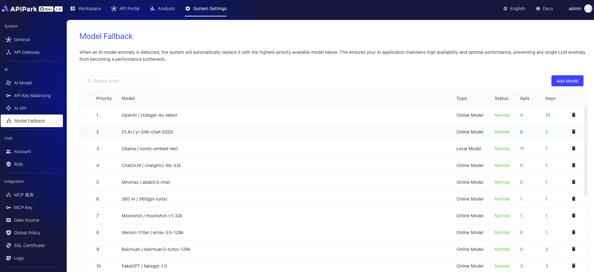

# AI Model Disaster Recovery

AI model disaster recovery is an intelligent scheduling mechanism designed to ensure high availability and stability of AI services. When the primary AI provider experiences a failure, load balancing can automatically switch requests to a backup AI provider. This effectively prevents service interruption caused by provider issues, ensures continuous operation of AI applications, and enhances user experience.

Model disaster recovery also supports prioritizing providers, ensuring that in the event of an anomaly, switching can occur according to a predetermined priority order, further optimizing resource utilization and response speed.

  