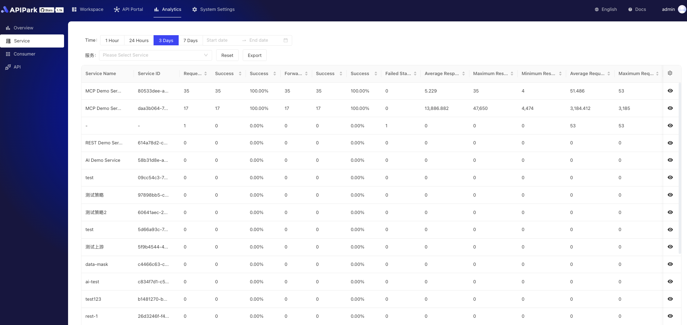
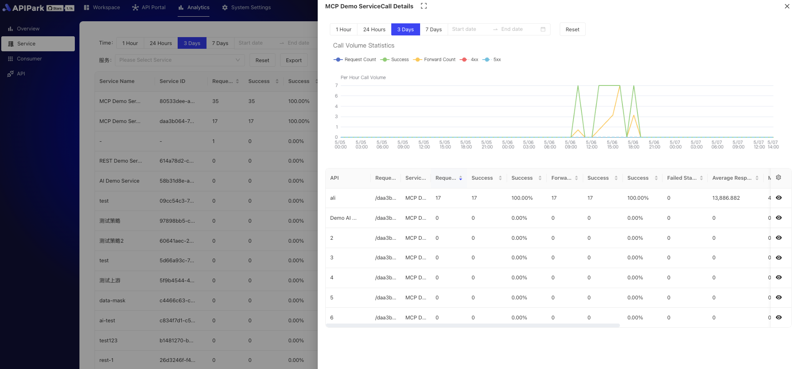

# API Call Analysis Report

APIPark analyzes historical call data to display long-term API call trends and performance changes, helping companies maintain API stability.

> 💡 APIPark's API call analysis report relies on the InfluxDB database. If you use the scripts provided by APIPark for deployment, InfluxDB will be installed by default. Learn more: [🔗 Deploy APIPark](deploy.md).
> 💡 You can also deploy an external InfluxDB database and fill in the InfluxDB data source information in the APIPark system settings. Learn more: [🔗 Set Data Source](system_setting/data_source.md).

## Global Overview

1. REST Service Call Overview
Provides visual analysis of multiple metrics, including but not limited to total request volume, data transfer volume, and average response time. Supports custom time period data filtering, with clear trend and change demonstrations on charts.

  

2. AI Service Call Overview
Displays key indicators for AI services, such as request count, token usage, average token duration, etc. Supports custom time period data filtering, presenting performance and usage through intuitive charts.

  

3. Multi-Dimensional Call Statistics
Supports multi-dimensional filtering analysis based on services, consumers, and APIs.

  

  

## Service Level Overview

Provides service call statistics, detailing the usage and performance of each service, supporting in-depth analysis and optimization decisions.

  
