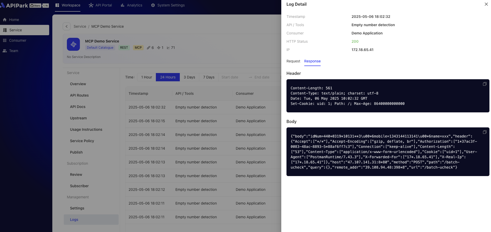

# Service Call Logs

In the **Service Management - Logs** module, users can query and view historical request logs of **API** or **MCP** within the service in real-time. This feature offers the following characteristics:

1. Request and Response Details:
* Supports viewing the complete request parameters and return parameters, clearly showing the input and output content of each call.
* Parameters are presented in a structured format for easy understanding and analysis.

2. Streaming Data Processing:
* For streaming data, logs are automatically organized into an easy-to-read format, optimizing the viewing experience and ensuring data continuity and readability.

3. Real-time Query and Historical Traceability:
* Provides real-time log query functionality, allowing users to monitor the current status of service calls.
* Supports filtering historical logs by time range, quickly locating specific call records.

This feature aims to provide developers and service managers with efficient and convenient log management tools, assisting in service call analysis and optimization.

## Feature Display
1. Query the service log list by time, displaying basic information such as consumers, call status codes, calling IP, response time, and data transfer size.

  

2. Obtain call log details, including request body information, response body information, etc.

  

3. For streaming (i.e., AI large model calls), logs are automatically organized into an easy-to-read format, optimizing the viewing experience and ensuring data continuity and readability.

  