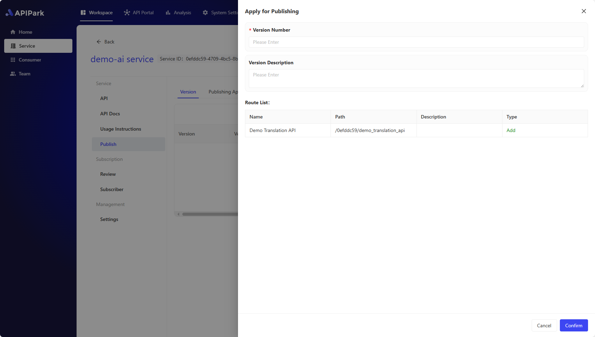

# REST Services (API Gateway)

REST services are web services following the REST (Representational State Transfer) architectural style. They utilize standard HTTP methods to handle data and interactions, making the services easy to understand and use. On the APIPark platform, REST services can be easily created and managed to support various web and mobile application needs.

In the API Gateway, **REST Services** refer to a set of **REST APIs** (Application Programming Interfaces) that collectively offer specific functionalities or business logic. **REST Services** are the basic units used on the platform to organize and manage APIs. Through **REST Services**, developers can define, publish, manage, and monitor a series of APIs available for other users or systems to call.

Consumers can choose and subscribe to **REST Services** that meet their needs. By subscribing, consumers obtain access rights to specific API interfaces, allowing them to customize calls according to actual business needs. The system employs an efficient authentication mechanism to ensure that when APIs are called, access requests carry valid authentication information, ensuring data security and user privacy.

# Creating and Publishing REST Services
## 1. Create a REST Service

Go to the **Workspace** module, select **Services** in the sidebar, then **Create Service**, and fill in:

- **Service Name**
- **Service ID**: The unique identifier of the service, which cannot be changed once saved.
- **Service Type**, select **REST Service**:
  - **AI Service**: AI Gateway, which converts different AI models and Prompts into a unified REST API through APIPark.
  - **REST Service**: A traditional API Gateway that can connect to microservices or HTTP REST APIs.
- **API Request Prefix**: Set a unified request prefix for all APIs of this service, which cannot be changed once saved.
- **Team**: If you have joined multiple teams, you need to set which team is responsible for managing this service.
- **Subscription Review**:
  - **No Review Required**: All consumers can subscribe and call this service.
  - **Manual Review**: Only consumers who pass the review can call this service.
- **Service Category**: Choose which category to publish the service to in the API portal.

## 2. Fill in API Upstream

  

**Field Descriptions**

<table><thead><tr><th width="169">Field Name</th><th>Description</th></tr></thead><tbody><tr><td>Upstream Type</td><td>The type of upstream service, currently only <code>static upstream with a fixed IP/domain and port number as the service entrance</code> is supported.</td></tr><tr><td>Service Address</td><td>The access address for upstream services; multiple upstream addresses can be filled in, and the weight of each upstream service can be configured.</td></tr><tr><td>Request Protocol</td><td>The protocol used to request upstream services, currently only HTTP/HTTPS is supported.</td></tr><tr><td>Load Balancing</td><td>Load balancing algorithm, currently supports weighted round-robin and IP Hash.</td></tr><tr><td>Forward Host</td><td>The Host value used when requesting upstream services. There are three options:  <b>Pass Client Request Host:</b> Under this strategy, the gateway or proxy server does not modify the Host header information in the request. It directly passes the original Host header from the client (the initiating party) to the upstream service (the server providing the service).  This allows the upstream service to recognize the original source domain of the request, enabling customized content delivery or specific logic execution based on the original request's Host header.  <b>Use Upstream Service Host:</b>  In this strategy, the gateway or proxy server replaces the original Host header in the request with one or more configured Host headers of upstream services.  This is usually used to route requests to specific backend services regardless of the Host header in the client request. This can simplify the configuration of upstream services since they do not need to care about the Host header information of incoming requests.  <b>Rewrite Host:</b>  This strategy involves modifying the Host header in the request to a specific value. This can be used in various cases, such as when requests need to be routed to a different domain name or when requests need to comply with specific format or security requirements.  Rewriting the Host header can provide greater flexibility, but it may also lead to unexpected behavior, especially if the client relies on the original Host header for certain operations.</td></tr><tr><td>Timeout</td><td>The timeout for requesting upstream services, in ms.</td></tr><tr><td>Timeout Retry Count</td><td>Allows the number of times to retry requesting upstream when a timeout occurs. During a retry, if multiple service addresses are configured for upstream, the gateway will request an unqueried service address.</td></tr><tr><td>Call Frequency Limit</td><td>The current allowable request limit per second for upstream.</td></tr><tr><td>Forward Upstream Request Header</td><td>The request header information that needs to be added or deleted when requesting upstream; if not configured, the gateway will forward the request header to the upstream service as is.</td></tr></tbody></table>

## 3. Create a Route

  

  

**Field Descriptions**

| Field Name          | Description                                               |
| :------------------ | :-------------------------------------------------------- |
| Intercept Request   | Whether to intercept requests to this interface            |
| Request Method      | Supports common HTTP request methods like GET, POST, PUT, DELETE, etc., and supports multi-select |
| Request Path        | The URI of the API used in the application's request URL relative path, supporting Restful parameters and path prefix matching |
| Advanced Matching   | Supports routing matching through request headers, request parameters, and Cookies. Multiple entries can be added |
| Forward Upstream Path | The relative path forwarded to upstream                 |
| Request Timeout     | Defines the timeout from gateway forwarding request to upstream response |
| Retry Count         | When the request forwarding to upstream fails, the gateway will automatically trigger a retry of the forwarding request, with the maximum number not exceeding the retry count |
| Forward Upstream Request Header | New, edit, and delete parameters for forwarding upstream request headers are available, mainly used for authentication between the gateway and upstream |

## 4. Fill in API Documentation

## 5. Publish the Service

✨ If the **API, API Documentation, Usage Instructions, or Upstream** of the service changes, you need to publish a new version for the new configuration to take effect.

Select **Publish** in the sidebar, then click **New Version**, and fill in:

- **Version Number**
- **Version Description**

Click **Confirm** to complete the publishing.

> 💡 If this is the first time publishing the service, it will appear in the **API Portal** and can be subscribed to by **consumers**.
> 💡 If the service requires **manual review**, consumers who subscribe to the service will need to wait for approval from the **Service Administrator** before they can call the API.

# [Optional] Create Consumers and Subscribe to Services

APIPark provides the **API Portal** feature, allowing users to publish services to the API portal so other users can view, subscribe, and call them.

To ensure the secure and standardized use of APIs and reduce the management cost of APIs, users need to first create **Consumers** and subscribe to services through them, and then use the **Authorization Certificate** of the consumer to call the API.

[🔗 Learn More: Consumers](../consumers.md)

# [Optional] Call API

[🔗 Learn More: Call API](../call_api.md)