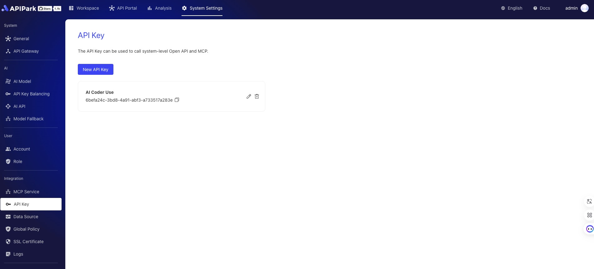

# System APIKey

The APIPark APIKey module is a system-level feature designed to provide secure and efficient integration with the APIPark OpenAPI. Users can securely access the OpenAPI provided by APIPark through a valid API key, enabling quick integration with third-party systems. Additionally, this module supports accessing the system-level MCP (Model Context Protocol) Server functions using the API key, facilitating quick connections for MCP Clients (like Claude, Cursor, Cline, etc.).

On APIPark, we can manage system APIKeys as shown in the image below:

  

In the MCP page, quick integration is possible as shown below:

  