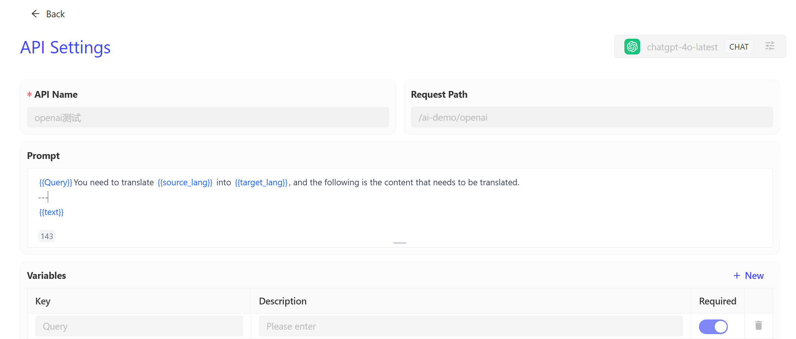

# AI API Management

AI API Management is used to centrally display and manage the APIs called from various AI vendors. Users can view detailed information and token consumption for all AI API calls through this list.

You can view all the APIs that utilized the capabilities of the model provider within the selected time range, as well as the models each API called and the number of tokens used. This is beneficial for controlling the resource consumption of that model.

You can also click the view button on the far right of the API list to see the routing configuration for this API, which includes the prompt information edited in APIPark.

