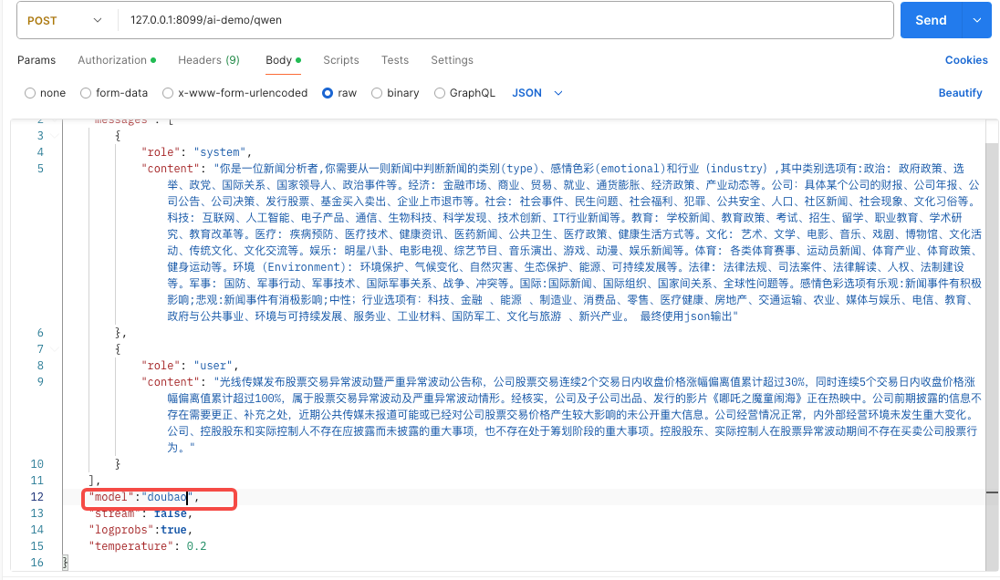

# Model Alias Mapping

Through the AI unified interface provided by `APIPark`, global model parameter routing is supported. You can directly call the target model in any connected AI interface using the format parameter **model=supplier ID/model name**. This automatically completes channel routing, authentication parameter passing, and response format standardization.

Example: `"model":"volcengine/llama3-8b"` calls the Llama3 model from Volcengine. You can view the specific model parameter values by clicking the number in the Models column of the AI Model list.

  

  

However, some model parameter names may be too long. To facilitate easier use during development, APIPark provides a model alias mapping feature. You can find the "Model Redirection" configuration in the respective "AI Service" settings to customize simplified model value mappings to the original model values.

  

For example, if you need to simplify the parameter value of the Doubao model under Volcengine, you can configure the following in JSON format to map the model parameter value "doubao" to "volcengine_maas/doubao-1-5-lite-32k-250115".

  

This feature is compatible with historical configurations, and the original model values can still be used as normal.

The API call is shown below:

  