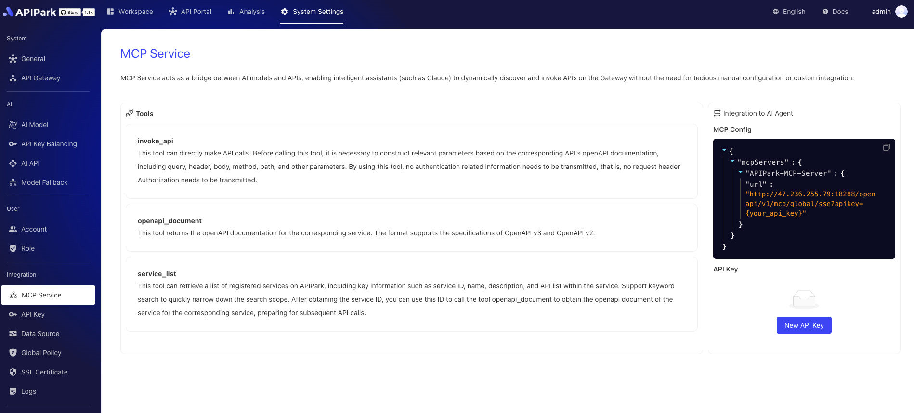
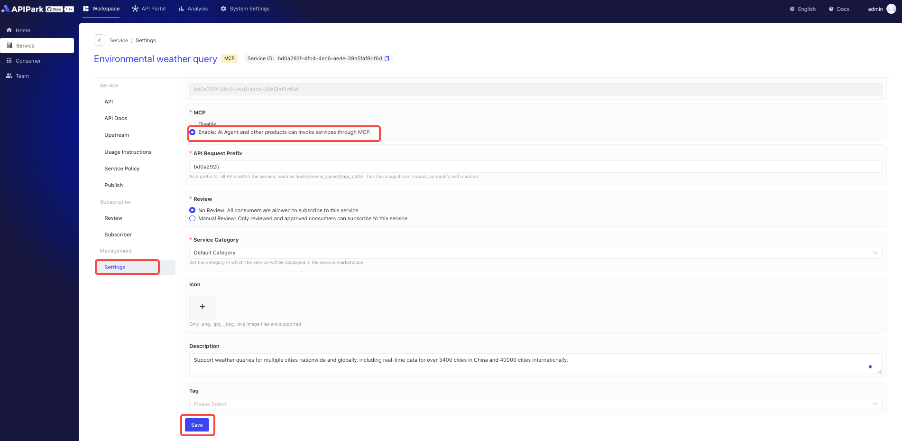
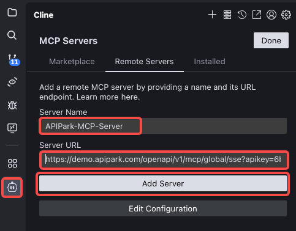

# Integrating MCP (Model Context Protocol)
Anthropic introduced the Model Context Protocol (MCP) at the end of 2024. As an emerging open protocol, MCP establishes a bidirectional communication channel between LLMs and external applications, functioning as a "USB-C" interface for AI. This protocol helps models discover, understand, and securely invoke various external tools or APIs. This means:
- Developers no longer need to write complex custom interfaces to integrate each external service.
- Users can experience AI effortlessly invoking massive third-party applications, whether handling daily office tasks, analyzing data, or executing marketing automation. AI is evolving from "intelligent conversation" to "efficient action."

  
(Image source: [What is Model Context Protocol (MCP)? How it simplifies AI integrations compared to APIs | AI Agents](https://norahsakal.com/blog/mcp-vs-api-model-context-protocol-explained/))

APIPark provides system-level MCP services and service-level MCP services, supporting seamless integration with AI Agents, MCP Host, MCP Client tools, and platforms like Claude, Cursor, Cline, and Dify. MCP (Model Context Protocol) is a standardized protocol designed to enable efficient communication and data exchange between AI models, services, and clients.  
Through APIPark's MCP Server, any client supporting the MCP protocol can rapidly access its ecosystem, achieving interoperability, scalability, and streamlined workflows. This allows developers and enterprises to leverage APIPark's robust infrastructure to build, manage, and deploy AI-driven solutions with minimal integration costs.

## System-Level MCP Service
The system-level MCP (Multi-Cloud Platform) interface provides a unified, standardized access mechanism for all publicly available services on the platform. This functionality simplifies service integration and enables seamless interactions across diverse services, making it ideal for building multimodal agents and automated workflows.



The system-level MCP offers the following tools:
- **service_list**: Retrieves a list of registered services in APIPark. Each service includes its unique identifier (service ID), name, description, and list of APIs. Supports keyword-based fuzzy search to quickly narrow down results. After obtaining a service ID, use the openapi_document tool to fetch its OpenAPI documentation for subsequent API calls.
- **openapi_document**: Fetches the OpenAPI documentation for a specified service. Supports both OpenAPI v2 and v3 specifications. By providing a service ID, users can view all API definitions, parameter structures, request methods, and other details needed to construct requests.
- **invoke_api**: Directly calls a specified API interface. Users must construct necessary request parameters (path, method, query parameters, headers, body) based on the API's OpenAPI documentation. No authentication information (e.g., Authorization header) is required during invocation.

Example scenario for **retrieving today's weather information** and the AI Agent invocation process:


## Consumer-Level MCP Service
The capabilities of the consumer-level MCP Service match those of the system-level service, but differ in the scope of accessible API services. When querying or requesting interfaces via consumer-level MCP, only APIs from services the consumer has subscribed to can be invoked.  
This feature provides a more secure and permission-restricted MCP invocation model, enabling teams to call authorized API capabilities through a unified MCP Service based on consumer permissions.


## Service-Level MCP Service
The service-level MCP (Model Context Protocol) provides an efficient, standardized approach to seamlessly integrate services with AI Agents and other MCP-compatible tools. Key features include:
- **One-click MCP activation**:  
  Quickly convert HTTP or AI APIs into MCP services. Simple configuration enables integration without complex development, significantly lowering barriers.
- **MCP tag display in Service Plaza**:  
  Services with MCP enabled display a dedicated MCP tag in the Service Plaza for easy identification.
- **MCP integration details on service pages**:  
  Service detail pages display complete MCP integration information. Copying relevant configurations allows effortless integration into AI Agents or other MCP-supported tools for rapid deployment.  
These features help developers and enterprises efficiently build and manage AI-driven service ecosystems, enhancing interoperability and scalability.

### Enabling MCP for New Services
Enable MCP when creating a service on the service list page, as shown:


### Enabling MCP for Existing Services
Enable MCP in the service settings interface, as shown:



### Displaying MCP Services in API Portal
After service publication, view MCP information in the API Portal, including MCP configuration previews for AI Client integration.


# Quick Integration with MCP Server
MCP Config can be obtained from the system-level or service-level MCP overview pages mentioned above. Example configuration (for reference only):
```
{
  "mcpServers": {
    "APIPark-MCP-Server": {
      "url": "https://demo.apipark.com/openapi/v1/mcp/global/sse?apikey=6befa24c-3bd8-4a91-abf3-a733517a283e"
    }
  }
}
```
## Integrating MCP Server with Cursor
### Mac Environment
1. Open Cursor → Preferences → Cursor Settings


2. Click MCP → Add new global MCP server


3. Paste the example configuration above and save.


4. After successful saving, the new MCP Server will appear in the list.


## Integrating MCP Server with Trae
Trae requires integration with Cline. First install Cline in Trae:
1. Open Trae's plugin marketplace and install Cline.



2. Select Cline in the left navigation bar, click MCP Servers → Remote Server. Paste the MCP Server information as shown:


3. After filling, click Add Server. Upon successful addition, the server will appear in the Installed list:


