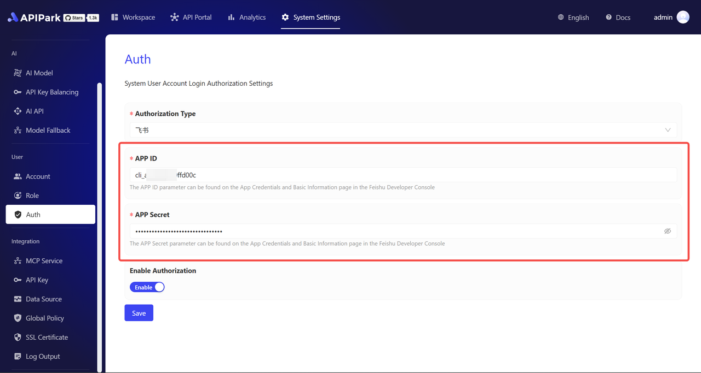

# Feishu Authorization Login
In System Settings, select the User Authentication menu to access the Account Authorization Login setup page. On this page, you can enable Feishu accounts for third-party authorization.
  

## Authorization Configuration
1. **Select Authentication Type as "Feishu"**  
   Choose Feishu in the Authorization Type dropdown.  
     

2. **Obtain and Enter APP ID and APP Secret**  
   - Log in to the Feishu Developer Console and navigate to the "Application Credentials & Basic Information" page.  
     
   - Enter the APP ID and APP Secret into the corresponding fields on the APIPark Account Authorization Configuration page.  
     

3. **Enable Authorization Switch**  
   After filling in the above fields, toggle the authorization switch to "ON" and save to activate immediately.  
     

## Feishu Login
After completing authorization configuration, the Feishu login entry will appear on the login interface.  
  

Click the **[Feishu Authorization Login]** button and follow the prompts to log in.  
