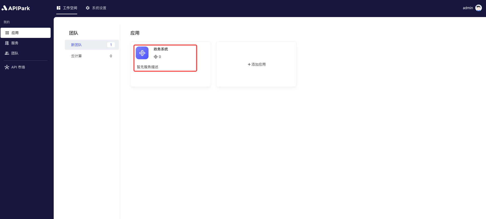
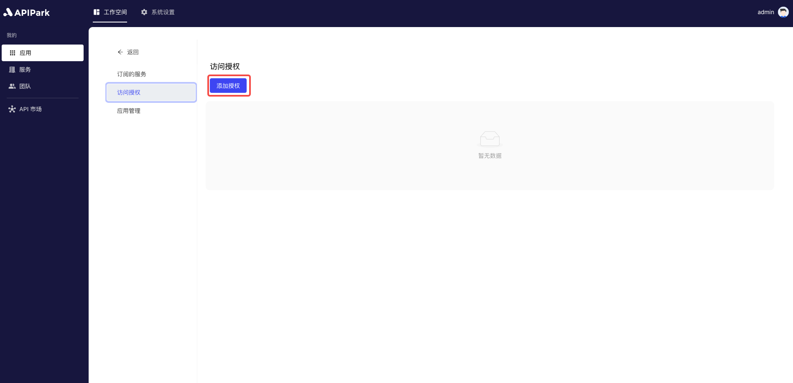

# 访问授权

在 `APIPark`中，订阅方以应用为单位订阅服务。每个应用有自己的访问授权管理，当订阅申请审批通过后，用户可以使用应用的访问授权信息（如 API 密钥或令牌）去调用订阅的服务。这样，可以确保应用调用 API 时符合安全策略，并且能够防止未经授权的访问，保障服务的安全和稳定。

## 操作演示

### 配置访问授权

1. 选中需要配置访问授权的应用，点击进入内页。

  

2. 点击`访问授权`，进入授权列表页面，点击`添加授权`按钮。

  

3. 选择一种鉴权方式，并填写相关信息，如下，我们选择了Basic鉴权：

  

此外，目前开放平台还支持`Apikey`、`JWT`、`AK/SK`**等多种鉴权方式。**

针对不同类型的鉴权方式，相关的公共配置字段如下：

<table><thead><tr><th width="182">字段名</th><th>说明</th></tr></thead><tbody><tr><td>名称</td><td>鉴权标识，建议使用具有含义的名称</td></tr><tr><td>参数位置</td><td>鉴权信息传输的参数位置，支持Query、Header。</td></tr><tr><td>参数Key</td><td>定义从哪个Key中获取参数值。</td></tr><tr><td>过期时间</td><td>鉴权过期时间，不设置则为永不过期。</td></tr><tr><td>隐藏鉴权信息</td><td>转发给上游服务时，是否将鉴权的字段隐藏。</td></tr></tbody></table>

若想了解更多鉴权的使用细节，可点击下方教程：

* [APIKey](./apikey.md)
* [Basic Authorization](./basic-auth.md)
* [AK/SK](./aksk.md)
* [JWT](./jwt.md)