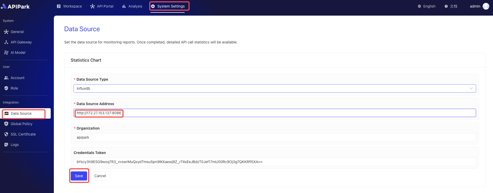

# 数据源

APIPark 会将 API 的调用统计数据存储在外部数据库中，便于生成各类分析报告。

## 设置分析图表的数据源

进入 **系统设置** 模块，在侧边栏点击 **数据源**，在数据源列表页面修改分析图表设置。

:::tip

💡 APIPark 的 API 调用分析报告依赖于 InfluxDB 数据库。如果你使用 APIPark 官方提供的脚本部署，默认会安装 InfluxDB，如下图

  

了解更多：[🔗 部署 APIPark](deploy.md)。

:::

  
