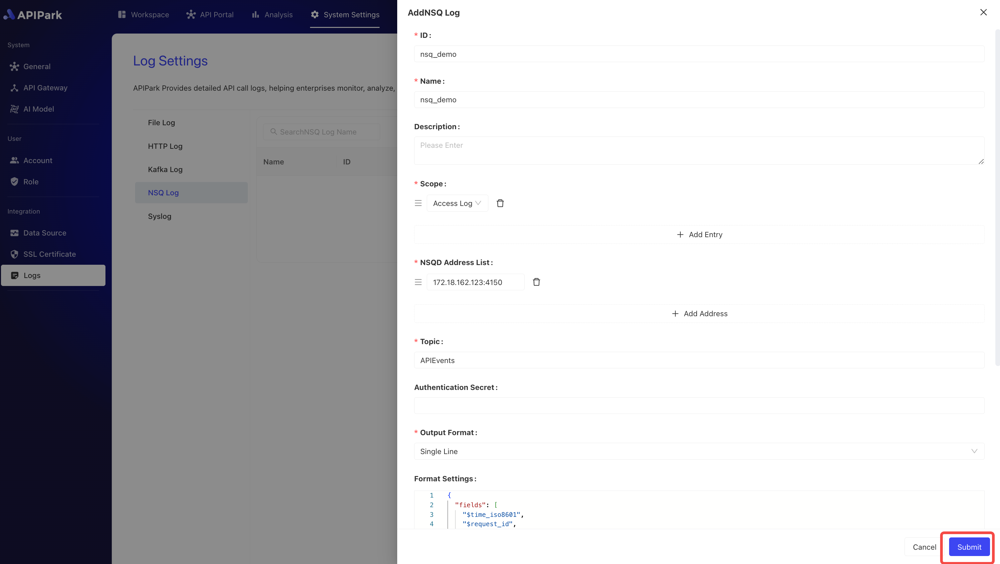
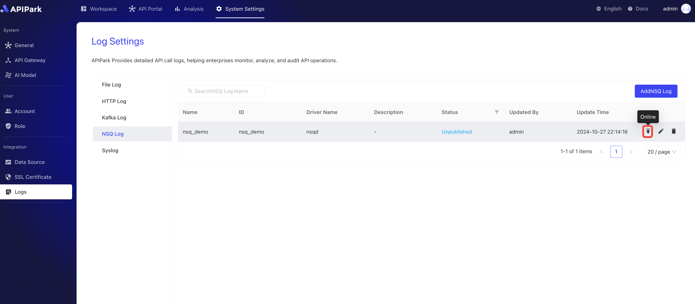

# NSQ日志

## 简介

收集请求网关的日志信息，并将其输出到`NSQ`中，方便使用者进行二次操作，如日志分析等。

## 特性

能够将程序运行中产生的日志内容输出到指定`NSQ`的Topic中。

* 支持填写多个`NSQD`请求地址
* 支持日志输出格式类型
* 支持自定义日志格式化配置

## 操作演示

### 新建NSQ日志配置

1. 点击`运维与集成` -> `NSQ日志`，点击`添加NSQ日志`。

  


2. 填写NSQ日志配置，填写完成后点击`确认`。

  

**配置说明**：

| 字段名称     | 说明                                                         |
| ------------ | ------------------------------------------------------------ |
| NSQD地址列表 | NSQD提供TCP服务的地址列表，支持填写多个地址                  |
| Topic        | NSQD的Topic信息                                              |
| 鉴权Secret   | 配置访问NSQD的鉴权密钥信息                                   |
| 输出格式     | 输出日志内容格式，支持单行、Json格式输出                     |
| 格式化配置   | 输出格式模版，配置教程[点此](https://help.apinto.com/docs/formatter)进行跳转 |

**示例格式化配置**

```json
{
   "fields": [
      "$time_iso8601",
      "$request_id",
      "@request",
      "@proxy",
      "@response",
      "@status_code",
      "@time"
   ],
   "request": [
      "$request_method",
      "$scheme",
      "$request_uri",
      "$host",
      "$header",
      "$remote_addr"
   ],
   "proxy": [
      "$proxy_method",
      "$proxy_scheme",
      "$proxy_uri",
      "$proxy_host",
      "$proxy_header",
      "$proxy_addr"
   ],
   "response": [
      "$response_headers"
   ],
   "status_code": [
      "$status",
      "$proxy_status"
   ],
   "time": [
      "$request_time",
      "$response_time"
   ]
}
```


### 上线
1. 点击待上线配置后方的`上线`按钮。

  

