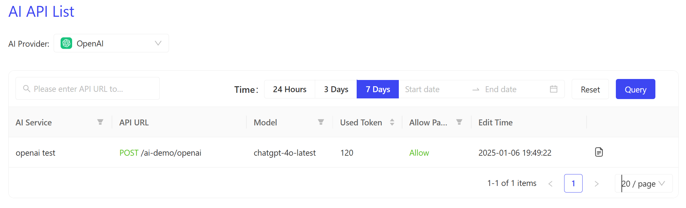
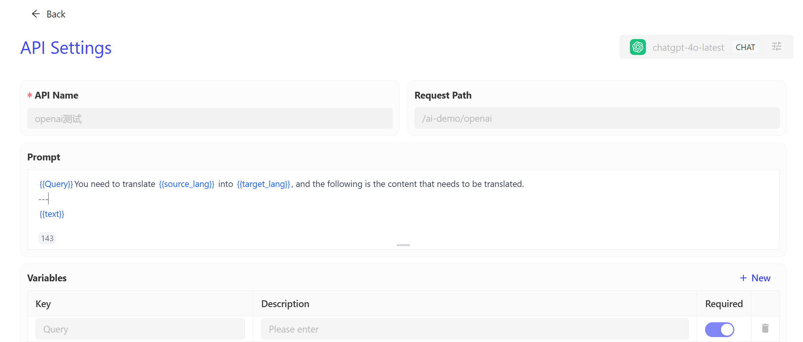

```
sidebar_position: 4
```

# AI API 管理

AI API 管理用于集中展示和管理调用各个 AI 供应商的 API。用户可以通过该列表查看所有调用的 AI API 的详细信息和消耗token的情况。

  


你可以查看在选定时间范围内，调用了该模型供应商能力的所有API。以及每一个API的调用的模型和使用的token数量。这有利于对该模型的资源消耗进行管控。

你也可以点击API列表中最后侧的查看按钮，查看这个 API的路由配置，这包含了其在APIPark上编辑的prompt信息。

  
