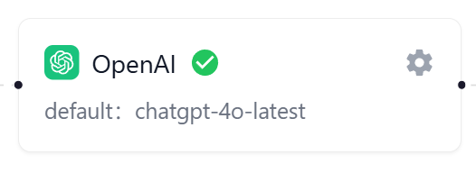

# AI 模型负载均衡

AI 模型负载均衡是一种智能调度机制，旨在确保 AI 服务的高可用性和稳定性。当主要的 AI 供应商服务出现故障时，负载均衡能够自动将请求切换到备用的 AI 供应商上。通过这种方式，它能够有效避免因供应商问题导致的服务中断，保障 AI 应用的连续运行，提升用户体验。

负载均衡还支持对供应商进行优先级排序，确保在异常情况下，能够按照预设的优先级顺序进行切换，进一步优化资源利用和响应速度。

  

## 模型负载均衡图介绍

在AI模型页面的已设置tab下，会展示当前已配置的所有AI模型供应商的负载均衡图。你可在这个图上查看各个供应商以及其对应的APIKEY的状态信息。

- **供应商卡片**：在供应商卡片上可查看该供应商的存活状态，并且显示默认选择的模型。用户点击右上角的编辑按钮进行编辑。

  

- **APIKEY卡片**：连接在供应商卡片右侧的是该供应商的APIKEY卡片。每个色块代表该供应商上的APIKEY，绿色代表该APIKEY为正常状态，红色代表为异常状态（不可用）。

  

- **API关联数量**：AI Services 与各供应商卡片连接线上的数据代表有多少api调用了该供应商的AI模型。点击该数据文字可新开页面查看具体的AI API 列表。

  

- **APIKEY数量**：供应商卡片与APIKEY卡片连线上的数据代表该供应商存在多少个APIKEY。点击该数据文字可新开页面查看和管理对应的 APIKEY 资源池。

## 负载优先级

当前供应商配置中有一个负载优先级的字段，该字段觉得了在其他供应商异常的情况下，其关联的API优先调用哪个供应商的AI模型。优先级数字越靠前（越小）的优先级越高，优先调用该供应商的默认模型。

系统支持两种调整负载优先级的方法：

- 直接在负载均衡图中，拖动供应商的卡片即可改变优先级排序。
- 在对应的供应商配置弹窗中，调整其负载优先级数字为目标的排名数字即可。

  