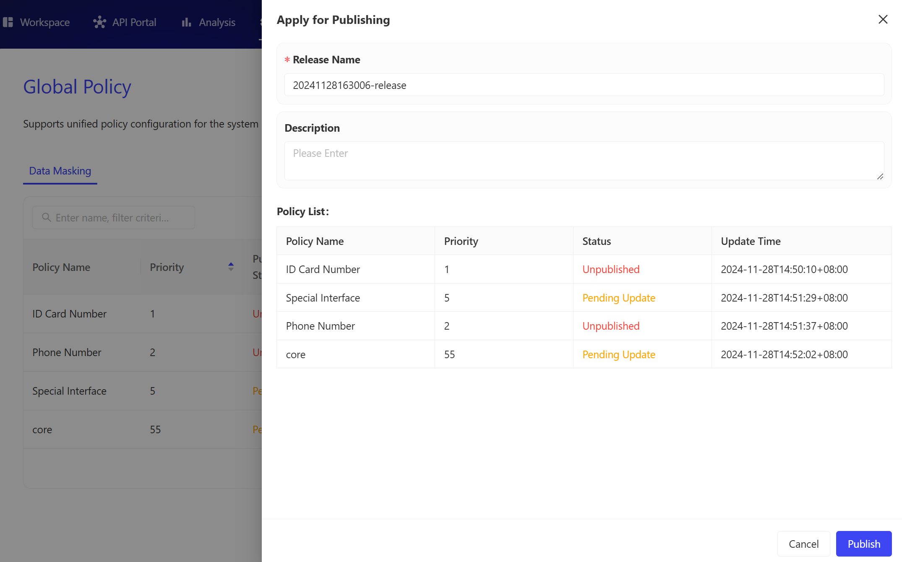
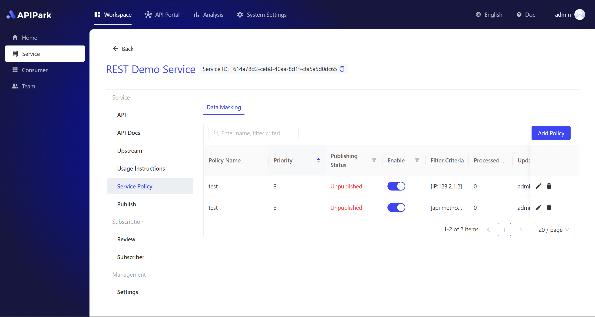

---

sidebar_position: 6

title: "数据脱敏"

---

# 数据脱敏

数据脱敏功能是 APIPark 安全特性的一个重要组成部分，在 API 响应中实现了自动将敏感信息进行替换或隐藏，确保数据传输过程中客户数据、财务数据、知识产权、员工信息... 等等企业的核心信息不被泄露。

数据脱敏功能不仅帮助企业满足数据保护法规的要求，同时也能增强了用户对企业数据管理能力的信任。APIPark 数据脱敏策略为企业提供一个安全、合规且高效的 API 开放生态。@崔嘉杰 

APIPark 的数据脱敏策略分为两个层级：全局策略和服务级策略。

## 1. 全局脱敏策略

进入 **系统设置** 模块，在侧边栏选择 **全局策略**，然后选择 **数据脱敏。**

  

### 1.1 添加策略

点击列表右上角的【添加策略】按钮，即可进入添加策略页面。

  

- 策略名称：策略名称，必填项，用于简洁说明该策略是什么。
- 策略类型：当前仅可选择数据脱敏，后续会增加更多策略类型。
- 优先级：用于判断多个策略间的执行优先级，数字越小优先级越高。仅支持正整数，最小为1。
- 描述：当前策略的详细介绍，例如制定该策略的背景和目标等。
- 匹配条件：可通过多个维度选中匹配当前规则的API，支持多个匹配条件。非必填，默认不填则代表匹配所有的API。
- 数据脱敏规则：制定需要脱敏的参数值和脱敏方式。必填项，支持添加多种脱敏规则。

### 1.2 添加匹配条件

- 在全局脱敏策略中，添加匹配条件时，有以下可选属性和属性值

| 属性名       | 可选属性值                                   |
| :----------- | :------------------------------------------- |
| API 请求方式 | ALL/GET/POST/PUT/DELETE/PATCH/HEADER/OPTIONS |
| API 路径     | 通过正则表达式填写需要命中的 API 路径        |
| IP           | 可输入 IP 地址或 CIDR 范围，每条以换行分割   |
| 消费者       | 可从消费者列表中进行选择，支持多选           |

- 当添加多条匹配条件时，最终匹配的API是符合多个匹配条件的并集。

  

### 1.3 添加脱敏规则

添加脱敏规则的时候，需要分两步，第一步是设置好需要对哪些数据进行脱敏，第二步是设置这些数据如何脱敏。

所以需要分别设置数据匹配规则和脱敏规则。

- 数据匹配规则支持以下可选属性和属性值

| 匹配类型   | 可选项                                       | 备注                                                        |
| :--------- | :------------------------------------------- | :---------------------------------------------------------- |
| 数据格式   | 姓名、手机号、身份证号、银行卡号、日期、金额 | 可选项是已内置的数据规则，系统会自动识别所有 value 进行匹配 |
| 关键字     | 可输入需要脱敏的key或value的关键词           | 对 key 和 value 都会进行模糊匹配                            |
| 正则表达式 | 可输入需要脱敏的参数名的正则表达式           | 对 key 和 value 都会进行正则匹配                            |
| JsonPath   | 可输入 JsonPath 表达式                       | 对key进行匹配                                               |

- 脱敏规则支持以下选项

| 脱敏类型 | 具体配置                                       |
| :------- | :--------------------------------------------- |
| 局部显示 | 可选择从第几位数据开始，显示多少位数据         |
| 局部遮蔽 | 可选择从第几位数据开始，遮蔽多少位数据         |
| 截取     | 可选择从第几位数据开始，截取多少位数据         |
| 替换     | 可选择用随机字符串替换或者指定替换为特定字符串 |

  

### 1.4 发布全局策略

策略创建成功后，需要对策略进行发布，才会正式生效。

- 对于全局策略，点击策略列表右上角的【发布】按钮，将会弹出确认弹窗，弹窗中会显示本次发布版本的变更内容。点击【确认】后即可发布成功。
- 策略有三种状态：
  - 未发布：新创建的策略未发布前会显示为“未发布”状态
  - 已发布：策略发布后，会显示为“已上线”状态
  - 待更新：策略发布后，编辑策略使得策略配置有变更，此时变更内容并不会马上生效，需要再次发布。这时候会显示该策略“待更新”状态

  

## 2. 服务级脱敏策略

进入 **工作空间** 模块，在侧边栏选择 **服务**，然后选择某个服务详情中二级菜单的 **服务策略**，选择 **数据脱敏。**

  

### 2.1 添加策略

点击列表右上角的【添加策略】按钮，即可进入添加策略页面。

- 策略名称：策略名称，必填项，用于简洁说明该策略是什么。
- 策略类型：当前仅可选择数据脱敏，后续会增加更多策略类型。
- 优先级：用于判断多个策略间的执行优先级，数字越小优先级越高。仅支持正整数，最小为1。
- 描述：当前策略的详细介绍，例如制定该策略的背景和目标等。
- 匹配条件：可通过多个维度选中匹配当前规则的API，支持多个匹配条件。非必填，默认不填则代表匹配所有的API。
- 数据脱敏规则：制定需要脱敏的参数值和脱敏方式。必填项，支持添加多种脱敏规则。  

### 2.2 添加匹配条件

- 在服务级脱敏策略中，添加匹配条件时，有以下可选属性和属性值
- 注意，相对于全局脱敏策略，服务级脱敏策略中增加提供API列表选项

| 属性名      | 可选属性值                                       |
| :---------- | :----------------------------------------------- |
| API请求方式 | ALL/GET/POST/PUT/DELETE/PATCH/HEADER/OPTIONS     |
| API路径     | 通过正则表达式填写需要命中的API路径              |
| IP          | 可输入IP地址或CIDR范围，每条以换行分割           |
| 消费者      | 可从**当前服务**的消费者列表中进行选择，支持多选 |
| API         | 可从**当前服务**的API列表中进行选择，支持多选    |

- 当添加多条匹配条件时，最终匹配的API是符合多个匹配条件的并集。

### 2.3 添加脱敏规则

添加脱敏规则的时候，需要分两步，第一步是设置好需要对哪些数据进行脱敏，第二步是设置这些数据如何脱敏。

所以需要分别设置数据匹配规则和脱敏规则。

- 数据匹配规则支持以下可选属性和属性值

| 匹配类型   | 可选项                                       | 备注                                                      |
| :--------- | :------------------------------------------- | :-------------------------------------------------------- |
| 数据格式   | 姓名、手机号、身份证号、银行卡号、日期、金额 | 可选项是已内置的数据规则，系统会自动识别所有value进行匹配 |
| 关键字     | 可输入需要脱敏的key或value的关键词           | 对key和value都会进行模糊匹配                              |
| 正则表达式 | 可输入需要脱敏的参数名的正则表达式           | 对key和value都会进行正则匹配                              |
| JsonPath   | 可输入JsonPath表达式                         | 对key进行匹配                                             |

- 脱敏规则支持以下选项

| 脱敏类型 | 具体配置                                       |
| :------- | :--------------------------------------------- |
| 局部显示 | 可选择从第几位数据开始，显示多少位数据         |
| 局部遮蔽 | 可选择从第几位数据开始，遮蔽多少位数据         |
| 截取     | 可选择从第几位数据开始，截取多少位数据         |
| 替换     | 可选择用随机字符串替换或者指定替换为特定字符串 |

  

### 2.4 发布服务级策略

策略创建成功后，需要对策略进行发布，才会正式生效。

- 对于服务级策略，在服务详情内二级菜单的发布菜单，点击发布列表右上角的【发布】按钮。将会弹出确认弹窗，弹窗中会显示本次发布版本的变更内容。点击【确认】后即可发布成功。

  

- 策略有三种状态：
  - 未发布：新创建的策略未发布前会显示为“未发布”状态
  - 已发布：策略发布后，会显示为“已上线”状态
  - 待更新：策略发布后，编辑策略使得策略配置有变更，此时变更内容并不会马上生效，需要再次发布。这时候会显示该策略“待更新”状态

  

## 3. 策略优先级

同一个对象命中多个策略时，会存在执行优先级的问题，主要逻辑如下：

- 服务级策略优先于全局策略
- 同一个层级策略中，优先级数字越小，优先级越高
- 多条策略命中同一个对象时，仅执行优先级最高的策略

## 4. 处理日志

策略处理日志可以查看到当前策略对目标对象的处理情况，如数据脱敏策略的处理日志，可以看到需要脱敏的API入参或出参的原参数值和脱敏后的参数值情况对比。

- 在策略列表中，每一条已发布的侧栏右侧均有处理日志查看的操作按钮，点击该按钮后会弹出处理日志弹窗。
- 在处理日志弹窗中，支持对关键字段进行搜索策略日志条目。也支持通过时间段来筛选日志条目。