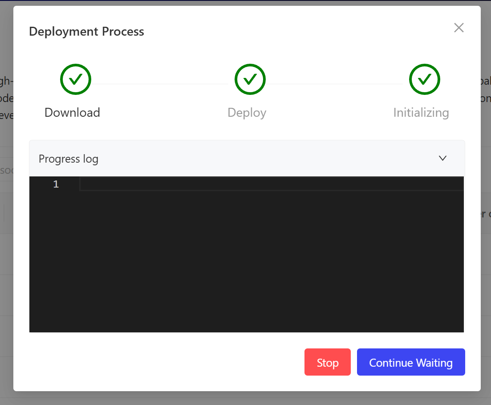
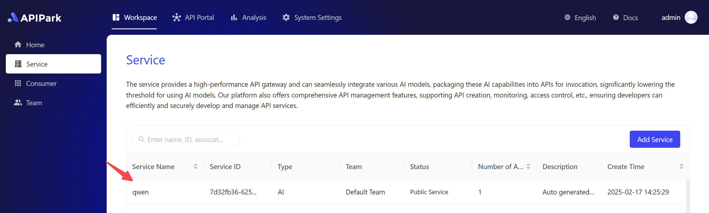

# 一键部署开源LLM

APIPark 一键部署开源LLM能力支持用户通过可视化界面一键部署主流开源大语音模型（如DeepSeek、LLaMA、ChatGLM、QWen等），自动完成模型优化、服务部署、网关配置初始化等操作。开发者无需关注底层架构，数分钟内即可将开源模型在本地部署起来，并转化为符合openai请求和响应格式的API接口。可以支持集成至现有业务系统，显著降低AI应用落地门槛，助力企业快速构建智能化服务能力。

## 1. 部署开源LLM
- 点击首页的“Deploy AI Locally & Generate API” 卡片

  

注：如果直接点击“Deploy Deepseek-R1”，那么会直接部署该模型，无需进行后续步骤。

- 输入需要部署的供应商名称，并且选择对应的模型，点击确认即可发起部署。

  

- 部署过程中会经历下载“下载模型文件”、“部署模型”和“初始化配置”三个阶段。用户可随时查看部署进程日志。

  

- 部署成功后，在服务列表中会增加该模型名的服务，可进入该服务内调用本地模型。

  

## 2. 调用开源LLM
- 在消费者列表中，找到该服务的订阅方消费者。一般默认为“Demo Application”，进去消费者详情，获取其API Key。复制该API Key准备调用接口时使用。

  

- 进入新部署的开源AI服务，查看其详情配置是否有误。确认无误后，需要在发布菜单处，点击【新建版本】按钮。把当前的配置发布到网关中，方可被调用。

  

- 发布后在API门户菜单中，找到该服务，即可调用对应的接口。调用该接口时，授权校验使用上述的API Key。

  
