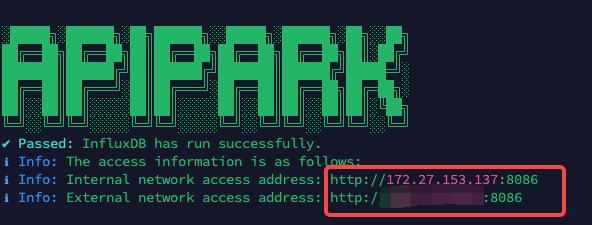
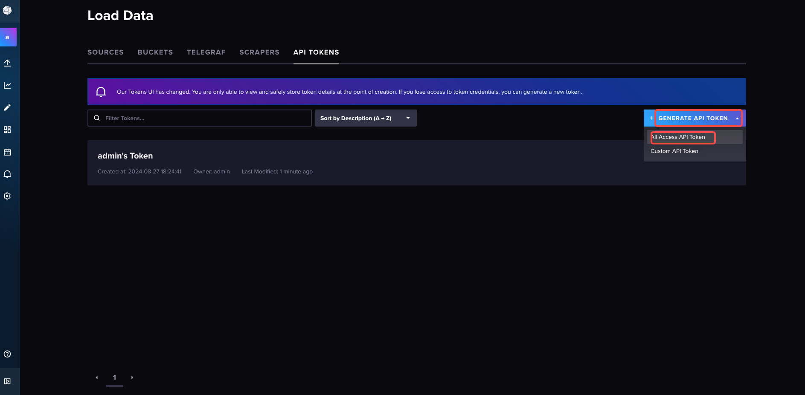
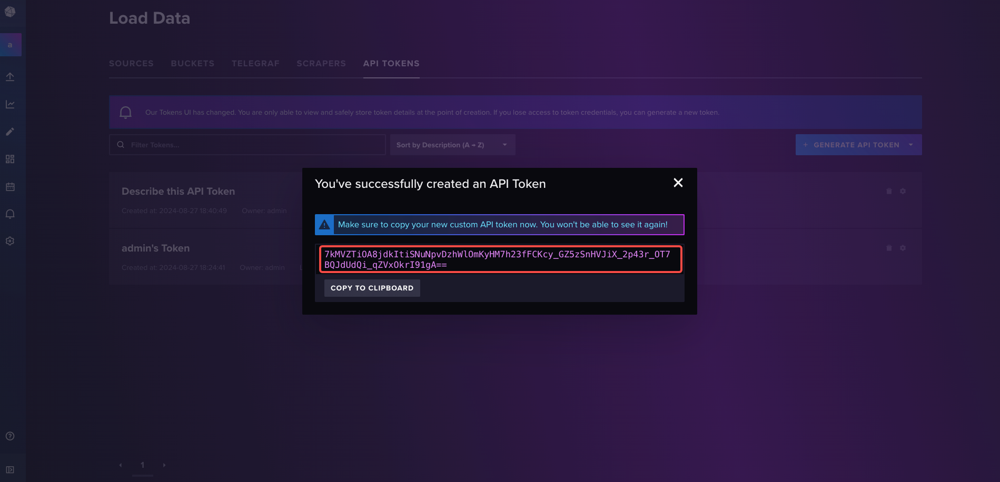

# 部署 APIPark
## 硬件要求

:::tip
建议配置：

- **CPU**：8核
- **内存**：16G
- **硬盘存储**：200G
- **操作系统**：Linux / Mac
- **系统架构**：AMD64 / ARM64
:::

:::note
最低配置：

- **CPU**：2核
- **内存**：4G
- **硬盘存储**：200G
- **操作系统**：Linux / Mac
- **系统架构**：AMD64 / ARM64
:::

## 程序依赖

`APIPark` 依赖 `MYSQL、Redis、InfluxDB` 数据库，下表是数据库所需版本：

<table><thead><tr><th width="184">名称</th><th>版本要求</th></tr></thead><tbody><tr><td>MYSQL</td><td>>=5.7.x</td></tr><tr><td>Redis</td><td>>=6.2.x</td></tr><tr><td>InfluxDB</td><td>>=2.6</td></tr></tbody></table>

## 部署方式

### 使用脚本部署

:::note
支持的系统列表：

* CentOS 7.9（7.x为代表）
* CentOS 8.5（8.x为代表）
* Ubuntu 20.04
* Ubuntu 22.04
* Debain 12.4
* Alibaba Cloud Linux 3.2104
* Alibaba Cloud Linux 2.1903

当前仅测试了上述部署的安装，若需要其他系统的一键部署，可给我们提交[Issue](https://github.com/APIParkLab/APIPark/issues)。
:::

输入一键部署指令：

```
curl -sSO https://download.apipark.com/install/quick-start.sh; bash quick-start.sh
```

按照提示进行部署即可，部署完成后，将会展示部署信息。

### Docker-Compose部署

:::node

使用此方法安装 APIPark，你需要安装 [Docker](https://www.docker.com/) 和 [Docker Compose](https://docs.docker.com/compose/)。

部署完成后，APIPark需要绑定API网关节点才可使用，具体教程请参考[配置API网关](./system_setting/api_gateway_cluster.md)

:::

#### 部署APIPark+API网关

1. 编辑`config.yml`

```
vi config.yml
```

2. 修改文件配置

```
version: 2
#certificate: # 证书存放根目录
#  dir: /etc/apinto/cert
client:
  advertise_urls: # open api 服务的广播地址
    - http://{IP}:9400
  listen_urls: # open api 服务的监听地址
    - http://0.0.0.0:9400
  #certificate:  # 证书配置，允许使用ip的自签证书
  #  - cert: server.pem
  #    key: server.key
gateway:
  advertise_urls: # 转发服务的广播地址
    - http://{IP}:8099
    - https://{IP}:8099
  listen_urls: # 转发服务的监听地址
    - https://0.0.0.0:8099
    - http://0.0.0.0:8099
peer: # 集群间节点通信配置信息
  listen_urls: # 节点监听地址
    - http://0.0.0.0:9401
  advertise_urls: # 节点通信广播地址
    - http://{IP}:9401
  #certificate:  # 证书配置，允许使用ip的自签证书
  #  - cert: server.pem
  #    key: server.key
```

上述配置中的`{IP}`是一个变量，应该填写容器所在**宿主机IP**，假设宿主机IP为`172.18.65.22`，则此时配置应如下

```
version: 2
#certificate: # 证书存放根目录
#  dir: /etc/apinto/cert
client:
  advertise_urls: # open api 服务的广播地址
    - http://172.18.65.22:9400
  listen_urls: # open api 服务的监听地址
    - http://0.0.0.0:9400
  #certificate:  # 证书配置，允许使用ip的自签证书
  #  - cert: server.pem
  #    key: server.key
gateway:
  advertise_urls: # 转发服务的广播地址
    - http://172.18.65.22:8099
    - https://172.18.65.22:8099
  listen_urls: # 转发服务的监听地址
    - https://0.0.0.0:8099
    - http://0.0.0.0:8099
peer: # 集群间节点通信配置信息
  listen_urls: # 节点监听地址
    - http://0.0.0.0:9401
  advertise_urls: # 节点通信广播地址
    - http://172.18.65.22:9401
  #certificate:  # 证书配置，允许使用ip的自签证书
  #  - cert: server.pem
  #    key: server.key
```

**配置说明**

| 字段名称                  | 说明                                                         |
| :------------------------ | :----------------------------------------------------------- |
| version                   | 配置版本号，默认2                                            |
| client                    | openAPI配置信息                                              |
| client -> listen_urls     | openAPI监听地址列表，格式：`{协议}://{IP}:{端口}`              |
| client -> advertise_urls  | openAPI广播地址列表，在控制台集群节点列表中展示，格式：`{协议}://{IP/域名}:{端口}` |
| client -> certificate     | openAPI证书信息列表                                          |
| gateway                   | 转发代理核心程序配置信息                                     |
| gateway -> listen_urls    | 转发代理核心程序监听地址列表，格式：`{协议}://{IP}:{端口}`    |
| gateway -> advertise_urls | 转发代理核心程序广播地址列表，在控制台集群节点列表中展示，格式：`{协议}://{IP/域名}:{端口}` |
| peer                      | Raft节点配置信息，用于Raft集群节点配置同步、加入集群、离开集群等操作的通信 |
| peer -> listen_urls       | Raft节点监听地址列表，格式：`{协议}://{IP}:{端口}`            |
| peer -> advertise_urls    | Raft节点广播地址列表，格式：`{协议}://{IP/域名}:{端口}`        |
| peer -> certificate       | Raft节点证书信息列表                                         |

3. 编辑`docker-compose.yml`文件

```bash
vi docker-compose.yml
```

4. 修改文件配置

```
version: '3'
services:
  apipark-mysql:
    image: mysql:8.0.37
    privileged: true
    restart: always
    container_name: apipark-mysql
    hostname: apipark-mysql
    command:
      - "--character-set-server=utf8mb4"
      - "--collation-server=utf8mb4_unicode_ci"
    ports:
      - "33306:3306"
    environment:
      - MYSQL_ROOT_PASSWORD={MYSQL_PWD}
      - MYSQL_DATABASE=apipark
    volumes:
      - /var/lib/apipark/mysql:/var/lib/mysql
    networks:
      - apipark
  apipark:
    image: apipark/apipark:v1.5.0-beta
    container_name: apipark
    privileged: true
    restart: always
    networks:
      - apipark
    ports:
      - "18288:8288"
    depends_on:
      - apipark-mysql
    environment:
      - MYSQL_USER_NAME=root
      - MYSQL_PWD={MYSQL_PWD}
      - MYSQL_IP=apipark-mysql
      - MYSQL_PORT=3306                 #mysql端口
      - MYSQL_DB="apipark"
      - ERROR_DIR=work/logs  # 日志放置目录
      - ERROR_FILE_NAME=error.log          # 错误日志文件名
      - ERROR_LOG_LEVEL=info               # 错误日志等级,可选:panic,fatal,error,warning,info,debug,trace 不填或者非法则为info
      - ERROR_EXPIRE=7d                    # 错误日志过期时间，默认单位为天，d|天，h|小时, 不合法配置默认为7d
      - ERROR_PERIOD=day                  # 错误日志切割周期，仅支持day、hour
      - REDIS_ADDR=apipark-redis:6379           #Redis集群地址 多个用,隔开
      - REDIS_PWD={REDIS_PWD}                         # Redis密码
      - ADMIN_PASSWORD={ADMIN_PASSWORD}
  influxdb2:
    image: influxdb:2.6
    privileged: true
    restart: always
    container_name: influxdb2
    hostname: influxdb2
    ports:
      - "8086:8086"
    volumes:
      - /var/lib/apipark/influxdb2:/var/lib/influxdb2
    networks:
      - apipark
  apipark-redis:
    container_name: apipark-redis
    image: redis:7.2.4
    hostname: apipark-redis
    privileged: true
    restart: always
    ports:
      - 6379:6379
    command:
      - bash
      - -c
      - "redis-server --protected-mode yes --logfile redis.log --appendonly no --port 6379 --requirepass {REDIS_PWD}"
    networks:
      - apipark
  apipark-loki:
    container_name: apipark-loki
    image:  grafana/loki:3.2.1
    hostname: apipark-loki
    privileged: true
    user: root
    restart: always
    ports:
      - 3100:3100
    entrypoint:
      - sh
      - -euc
      - |
        mkdir -p /mnt/config
        cat <<EOF > /mnt/config/loki-config.yaml
        ---
        auth_enabled: false

        server:
          http_listen_port: 3100
          grpc_listen_port: 9096

        common:
          instance_addr: 127.0.0.1
          path_prefix: /tmp/loki
          storage:
            filesystem:
              chunks_directory: /tmp/loki/chunks
              rules_directory: /tmp/loki/rules
          replication_factor: 1
          ring:
            kvstore:
              store: inmemory

        query_range:
          results_cache:
            cache:
              embedded_cache:
                enabled: true
                max_size_mb: 100

        schema_config:
          configs:
            - from: 2020-10-24
              store: tsdb
              object_store: filesystem
              schema: v13
              index:
                prefix: index_
                period: 24h
        limits_config:
          max_query_length: 90d # 设置最大查询时长为 30 天
        ruler:
          alertmanager_url: http://localhost:9093

        # By default, Loki will send anonymous, but uniquely-identifiable usage and configuration
        # analytics to Grafana Labs. These statistics are sent to https://stats.grafana.org/
        #
        # Statistics help us better understand how Loki is used, and they show us performance
        # levels for most users. This helps us prioritize features and documentation.
        # For more information on what's sent, look at
        # https://github.com/grafana/loki/blob/main/pkg/analytics/stats.go
        # Refer to the buildReport method to see what goes into a report.
        #
        # If you would like to disable reporting, uncomment the following lines:
        #analytics:
        #  reporting_enabled: false
        table_manager:
          retention_period: 90d
        EOF
        /usr/bin/loki -config.file=/mnt/config/loki-config.yaml
    networks:
      - apipark
  apipark-grafana:
    container_name: apipark-grafana
    image:  grafana/grafana:11.3.2
    hostname: apipark-grafana
    privileged: true
    restart: always
    environment:
      - GF_PATHS_PROVISIONING=/etc/grafana/provisioning
      - GF_AUTH_ANONYMOUS_ENABLED=true
      - GF_AUTH_ANONYMOUS_ORG_ROLE=Admin
    depends_on:
      - apipark-loki
    entrypoint:
      - sh
      - -euc
      - |
        mkdir -p /etc/grafana/provisioning/datasources
        cat <<EOF > /etc/grafana/provisioning/datasources/ds.yaml
        apiVersion: 1
        datasources:
          - name: Loki
            type: loki
            access: proxy
            url: http://apipark-loki:3100
        EOF
        /run.sh
    ports:
      - "3000:3000"
    healthcheck:
      test: [ "CMD-SHELL", "wget --no-verbose --tries=1 --spider http://localhost:3000/api/health || exit 1" ]
      interval: 10s
      timeout: 5s
      retries: 5
    networks:
      - apipark
  apipark-nsq:
    container_name: apipark-nsq
    image: nsqio/nsq:v1.3.0
    hostname: apipark-nsq
    privileged: true
    restart: always
    command:
      - /nsqd
    ports:
      - 4150:4150
      - 4151:4151
    networks:
      - apipark
  apipark-apinto:
    image: eolinker/apinto-gateway
    container_name: apipark-apinto
    privileged: true
    restart: always
    command: 
      - ./start.sh
    ports:
      - "8099:8099"
      - "9400:9400"
      - "9401:9401"
    volumes:
      - /var/lib/apipark/apinto/data:/var/lib/apinto
      - /var/lib/apipark/apinto/log:/var/log/apinto
      - ${PWD}/config.yml:/etc/apinto/config.yml
    networks:
      - apipark
networks:
  apipark:
    driver: bridge
    ipam:
      driver: default
      config:
        - subnet: 172.100.0.0/24
```

上述配置中，使用 "{}" 包裹的均为变量，相关变量说明如下：

- **MYSQL_PWD：**mysql数据库root用户初始化密码
- **REDIS_PWD：**redis密码
- **ADMIN_PASSWORD：**APIPark Admin账号初始密码

替换后配置示例如下：

```
version: '3'
services:
  apipark-mysql:
    image: mysql:8.0.37
    privileged: true
    restart: always
    container_name: apipark-mysql
    hostname: apipark-mysql
    command:
      - "--character-set-server=utf8mb4"
      - "--collation-server=utf8mb4_unicode_ci"
    ports:
      - "33306:3306"
    environment:
      - MYSQL_ROOT_PASSWORD=123456
      - MYSQL_DATABASE=apipark
    volumes:
      - /var/lib/apipark/mysql:/var/lib/mysql
    networks:
      - apipark
  apipark:
    image: apipark/apipark:v1.5.0-beta
    container_name: apipark
    privileged: true
    restart: always
    networks:
      - apipark
    ports:
      - "18288:8288"
    depends_on:
      - apipark-mysql
    environment:
      - MYSQL_USER_NAME=root
      - MYSQL_PWD=123456
      - MYSQL_IP=apipark-mysql
      - MYSQL_PORT=3306                 #mysql端口
      - MYSQL_DB="apipark"
      - ERROR_DIR=work/logs  # 日志放置目录
      - ERROR_FILE_NAME=error.log          # 错误日志文件名
      - ERROR_LOG_LEVEL=info               # 错误日志等级,可选:panic,fatal,error,warning,info,debug,trace 不填或者非法则为info
      - ERROR_EXPIRE=7d                    # 错误日志过期时间，默认单位为天，d|天，h|小时, 不合法配置默认为7d
      - ERROR_PERIOD=day                  # 错误日志切割周期，仅支持day、hour
      - REDIS_ADDR=apipark-redis:6379           #Redis集群地址 多个用,隔开
      - REDIS_PWD=123456                         # Redis密码
      - ADMIN_PASSWORD=12345678
  influxdb2:
    image: influxdb:2.6
    privileged: true
    restart: always
    container_name: influxdb2
    hostname: influxdb2
    ports:
      - "8086:8086"
    volumes:
      - /var/lib/apipark/influxdb2:/var/lib/influxdb2
    networks:
      - apipark
  apipark-redis:
    container_name: apipark-redis
    image: redis:7.2.4
    hostname: apipark-redis
    privileged: true
    restart: always
    ports:
      - 6379:6379
    command:
      - bash
      - -c
      - "redis-server --protected-mode yes --logfile redis.log --appendonly no --port 6379 --requirepass 123456"
    networks:
      - apipark
  apipark-loki:
    container_name: apipark-loki
    image:  grafana/loki:3.2.1
    hostname: apipark-loki
    privileged: true
    user: root
    restart: always
    ports:
      - 3100:3100
    entrypoint:
      - sh
      - -euc
      - |
        mkdir -p /mnt/config
        cat <<EOF > /mnt/config/loki-config.yaml
        ---
        auth_enabled: false

        server:
          http_listen_port: 3100
          grpc_listen_port: 9096

        common:
          instance_addr: 127.0.0.1
          path_prefix: /tmp/loki
          storage:
            filesystem:
              chunks_directory: /tmp/loki/chunks
              rules_directory: /tmp/loki/rules
          replication_factor: 1
          ring:
            kvstore:
              store: inmemory

        query_range:
          results_cache:
            cache:
              embedded_cache:
                enabled: true
                max_size_mb: 100

        schema_config:
          configs:
            - from: 2020-10-24
              store: tsdb
              object_store: filesystem
              schema: v13
              index:
                prefix: index_
                period: 24h
        limits_config:
          max_query_length: 90d # 设置最大查询时长为 30 天
        ruler:
          alertmanager_url: http://localhost:9093

        # By default, Loki will send anonymous, but uniquely-identifiable usage and configuration
        # analytics to Grafana Labs. These statistics are sent to https://stats.grafana.org/
        #
        # Statistics help us better understand how Loki is used, and they show us performance
        # levels for most users. This helps us prioritize features and documentation.
        # For more information on what's sent, look at
        # https://github.com/grafana/loki/blob/main/pkg/analytics/stats.go
        # Refer to the buildReport method to see what goes into a report.
        #
        # If you would like to disable reporting, uncomment the following lines:
        #analytics:
        #  reporting_enabled: false
        table_manager:
          retention_period: 90d
        EOF
        /usr/bin/loki -config.file=/mnt/config/loki-config.yaml
    networks:
      - apipark
  apipark-grafana:
    container_name: apipark-grafana
    image:  grafana/grafana:11.3.2
    hostname: apipark-grafana
    privileged: true
    restart: always
    environment:
      - GF_PATHS_PROVISIONING=/etc/grafana/provisioning
      - GF_AUTH_ANONYMOUS_ENABLED=true
      - GF_AUTH_ANONYMOUS_ORG_ROLE=Admin
    depends_on:
      - apipark-loki
    entrypoint:
      - sh
      - -euc
      - |
        mkdir -p /etc/grafana/provisioning/datasources
        cat <<EOF > /etc/grafana/provisioning/datasources/ds.yaml
        apiVersion: 1
        datasources:
          - name: Loki
            type: loki
            access: proxy
            url: http://apipark-loki:3100
        EOF
        /run.sh
    ports:
      - "3000:3000"
    healthcheck:
      test: [ "CMD-SHELL", "wget --no-verbose --tries=1 --spider http://localhost:3000/api/health || exit 1" ]
      interval: 10s
      timeout: 5s
      retries: 5
    networks:
      - apipark
  apipark-nsq:
    container_name: apipark-nsq
    image: nsqio/nsq:v1.3.0
    hostname: apipark-nsq
    privileged: true
    restart: always
    command:
      - /nsqd
    ports:
      - 4150:4150
      - 4151:4151
    networks:
      - apipark
  apipark-apinto:
    image: eolinker/apinto-gateway
    container_name: apipark-apinto
    privileged: true
    restart: always
    command: 
      - ./start.sh
    ports:
      - "8099:8099"
      - "9400:9400"
      - "9401:9401"
    volumes:
      - /var/lib/apipark/apinto/data:/var/lib/apinto
      - /var/lib/apipark/apinto/log:/var/log/apinto
      - ${PWD}/config.yml:/etc/apinto/config.yml
    networks:
      - apipark
networks:
  apipark:
    driver: bridge
    ipam:
      driver: default
      config:
        - subnet: 172.100.0.0/24

```

5. 启动APIPark

```
docker-compose up -d
```

执行完成后，将出现如下图所示：

  


  

#### 单独部署APIPark

1. 编辑`docker-compose.yml`文件

```bash
vi docker-compose.yml
```

2. 修改文件配置

```
version: '3'
services:
  apipark-mysql:
    image: mysql:8.0.37
    privileged: true
    restart: always
    container_name: apipark-mysql
    hostname: apipark-mysql
    command:
      - "--character-set-server=utf8mb4"
      - "--collation-server=utf8mb4_unicode_ci"
    ports:
      - "33306:3306"
    environment:
      - MYSQL_ROOT_PASSWORD={MYSQL_PWD}
      - MYSQL_DATABASE=apipark
    volumes:
      - /var/lib/apipark/mysql:/var/lib/mysql
    networks:
      - apipark
  apipark:
    image: apipark/apipark:v1.5.0-beta
    container_name: apipark
    privileged: true
    restart: always
    networks:
      - apipark
    ports:
      - "18288:8288"
    depends_on:
      - apipark-mysql
    environment:
      - MYSQL_USER_NAME=root
      - MYSQL_PWD={MYSQL_PWD}
      - MYSQL_IP=apipark-mysql
      - MYSQL_PORT=3306                 #mysql端口
      - MYSQL_DB="apipark"
      - ERROR_DIR=work/logs  # 日志放置目录
      - ERROR_FILE_NAME=error.log          # 错误日志文件名
      - ERROR_LOG_LEVEL=info               # 错误日志等级,可选:panic,fatal,error,warning,info,debug,trace 不填或者非法则为info
      - ERROR_EXPIRE=7d                    # 错误日志过期时间，默认单位为天，d|天，h|小时, 不合法配置默认为7d
      - ERROR_PERIOD=day                  # 错误日志切割周期，仅支持day、hour
      - REDIS_ADDR=apipark-redis:6379           #Redis集群地址 多个用,隔开
      - REDIS_PWD={REDIS_PWD}                         # Redis密码
      - ADMIN_PASSWORD={ADMIN_PASSWORD}
  influxdb2:
    image: influxdb:2.6
    privileged: true
    restart: always
    container_name: influxdb2
    hostname: influxdb2
    ports:
      - "8086:8086"
    volumes:
      - /var/lib/apipark/influxdb2:/var/lib/influxdb2
    networks:
      - apipark
  apipark-redis:
    container_name: apipark-redis
    image: redis:7.2.4
    hostname: apipark-redis
    privileged: true
    restart: always
    ports:
      - 6379:6379
    command:
      - bash
      - -c
      - "redis-server --protected-mode yes --logfile redis.log --appendonly no --port 6379 --requirepass {REDIS_PWD}"
    networks:
      - apipark
  apipark-loki:
    container_name: apipark-loki
    image:  grafana/loki:3.2.1
    hostname: apipark-loki
    privileged: true
    user: root
    restart: always
    ports:
      - 3100:3100
    entrypoint:
      - sh
      - -euc
      - |
        mkdir -p /mnt/config
        cat <<EOF > /mnt/config/loki-config.yaml
        ---
        auth_enabled: false

        server:
          http_listen_port: 3100
          grpc_listen_port: 9096

        common:
          instance_addr: 127.0.0.1
          path_prefix: /tmp/loki
          storage:
            filesystem:
              chunks_directory: /tmp/loki/chunks
              rules_directory: /tmp/loki/rules
          replication_factor: 1
          ring:
            kvstore:
              store: inmemory

        query_range:
          results_cache:
            cache:
              embedded_cache:
                enabled: true
                max_size_mb: 100

        schema_config:
          configs:
            - from: 2020-10-24
              store: tsdb
              object_store: filesystem
              schema: v13
              index:
                prefix: index_
                period: 24h
        limits_config:
          max_query_length: 90d # 设置最大查询时长为 30 天
        ruler:
          alertmanager_url: http://localhost:9093

        # By default, Loki will send anonymous, but uniquely-identifiable usage and configuration
        # analytics to Grafana Labs. These statistics are sent to https://stats.grafana.org/
        #
        # Statistics help us better understand how Loki is used, and they show us performance
        # levels for most users. This helps us prioritize features and documentation.
        # For more information on what's sent, look at
        # https://github.com/grafana/loki/blob/main/pkg/analytics/stats.go
        # Refer to the buildReport method to see what goes into a report.
        #
        # If you would like to disable reporting, uncomment the following lines:
        #analytics:
        #  reporting_enabled: false
        table_manager:
          retention_period: 90d
        EOF
        /usr/bin/loki -config.file=/mnt/config/loki-config.yaml
    networks:
      - apipark
  apipark-grafana:
    container_name: apipark-grafana
    image:  grafana/grafana:11.3.2
    hostname: apipark-grafana
    privileged: true
    restart: always
    environment:
      - GF_PATHS_PROVISIONING=/etc/grafana/provisioning
      - GF_AUTH_ANONYMOUS_ENABLED=true
      - GF_AUTH_ANONYMOUS_ORG_ROLE=Admin
    depends_on:
      - apipark-loki
    entrypoint:
      - sh
      - -euc
      - |
        mkdir -p /etc/grafana/provisioning/datasources
        cat <<EOF > /etc/grafana/provisioning/datasources/ds.yaml
        apiVersion: 1
        datasources:
          - name: Loki
            type: loki
            access: proxy
            url: http://apipark-loki:3100
        EOF
        /run.sh
    ports:
      - "3000:3000"
    healthcheck:
      test: [ "CMD-SHELL", "wget --no-verbose --tries=1 --spider http://localhost:3000/api/health || exit 1" ]
      interval: 10s
      timeout: 5s
      retries: 5
    networks:
      - apipark
  apipark-nsq:
    container_name: apipark-nsq
    image: nsqio/nsq:v1.3.0
    hostname: apipark-nsq
    privileged: true
    restart: always
    command:
      - /nsqd
    ports:
      - 4150:4150
      - 4151:4151
    networks:
      - apipark
networks:
  apipark:
    driver: bridge
    ipam:
      driver: default
      config:
        - subnet: 172.100.0.0/24
```

上述配置中，使用 "{}" 包裹的均为变量，相关变量说明如下：

- **MYSQL_PWD：**mysql数据库root用户初始化密码
- **REDIS_PWD：**redis密码
- **ADMIN_PASSWORD：**APIPark Admin账号初始密码

替换后配置示例如下：

```
version: '3'
services:
  apipark-mysql:
    image: mysql:8.0.37
    privileged: true
    restart: always
    container_name: apipark-mysql
    hostname: apipark-mysql
    command:
      - "--character-set-server=utf8mb4"
      - "--collation-server=utf8mb4_unicode_ci"
    ports:
      - "33306:3306"
    environment:
      - MYSQL_ROOT_PASSWORD=123456
      - MYSQL_DATABASE=apipark
    volumes:
      - /var/lib/apipark/mysql:/var/lib/mysql
    networks:
      - apipark
  apipark:
    image: apipark/apipark:v1.5.0-beta
    container_name: apipark
    privileged: true
    restart: always
    networks:
      - apipark
    ports:
      - "18288:8288"
    depends_on:
      - apipark-mysql
    environment:
      - MYSQL_USER_NAME=root
      - MYSQL_PWD=123456
      - MYSQL_IP=apipark-mysql
      - MYSQL_PORT=3306                 #mysql端口
      - MYSQL_DB="apipark"
      - ERROR_DIR=work/logs  # 日志放置目录
      - ERROR_FILE_NAME=error.log          # 错误日志文件名
      - ERROR_LOG_LEVEL=info               # 错误日志等级,可选:panic,fatal,error,warning,info,debug,trace 不填或者非法则为info
      - ERROR_EXPIRE=7d                    # 错误日志过期时间，默认单位为天，d|天，h|小时, 不合法配置默认为7d
      - ERROR_PERIOD=day                  # 错误日志切割周期，仅支持day、hour
      - REDIS_ADDR=apipark-redis:6379           #Redis集群地址 多个用,隔开
      - REDIS_PWD=123456                         # Redis密码
      - ADMIN_PASSWORD=12345678
  influxdb2:
    image: influxdb:2.6
    privileged: true
    restart: always
    container_name: influxdb2
    hostname: influxdb2
    ports:
      - "8086:8086"
    volumes:
      - /var/lib/apipark/influxdb2:/var/lib/influxdb2
    networks:
      - apipark
  apipark-redis:
    container_name: apipark-redis
    image: redis:7.2.4
    hostname: apipark-redis
    privileged: true
    restart: always
    ports:
      - 6379:6379
    command:
      - bash
      - -c
      - "redis-server --protected-mode yes --logfile redis.log --appendonly no --port 6379 --requirepass 123456"
    networks:
      - apipark
  apipark-loki:
    container_name: apipark-loki
    image:  grafana/loki:3.2.1
    hostname: apipark-loki
    privileged: true
    user: root
    restart: always
    ports:
      - 3100:3100
    entrypoint:
      - sh
      - -euc
      - |
        mkdir -p /mnt/config
        cat <<EOF > /mnt/config/loki-config.yaml
        ---
        auth_enabled: false

        server:
          http_listen_port: 3100
          grpc_listen_port: 9096

        common:
          instance_addr: 127.0.0.1
          path_prefix: /tmp/loki
          storage:
            filesystem:
              chunks_directory: /tmp/loki/chunks
              rules_directory: /tmp/loki/rules
          replication_factor: 1
          ring:
            kvstore:
              store: inmemory

        query_range:
          results_cache:
            cache:
              embedded_cache:
                enabled: true
                max_size_mb: 100

        schema_config:
          configs:
            - from: 2020-10-24
              store: tsdb
              object_store: filesystem
              schema: v13
              index:
                prefix: index_
                period: 24h
        limits_config:
          max_query_length: 90d # 设置最大查询时长为 30 天
        ruler:
          alertmanager_url: http://localhost:9093

        # By default, Loki will send anonymous, but uniquely-identifiable usage and configuration
        # analytics to Grafana Labs. These statistics are sent to https://stats.grafana.org/
        #
        # Statistics help us better understand how Loki is used, and they show us performance
        # levels for most users. This helps us prioritize features and documentation.
        # For more information on what's sent, look at
        # https://github.com/grafana/loki/blob/main/pkg/analytics/stats.go
        # Refer to the buildReport method to see what goes into a report.
        #
        # If you would like to disable reporting, uncomment the following lines:
        #analytics:
        #  reporting_enabled: false
        table_manager:
          retention_period: 90d
        EOF
        /usr/bin/loki -config.file=/mnt/config/loki-config.yaml
    networks:
      - apipark
  apipark-grafana:
    container_name: apipark-grafana
    image:  grafana/grafana:11.3.2
    hostname: apipark-grafana
    privileged: true
    restart: always
    environment:
      - GF_PATHS_PROVISIONING=/etc/grafana/provisioning
      - GF_AUTH_ANONYMOUS_ENABLED=true
      - GF_AUTH_ANONYMOUS_ORG_ROLE=Admin
    depends_on:
      - apipark-loki
    entrypoint:
      - sh
      - -euc
      - |
        mkdir -p /etc/grafana/provisioning/datasources
        cat <<EOF > /etc/grafana/provisioning/datasources/ds.yaml
        apiVersion: 1
        datasources:
          - name: Loki
            type: loki
            access: proxy
            url: http://apipark-loki:3100
        EOF
        /run.sh
    ports:
      - "3000:3000"
    healthcheck:
      test: [ "CMD-SHELL", "wget --no-verbose --tries=1 --spider http://localhost:3000/api/health || exit 1" ]
      interval: 10s
      timeout: 5s
      retries: 5
    networks:
      - apipark
  apipark-nsq:
    container_name: apipark-nsq
    image: nsqio/nsq:v1.3.0
    hostname: apipark-nsq
    privileged: true
    restart: always
    command:
      - /nsqd
    ports:
      - 4150:4150
      - 4151:4151
    networks:
      - apipark
networks:
  apipark:
    driver: bridge
    ipam:
      driver: default
      config:
        - subnet: 172.100.0.0/24

```

3. 启动APIPark

```
docker-compose up -d
```

执行完成后，将出现如下图所示：
  

  

#### 单独部署API网关

1. 编辑`config.yml`

```
vi config.yml
```

2. 修改文件配置

```
version: 2
#certificate: # 证书存放根目录
#  dir: /etc/apinto/cert
client:
  advertise_urls: # open api 服务的广播地址
    - http://{IP}:9400
  listen_urls: # open api 服务的监听地址
    - http://0.0.0.0:9400
  #certificate:  # 证书配置，允许使用ip的自签证书
  #  - cert: server.pem
  #    key: server.key
gateway:
  advertise_urls: # 转发服务的广播地址
    - http://{IP}:8099
    - https://{IP}:8099
  listen_urls: # 转发服务的监听地址
    - https://0.0.0.0:8099
    - http://0.0.0.0:8099
peer: # 集群间节点通信配置信息
  listen_urls: # 节点监听地址
    - http://0.0.0.0:9401
  advertise_urls: # 节点通信广播地址
    - http://{IP}:9401
  #certificate:  # 证书配置，允许使用ip的自签证书
  #  - cert: server.pem
  #    key: server.key
```

上述配置中的`{IP}`是一个变量，应该填写容器所在**宿主机IP**，假设宿主机IP为`172.18.65.22`，则此时配置应如下

```
version: 2
#certificate: # 证书存放根目录
#  dir: /etc/apinto/cert
client:
  advertise_urls: # open api 服务的广播地址
    - http://172.18.65.22:9400
  listen_urls: # open api 服务的监听地址
    - http://0.0.0.0:9400
  #certificate:  # 证书配置，允许使用ip的自签证书
  #  - cert: server.pem
  #    key: server.key
gateway:
  advertise_urls: # 转发服务的广播地址
    - http://172.18.65.22:8099
    - https://172.18.65.22:8099
  listen_urls: # 转发服务的监听地址
    - https://0.0.0.0:8099
    - http://0.0.0.0:8099
peer: # 集群间节点通信配置信息
  listen_urls: # 节点监听地址
    - http://0.0.0.0:9401
  advertise_urls: # 节点通信广播地址
    - http://172.18.65.22:9401
  #certificate:  # 证书配置，允许使用ip的自签证书
  #  - cert: server.pem
  #    key: server.key
```

**配置说明**

| 字段名称                  | 说明                                                         |
| :------------------------ | :----------------------------------------------------------- |
| version                   | 配置版本号，默认2                                            |
| client                    | openAPI配置信息                                              |
| client -> listen_urls     | openAPI监听地址列表，格式：`{协议}://{IP}:{端口}   `           |
| client -> advertise_urls  | openAPI广播地址列表，在控制台集群节点列表中展示，格式：`{协议}://{IP/域名}:{端口}` |
| client -> certificate     | openAPI证书信息列表                                          |
| gateway                   | 转发代理核心程序配置信息                                     |
| gateway -> listen_urls    | 转发代理核心程序监听地址列表，格式：`{协议}://{IP}:{端口}`     |
| gateway -> advertise_urls | 转发代理核心程序广播地址列表，在控制台集群节点列表中展示，格式：`{协议}://{IP/域名}:{端口}` |
| peer                      | Raft节点配置信息，用于Raft集群节点配置同步、加入集群、离开集群等操作的通信 |
| peer -> listen_urls       | Raft节点监听地址列表，格式：`{协议}://{IP}:{端口}`            |
| peer -> advertise_urls    | Raft节点广播地址列表，格式：`{协议}://{IP/域名}:{端口}`        |
| peer -> certificate       | Raft节点证书信息列表                                         |

3. 运行Docker容器，并挂载配置文件`config.yml`

```
docker run -td  -p 8099:8099 -p 9400:9400 -p 9401:9401 --privileged=true \
-v /var/lib/apinto/data:/var/lib/apinto \
-v /var/lib/apinto/log:/var/log/apinto \
-v ${PWD}/config.yml:/etc/apinto/config.yml \
--name=apinto_node  eolinker/apinto-gateway:latest ./start.sh
```

#### 构建API网关集群

1. 在另一台服务器上按上述 **部署步骤** 部署一台新节点

2. 部署完成后，进入任一节点Docker容器（**安装包部署**可忽略该步骤）

```
docker exec -it apinto_node bash
```

3. 执行加入集群命令

```
./apinto join -addr {IP}:{端口号}
```

上述命令，带有`{}`的为变量，需要根据情况填入实际的值

- IP：服务器IP
- 端口号：Raft节点通信端口号，`config.yml` 中 `peer` 配置部分

示例如下

```
./apinto join -addr 172.18.189.72:9401
```


## 配置InfluxDB

### 初始化InfluxDB

:::tip

一键部署脚本默认安装InfluxDB数据库，部署完成后，会打印InfluxDB的访问地址，如下图：



:::

1. 在浏览器打开InfluxDB地址。


2. 填写初始化信息，包括用户名、密码、组织名称，Bucket名称。

:::warning
此处的 `Organization Name` 填 `apipark` ，`Bucket Name` 填 `apinto`。
:::


### 新建API Tokens

:::tip

InfluxDB 的 API Tokens 是用于认证和授权的令牌，允许用户和应用程序安全地访问 InfluxDB 的数据和功能。它们的主要作用如下：

1. **访问控制**：API Tokens 可以用来控制谁可以访问 InfluxDB 数据库中的数据。每个令牌可以关联不同的权限级别，限制对特定数据库、组织或资源的访问。
2. **读写权限**：API Tokens 可以区分读和写权限。你可以创建只读令牌、只写令牌或具有读写权限的令牌，从而控制不同用户或应用程序的操作能力。
3. **安全通信**：API Tokens 可以与 HTTPS 协同工作，确保与 InfluxDB 的通信是加密和安全的，防止未经授权的访问和数据泄露。
4. **多用户管理**：在多用户或多租户环境中，API Tokens 允许为每个用户或应用程序生成不同的令牌，并根据需求分配不同的权限。
5. **审计和追踪**：通过 API Tokens，可以追踪哪些用户或应用程序在何时访问了哪些数据，便于进行日志记录和安全审计。

:::

1. 进入InfluxDB浏览器页面后，选中`API Tokens`。


2. 生成 `All Access API Token`。

 

3. 输入描述信息后，点击`SAVE`。


4. 将生成的`API Token`复制，后续在[配置APIPark数据源](system_setting/data_source.md)时需要用到。



