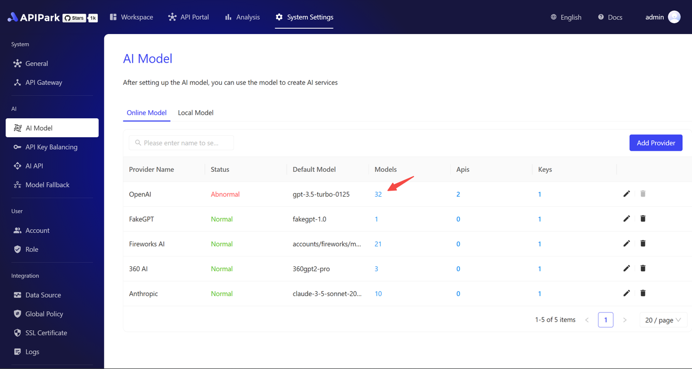
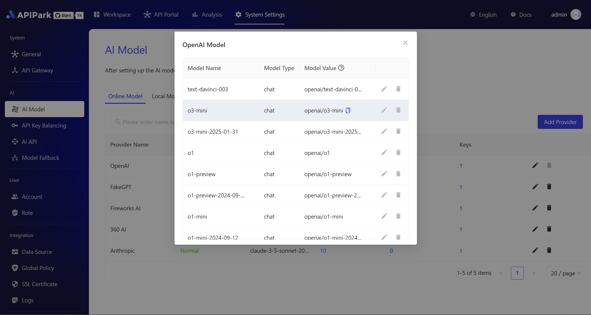
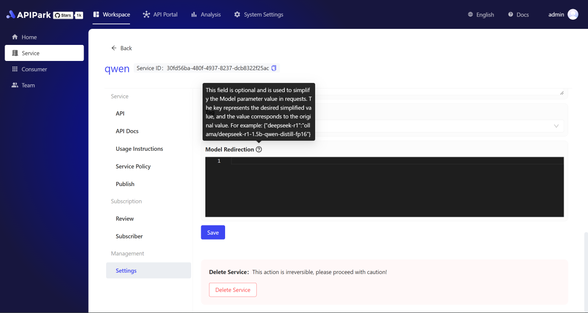
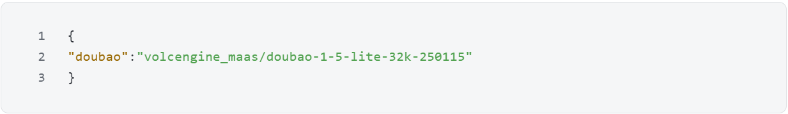
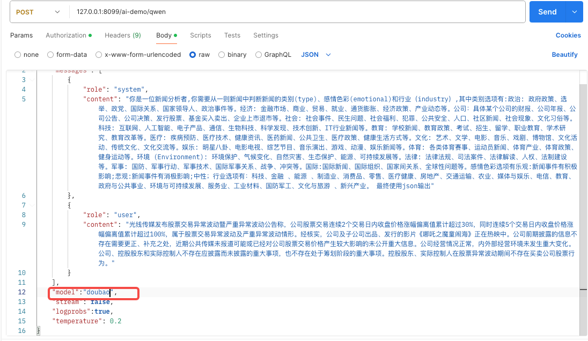

# 模型别名映射
通过`APIPark`输出的 AI 统一接口，支持全局model参数路由。可在任意已接AI接口中，通过**model=供应商ID/模型名称**的格式参数即可直接调用目标模型。并且自动完成渠道路由、鉴权参数传递、响应格式标准化。

示例：`"model":"volcengine/llama3-8b"`调用火山引擎的 Llama3 模型
具体指定的 model 参数值可以在 AI Model 列表中点击 Models 的数字查看具体的模型参数值。

  

  

但部分模型的参数值名称过长，为了在开发调用过程中使用更加便捷，APIPark 提供了模型别名映射的功能。
可在对应的「AI 服务」配置中找到「模型重定向」配置，自定义简化的模型值映射为原模型值。

  

例如：如果需要简化火山引擎下的豆包模型的参数值，那么可通过以下的Json格式配置，将model的参数值通过「doubao」映射为「volcengine_maas/doubao-1-5-lite-32k-250115」。

  

该功能兼容历史配置，原有模型值仍可正常使用。

调用API如下图所示：

  
