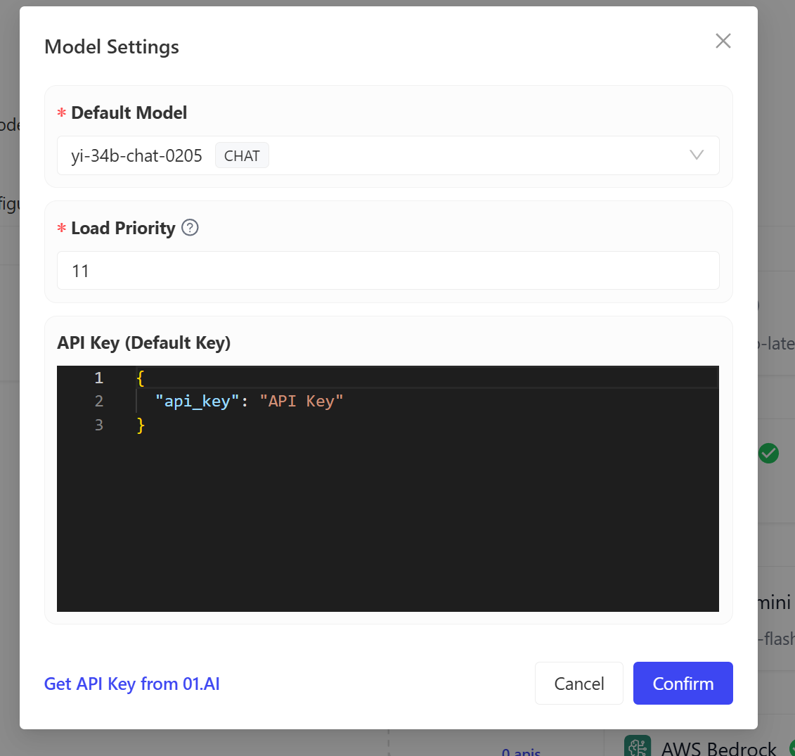
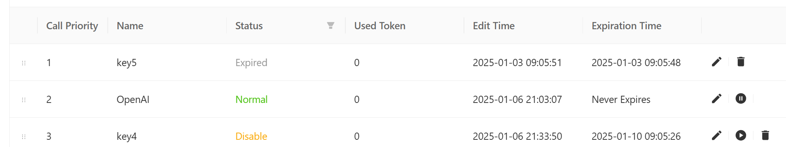
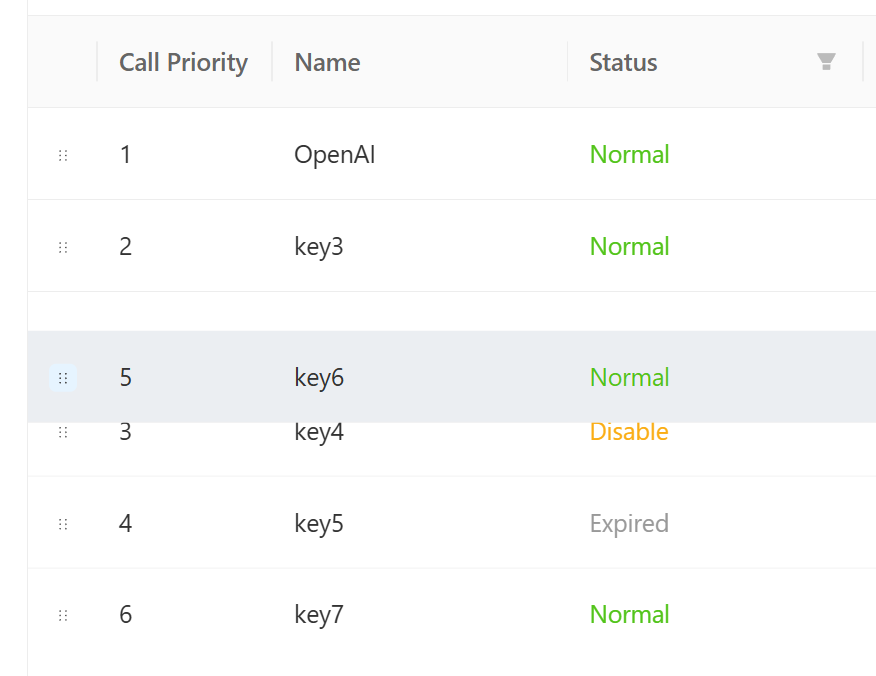

# APIKEY 资源池

APIKEY 资源池是一个集中管理和调配 APIKEY 的功能，为 AI 服务的稳定运行提供有力支持。在资源池中，用户可以查看和管理各个供应商的 APIKEY，包括其状态（如正常、超额、过期等）和调用优先级。通过拖拉操作，用户可以轻松调整 APIKEY 的优先级顺序，以适应不同的业务需求。当某个 APIKEY 出现超额或过期等问题时，系统自动按优先级启用其他 APIKEY ，确保AI服务的持续可用。

当然，您也可以使用AI APIKEY 资源池对 AI 调用资源额度进行统一再分配。

  

## 默认 APIKEY

在设置AI供应商的配置弹窗上配置的APIKEY为默认 APIKEY。该APIKEY是不可删除的，保证当前的供应商至少有一个APIKEY。

  

## 添加更多 APIKEY

在 APIKEY 资源池页面中，可添加对应供应商的APIKEY。点击添加按钮后会弹出如下的配置弹窗。

- 名称：KEY的名称。系统会默认提供key+序号的名称，可修改。
- API Key：实际的APIKEY参数配置。注意这里不仅仅可填写API Key 还可以填写API URL等配置。
- 过期时间：默认永不过期，可选择具体的过期时间。到过期时间后，该APIKEY不可再使用。

  

## 停用/启用 APIKEY

可在APIKEY资源池上，操作停用或启用APIKEY。

- 已过期的APIKEY没有启用或停用按钮，仅可进行删除。
- 若停用APIKEY，则该APIKEY不可调用，系统自动调用下一个APIKEY。
- 若存在某个APIKEY因限额异常后，可再次启用该APIKEY恢复为正常状态。启用后该APIKEY可在下一个AI服务调用时正常被使用。

  

## 调整优先级

可通过拖拉每行APIKEY前的按钮，来调整其优先级。优先级越靠前的APIKEY会越优先被使用。

  
