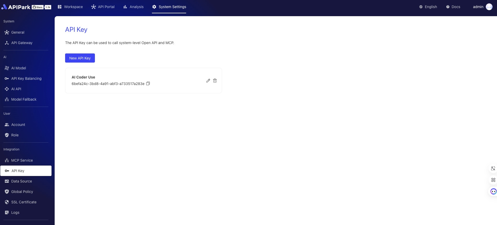
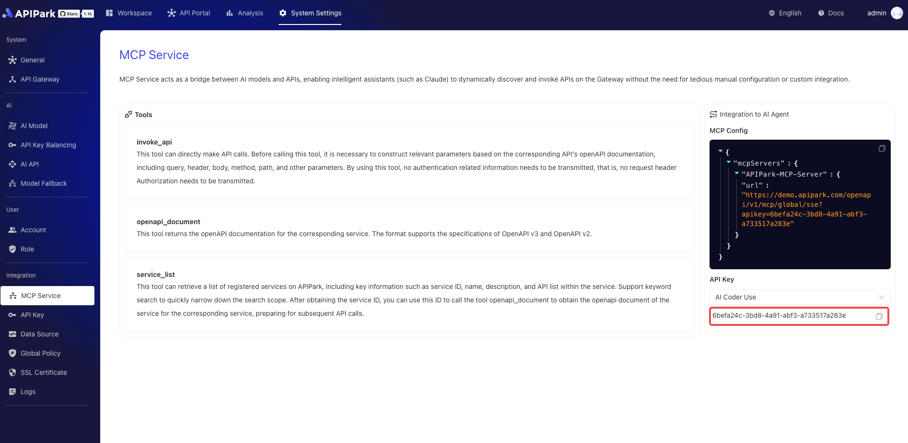

# 系统APIKey

APIPark APIKey 模块是一个系统级功能，旨在提供与 APIPark OpenAPI 的安全高效集成。用户可通过合法有效的 API 密钥，安全访问 APIPark 提供的 OpenAPI，快速实现与第三方系统的集成。同时，该模块支持使用 API 密钥访问系统级 MCP（模型上下文协议）Server 功能，方便 MCP Client（如 Claude、Cursor、Cline 等）快速接入。
在APIPark上，我们可以对系统APIKey进行管理，如下图：

  

在MCP页面，可快速接入使用，如下图：

  
