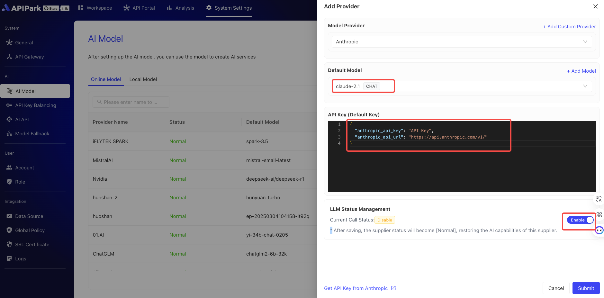
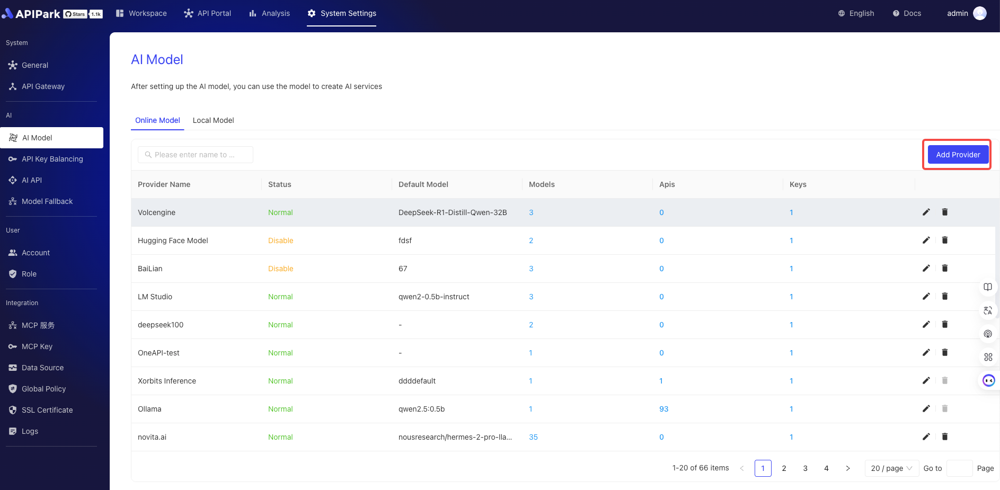
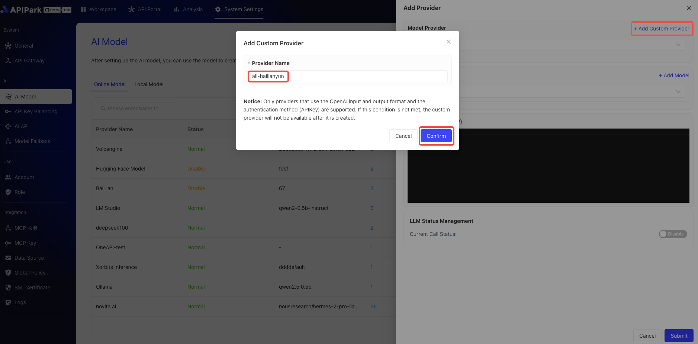
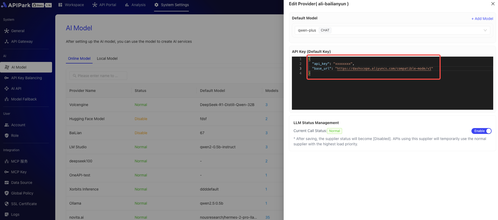
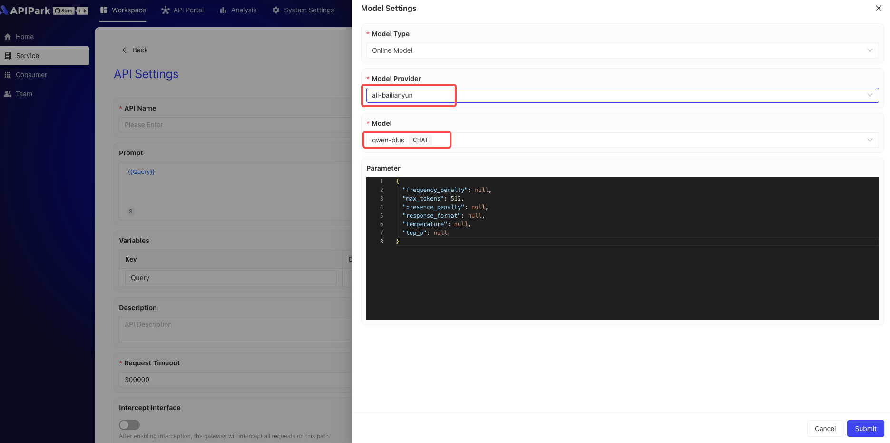

# 接入LLM供应商
在开始创建 AI 服务之前，首先需要配置 AI 模型供应商。APIPark 支持超过100种 AI 模型，包括 OpenAI、Anthropic、AWS Bedrock、Google Gemini等。
配置供应商后，您可以选择不同的模型来创建 AI 服务，并在 APIPark 中统一管理所有 AI 服务的授权信息和成本统计。
目前APIPark预集成六大服务平台：
- 火山引擎（字节跳动云服务）
- 阿里百炼云（阿里巴巴智能计算平台）
- Hugging Face（开源模型社区）
- Ollama（本地大模型框架）
- LM Studio（桌面端模型工具）
- Xinference（分布式推理平台）
## 新增内置供应商
### 配置步骤

1. 点击系统设置 -> AI Models，进入在线模型页面，点击新增供应商。

  

2. 选择需要配置的供应商，填写供应商APIKey信息，开启LLM后点击保存，如下：

  

保存完成后，即可[创建并发布AI服务](../services/ai_services.md)了
## 新增自定义供应商
APIPark不仅内置了多家主流LLM（大语言模型）供应商，还支持将符合OpenAI接口标准的第三方服务快速添加为新的LLM供应商。通过标准化的配置流程，您只需5分钟即可完成注册和接入，轻松扩展适合您业务需求的模型服务。
### 配置步骤

1. 准备工作。
确保您的第三方LLM服务兼容OpenAI接口标准，并获取API密钥和端点地址。
本示例使用阿里百炼云的配置进行演示。

2. 新增自定义供应商
  

  

3. 新增自定义模型
添加自定义模型时，模型名称需要与供应商的模型名称一致，如下图

  

  

4. 填写供应商基本信息

阿里百炼云的base_url为https://dashscope.aliyuncs.com/compatible-mode/v1，apikey需要自行获取。

  

保存后，即可在AI服务中创建AI API，并绑定其供应商及模型。

  

  

> 💡 如果 APIPark 没有支持你使用的 AI 供应商，欢迎 [🔗 给我们提交 Issue](https://github.com/APIParkLab/APIPark/issues/new)

