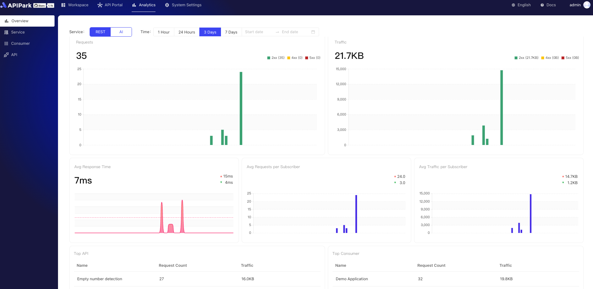
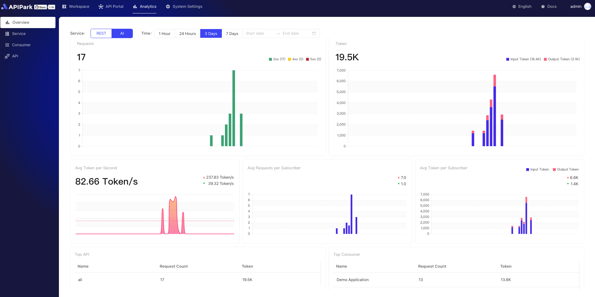

#  API 调用分析报告

APIPark 通过对历史调用数据的分析， 展示 API 长期的调用趋势和性能变化，帮助企业维持 API 的稳定。

> 💡 APIPark 的 API 调用分析报告依赖于 InfluxDB 数据库。如果你使用 APIPark 官方提供的脚本部署，默认会安装 InfluxDB，了解更多：[🔗 部署 APIPark](deploy.md)。
> 💡 你也可以部署外部的 InfluxDB 数据库，然后在 APIPark 的系统设置中填写 InfluxDB 的数据源信息，了解更多：[🔗 设置数据源](system_setting/data_source.md)。

## 全局Overview

1. REST服务调用概览
提供多维度指标的可视化分析，包括但不限于请求总量、流量传输量、平均响应时间等。支持自定义时间段筛选数据，图表清晰展示趋势与变化。

  

2. AI服务调用概览
展示AI服务关键指标，如请求数量、Token使用量、平均Token耗时等，支持自定义时间段数据筛选，通过直观图表呈现性能与使用情况。

  

3. 多维度统计调用情况。
支持按照服务、消费者、API进行多维度的筛选分析。

  

  

## 服务级别Overview

提供服务调用统计功能，详细展示各服务的使用情况与性能表现，支持深入分析与优化决策。

  
