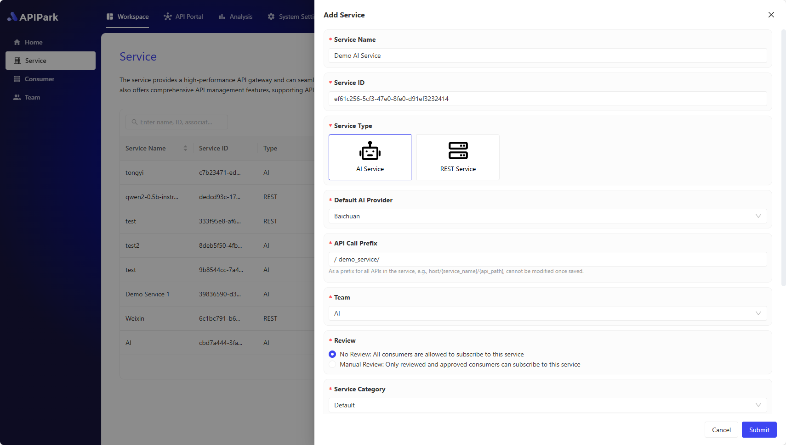
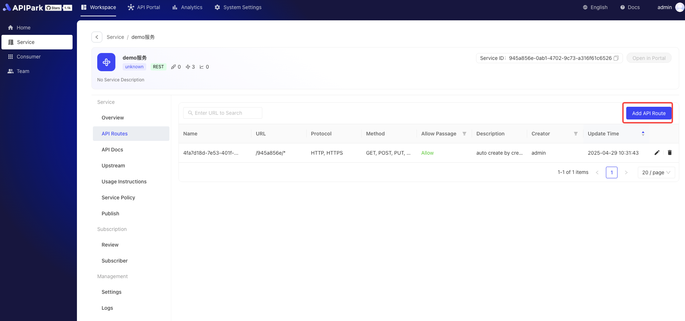

# REST 服务（API 网关）

REST服务是一种遵循REST（Representational State Transfer）架构风格的网络服务。它利用标准的HTTP方法来处理数据和交互，使得服务易于理解和使用。在APIPark平台上，REST服务可以被轻松创建和管理，以支持各种Web和移动应用的需求。

在API网关中，**REST服务** 是指一组 **REST API**（应用程序接口）集合，它们共同提供某种特定的功能或业务逻辑。**REST服务** 是平台上用于组织和管理API的基本单位，通过 **REST服务**，开发者可以定义、发布、管理和监控一系列API，供其他用户或系统调用。

消费者可以选择并订阅符合需求的**REST服务**。通过订阅，消费者可以获得对特定API接口的访问权限，以便根据实际业务需求定制化调用。系统采用高效的鉴权机制，确保在进行API调用时，访问请求携带有效的鉴权信息，保障数据的安全性和用户隐私。

# 创建并发布 REST 服务
## 1. 创建 REST 服务

进入 **工作空间** 模块，在侧边栏中选择 **服务**，然后 **创建服务**，填写：

- **服务名称**
- **服务 ID**：服务的唯一标识，一旦保存无法修改。
- **服务类型**，选择 **REST 服务**：
  - **AI 服务**：AI 网关，通过 APIPark 将不同的 AI 模型和 Prompt 转换为统一的 REST API。
  - **REST 服务**：传统的 API 网关，可以接入微服务或者 HTTP REST API。
- **API 请求前缀**：为该服务的所有 API 设置统一的请求前缀，一旦保存无法修改。
- **团队**：如果你加入了多个团队，你需要设置哪个团队负责管理这个服务。
- **订阅审核**：
  - **无需审核**：所有消费者都可以订阅和调用该服务。
  - **人工审核**：只有审核通过的消费者可以调用该服务。
- **服务分类**：选择服务发布到 API 门户的哪一个分类。

## 2. 填写 API 上游

  

**字段说明**

<table><thead><tr><th width="169">字段名</th><th>说明</th></tr></thead><tbody><tr><td>上游类型</td><td>上游服务的类型，目前仅支持<code>静态上游，即有固定IP/域名+端口号的上游入口的服务。</code></td></tr><tr><td>服务地址</td><td>上游服务访问地址，可填写多个上游地址，并配置每个上游服务的权重。</td></tr><tr><td>请求协议</td><td>请求上游服务的协议，目前仅支持HTTP/HTTPS。</td></tr><tr><td>负载均衡</td><td>负载均衡算法，当前支持带权轮询、IP Hash。</td></tr><tr><td>转发Host</td><td>请求上游服务时，使用的Host值，此处有三个选项：  <b>透传客户端请求Host：</b> 这种策略下，网关或代理服务器不会修改请求中的Host头信息。它将客户端（发起请求的一方）原始的Host头直接传递给上游服务（即实际提供服务的服务器）。  这允许上游服务识别请求的原始来源域名，从而可以根据原始请求的Host头提供定制化的内容或执行特定的逻辑。  <b>使用上游服务Host：</b>  这种策略中，网关或代理服务器会用配置好的一个或多个上游服务的Host头来替换原始请求中的Host头。  这通常用于将请求路由到特定的后端服务，而不管客户端请求中的Host头是什么。这可以简化上游服务的配置，因为它们不需要关心进入请求的Host头信息。  <b>重写Host：</b>  这种策略涉及到修改请求中的Host头，将其更改为特定的值。 这可以用于多种情况，比如当需要将请求路由到一个不同的域名，或者当需要确保请求符合特定的格式或安全要求时。  重写Host头可以提供更大的灵活性，但也可能导致一些意外的行为，特别是如果客户端依赖于原始Host头来进行某些操作时。</td></tr><tr><td>超时时间</td><td>请求上游超时时间，单位为ms。</td></tr><tr><td>超时重试次数</td><td>允许超时时，重新请求上游的次数，重试时，若上游配置多个服务地址，则网关会重新请求未请求过的服务地址。</td></tr><tr><td>调用频率限制</td><td>当前上游每秒允许请求的次数。</td></tr><tr><td>转发上游请求头</td><td>当请求上游时，需要增加或删除的请求头部信息，若不配置，网关会原封不动将请求头部转发给上游服务。</td></tr></tbody></table>

## 3. 创建路由

  

  

**字段描述**

| 字段名称         | 字段描述                                                     |
| :--------------- | :----------------------------------------------------------- |
| 拦截该接口的请求 | 是否拦截该接口的请求                                         |
| 请求方式         | 支持常见HTTP请求方式GET、POST、PUT、DELETE等，支持多选       |
| 请求路径         | API的URI，用于应用请求URL中的相对路径，支持Restful参数以及路径前缀匹配 |
| 高级匹配         | 支持通过请求头，请求参数、Cookie 进行路由匹配，可添加多条    |
| 转发上游路径     | 转发至上游的相对路径                                         |
| 请求超时时间     | 定义网关转发请求到上游至响应的超时时间                       |
| 重试次数         | 当转发请求到上游失败时，网关会自动触发重试转发请求，最大次数不超过重试次数 |
| 转发上游请求头   | 可对转发上游请求头进行新建、编辑以及删除参数，主要应用于网关与上游间鉴权 |

## 4. 填写API文档

## 5. 发布服务

✨ 如果服务的 **API、API 文档、使用介绍、上游** 发生了变化，你需要发布新版本让新配置生效。

在侧边栏选择 **发布**，然后点击 **新建版本**，填写：

- **版本号**
- **版本说明**

点击 **确认** 即可完成发布。

> 💡 如果这是首次发布服务，服务会出现在 **API 门户**，并且可以被 **消费者** 订阅。
> 💡 如果服务开启了 **人工审核**，订阅了服务的 **消费者** 需要等待 **服务管理员** 审核通过之后才能调用 API。

# [可选] 创建消费者并订阅服务

APIPark 提供了 **API 门户** 功能，用户可以将服务发布到 API 门户并且被其他用户查看、订阅和调用。

为了保证安全、规范地使用 API，并且降低 API 的管理成本。用户需要先创建 **消费者**，并通过消费者订阅服务，然后再使用消费者的 **授权证书** 来调用 API。

[🔗 了解更多：消费者](../consumers.md)

# [可选] 调用 API

[🔗 了解更多：调用API](../call_api.md)